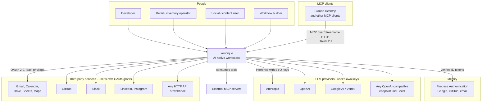
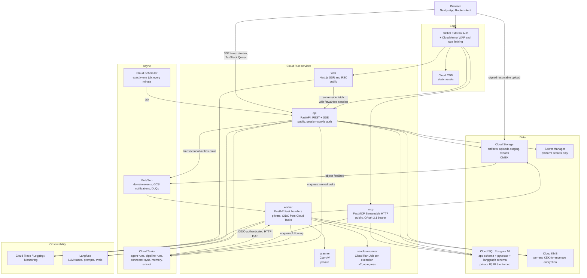
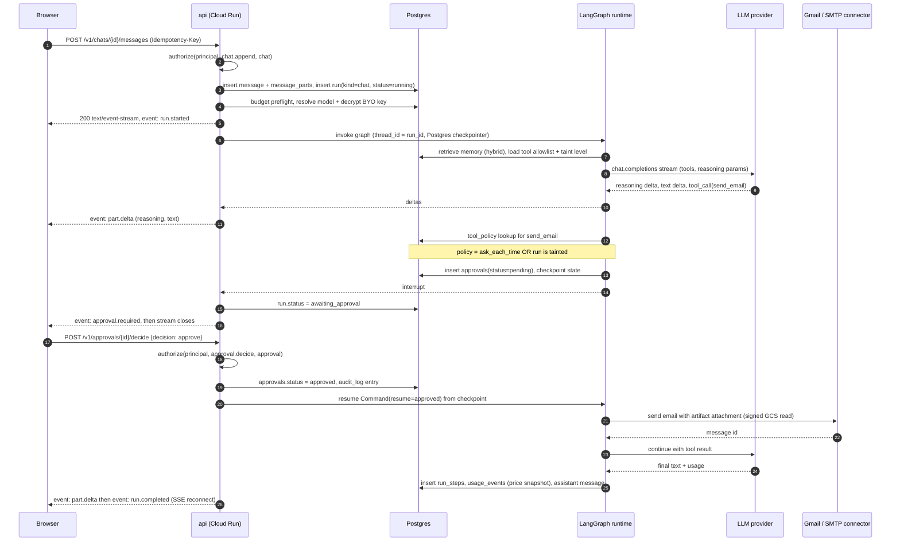
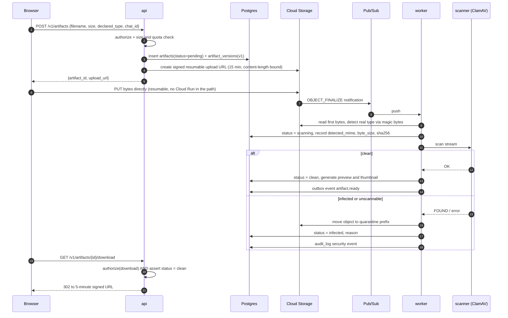
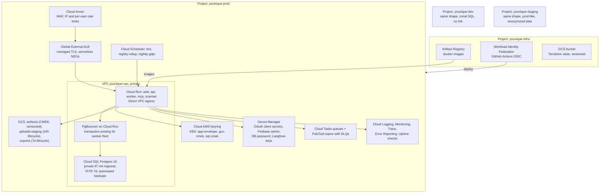

# 02 — System Architecture

## 1. Architectural principles

These are the rules that resolve design arguments. When a proposal violates one, it needs an ADR.

1. **One execution engine.** Chat turns, background agents, and pipelines all compile to
   LangGraph graphs and all write to the same `runs` / `run_steps` tables. We do not build a
   second scheduler, a second state machine, or a second cost accounting path.
2. **One authorization chokepoint.** Every request resolves permissions through a single
   `authorize(principal, action, resource)` function invoked as a FastAPI dependency. Route
   handlers never do ad-hoc permission checks. Postgres RLS is a *backstop*, not the primary
   control.
3. **Postgres is the source of truth.** Including agent checkpoints, vectors, and the job
   ledger. Queues carry pointers, never state.
4. **Stateless services.** Any Cloud Run instance can be killed at any moment. Anything that
   must survive is in Postgres or GCS before we acknowledge it.
5. **Untrusted by default.** Content from a connector, a file, a web fetch, or an external MCP
   server is data, never instruction. It carries a taint level that gates capabilities.
6. **Secrets never traverse the frontend.** Provider keys and OAuth tokens are write-only from
   the client's perspective; reads return masked metadata.
7. **Large payloads go direct to GCS.** Signed resumable upload and short-lived signed download.
   File bytes do not flow through Cloud Run.
8. **Idempotent by construction.** Every mutating endpoint accepts `Idempotency-Key`; every
   queued task has a deterministic task name.

## 2. Context diagram (C4 L1)



## 3. Container diagram (C4 L2)



## 4. Service boundaries

| Service | Owns | Must never | Scaling shape |
| --- | --- | --- | --- |
| `web` | Rendering, routing, client state, optimistic UI. Holds no business logic and no direct DB access. | Talk to Postgres. Hold a provider key. | min 0, max 20, concurrency 80 |
| `api` | Request authentication, the `authorize()` chokepoint, CRUD, SSE chat streaming, task enqueue, signed URL minting. **Foreground chat turns execute here** so tokens stream directly to the client. | Run a job longer than the request. Be the only place a check exists (RLS backs it up). | min 1, max 50, concurrency 40 |
| `worker` | Background agent runs, pipeline runs, schedule dispatch, memory extraction, connector sync, scan orchestration, usage rollups, outbox drain. | Be publicly reachable. Accept unauthenticated calls. | min 0, max 100, concurrency 4 (long tasks) |
| `mcp` | MCP protocol, OAuth 2.1 authorization-server metadata and token introspection, tool/agent/pipeline exposure. Reuses the same `authorize()` and approval policy. | Have a permission path `api` does not have. | min 0, max 10 |
| `scanner` | ClamAV signature updates and file scanning. | Reach the internet except for signature updates. | min 0, max 10, concurrency 1 |
| `sandbox-runner` (v2) | One untrusted code execution per Cloud Run Job instance. | Have network egress or a database credential. | per-execution job |

Why `api` and `worker` are separate services from the same codebase: they share models,
`authorize()`, and the connector registry, so a single Python package with two entrypoints
avoids drift. They are deployed separately because their scaling and ingress needs are
opposite — `api` wants high concurrency and public ingress, `worker` wants low concurrency,
long timeouts, and no public ingress.

## 5. Key request flows

### 5.1 Chat turn with a tool call that needs approval

This is the flow that defines the product. Note that the run *suspends durably* at the
approval, so the browser can close and reopen.



The browser reconnects to `GET /v1/runs/{id}/events?last_event_id=N` to receive the
post-approval stream. Event sequence numbers are persisted per run, so reconnect is
gap-free and a dropped connection never loses tokens.

### 5.2 Scheduled background agent run

```mermaid
sequenceDiagram
    autonumber
    participant S as Cloud Scheduler (1 job, * * * * *)
    participant A as api
    participant DB as Postgres
    participant T as Cloud Tasks (agent-runs)
    participant W as worker
    participant L as LangGraph runtime
    participant X as Connectors / LLM

    S->>A: POST /internal/scheduler/tick (OIDC)
    A->>DB: SELECT schedules WHERE next_fire_at <= now() FOR UPDATE SKIP LOCKED
    loop each due schedule
        A->>DB: insert runs(kind=agent, status=queued, idempotency=schedule_id:fire_at)
        A->>T: create task named "run-{run_id}" (dedup window)
        A->>DB: schedules.next_fire_at = croniter(cron, tz).next()
    end
    T->>W: POST /internal/tasks/agent-run (OIDC, at-least-once)
    W->>DB: claim run (CAS status queued -> running); if already running, ack and exit
    W->>L: invoke / resume graph (thread_id = run_id)
    L->>X: tool calls within the agent's allowlist and budget
    L->>DB: run_steps per node, usage_events per LLM call, checkpoint each step
    alt success
        W->>DB: run.status = succeeded
        W->>DB: outbox event run.succeeded
    else retryable failure
        W-->>T: 5xx, Cloud Tasks retries with exponential backoff
    else exhausted
        W->>DB: run.status = failed, outbox event run.failed
        Note over W,DB: Pub/Sub fan-out -> notification to user
    end
```

Two properties worth calling out. `FOR UPDATE SKIP LOCKED` means multiple `api` instances can
run the tick concurrently without double-dispatching. The Cloud Tasks **task name** derived
from `schedule_id` plus `fire_at` means a duplicated tick cannot create a duplicate run —
Cloud Tasks rejects a duplicate name, which is exactly the at-most-once guarantee the retail
persona needs.

### 5.3 Artifact upload, scan, and gated availability



Declared MIME type is never trusted. Only `clean` artifacts can be downloaded, attached to a
message, or read by a tool — the status check lives in the artifact-read helper, not in each
call site.

### 5.4 Connector OAuth with granular, per-connection permissions

```mermaid
sequenceDiagram
    autonumber
    participant B as Browser
    participant A as api
    participant DB as Postgres
    participant KMS as Cloud KMS
    participant P as Provider (e.g. GitHub)

    B->>A: POST /v1/connections {connector: github, requested_scopes}
    A->>DB: insert connections(status=pending), oauth_states(state, pkce_verifier, ttl 10 min)
    A-->>B: authorize_url (least-privilege scopes only)
    B->>P: user consents
    P->>A: GET /v1/connections/callback?code&state
    A->>DB: consume state (single use), verify PKCE
    A->>P: exchange code for tokens
    A->>KMS: encrypt refresh and access token with workspace DEK (AAD-bound)
    A->>DB: insert connection_secrets(ciphertext), connections.status = active
    A-->>B: redirect to resource-selection step
    B->>A: PUT /v1/connections/{id}/grants {repos: [owner/a, owner/b], actions: [read, create_pr]}
    A->>DB: insert connection_grants (the enforced allowlist)
    Note over A,DB: Every tool call re-checks connection_grants.<br/>Provider scope is the ceiling; grants are the policy.
```

The distinction that matters: the OAuth scope is what the *provider* allows, and
`connection_grants` is what *we* allow. GitHub cannot express "only these two repos" for a
classic OAuth app, so we enforce it ourselves on every tool invocation and refuse anything
outside the allowlist. Same pattern for "Gmail send-only versus read".

## 6. GCP deployment topology



### Why each GCP building block, and what we rejected

| Block | Decision | Reasoning and rejected alternatives |
| --- | --- | --- |
| **Cloud Run** | All services | Scale-to-zero matters enormously for an OSS project's hosted demo. Per-service IAM identity, built-in gVisor-class isolation, 60-minute request ceiling. Rejected GKE (a cluster to operate for no benefit at this scale), App Engine (legacy ergonomics), Cloud Functions (one-handler-per-service fights a FastAPI app). |
| **Cloud SQL Postgres 16** | Primary datastore | `pgvector` and the LangGraph Postgres checkpointer both need real Postgres. Regional HA plus PITR. Rejected AlloyDB (3-5x cost, and its advantages are analytical), Spanner (no `pgvector`, no Alembic story), Firestore (the relational model here is genuinely relational). **Known pitfall:** Cloud SQL ships a fixed extension allowlist — `pg_uuidv7` is *not* available, so UUIDv7 primary keys are generated in application code via `uuid6`, not in the database. |
| **PgBouncer** | Transaction pooling in front of Cloud SQL | The classic serverless failure: `max_instances × pool_size` exceeds Postgres `max_connections` and the whole app browns out under load. `api` uses a small direct pool (5); the `worker` fleet goes through PgBouncer in transaction mode. Session-scoped features (`LISTEN/NOTIFY`, `SET LOCAL` outside a transaction) must bypass it — documented in the backend rules file. |
| **Cloud Storage** | Artifacts, staging, exports | Signed resumable uploads keep file bytes out of Cloud Run. CMEK on the artifacts bucket, object versioning for artifact version history, uniform bucket-level access so per-object ACLs cannot drift. |
| **Cloud KMS + Secret Manager** | Split by purpose | KMS holds the per-environment KEK that wraps per-workspace DEKs; ciphertext lives in Postgres. Secret Manager holds *platform* secrets only. **Rejected:** one Secret Manager secret per user key — Secret Manager is priced and quota'd for ops secrets, its soft-delete semantics fight GDPR erasure, and six-figure secret counts are both expensive and unobservable. |
| **Cloud Tasks** | Work dispatch | Named tasks give free deduplication (our at-most-once guarantee), per-queue rate and concurrency caps give per-tenant backpressure, scheduled delivery gives retry-at, and the retry policy is declarative. |
| **Pub/Sub** | Domain event bus and GCS notifications | Fan-out that Cloud Tasks cannot do: `run.succeeded` feeding notifications, usage rollups, and webhooks simultaneously. Dead-letter topics per subscription with a documented redrive runbook. Published via a **transactional outbox** so an event is never emitted for a transaction that rolled back. |
| **Cloud Scheduler** | Exactly one minute-tick job plus two nightly jobs | See [00 §3.5](00-assumptions-and-decisions.md). User schedules are rows, not GCP resources. |
| **Cloud Armor** | WAF, bot control, L7 rate limiting at the edge | Cheap defence against volumetric abuse before it reaches Cloud Run and bills us. App-layer rate limits still exist per user and per workspace. |
| **Cloud Logging / Monitoring / Trace / Error Reporting** | Infrastructure observability | Already present, no extra vendor. LLM-specific tracing goes to Langfuse because Cloud Trace is a poor UI for prompt debugging. |
| **Artifact Registry** | Container images | Vulnerability scanning on push; Binary Authorization in v1 so only attested images deploy. |
| **GitHub Actions + Workload Identity Federation** | CI/CD | Path-filtered pipelines, and an OSS project's contributors already live on GitHub. WIF means zero long-lived service-account keys. Rejected Cloud Build as the primary (worse PR ergonomics, and contributors cannot see logs). |
| **Terraform** | IaC | Per-environment directories with a shared module library. Rejected Terraform workspaces (state collisions are a recurring, expensive mistake) and Pulumi (fewer contributors know it). |

### Environment promotion

`dev` auto-deploys from `main`. `staging` deploys on a release candidate tag and runs the full
E2E suite against prod-like infrastructure with anonymized data. `prod` deploys on a release
tag with **gradual traffic migration** (deploy `--no-traffic`, smoke-test the revision via its
tag URL, then 10% → 50% → 100%). Rollback is a traffic reassignment to the previous revision,
measured in seconds; database migrations are therefore constrained to be
backward-compatible within one release (expand-then-contract, never a breaking change in the
same release as the code that needs it).

## 7. Request path authentication summary

| Caller | Mechanism | Verified by |
| --- | --- | --- |
| Browser → `api` | `__Host-session` httpOnly cookie plus `X-Account-Id`, with an `X-CSRF-Token` double-submit on unsafe methods | Session lookup in Postgres; instant revocation |
| Browser → Firebase | Firebase SDK, exchanged once for our session | Firebase Admin SDK verifies the ID token at exchange time only |
| `web` SSR → `api` | Forwarded session cookie over internal URL | Same as browser |
| Cloud Tasks → `worker` | OIDC token with the queue's service account | Cloud Run IAM plus an explicit audience check |
| Cloud Scheduler → `api` | OIDC token | IAM plus audience check on `/internal/*` |
| Pub/Sub → `worker` | OIDC push authentication | IAM plus audience check |
| MCP client → `mcp` | OAuth 2.1 bearer with PKCE, scoped token | `mcp_tokens` lookup, scope intersection with workspace permissions |
| GitHub/Slack webhooks → `api` | Provider HMAC signature plus timestamp window | Per-connector verifier; replay rejected |

Note that `/internal/*` routes are additionally protected by the load balancer: they are not
mapped in the ALB URL map, so they are unreachable from the public internet regardless of
token state. Defence in depth, because an audience-check bug should not be exploitable.
