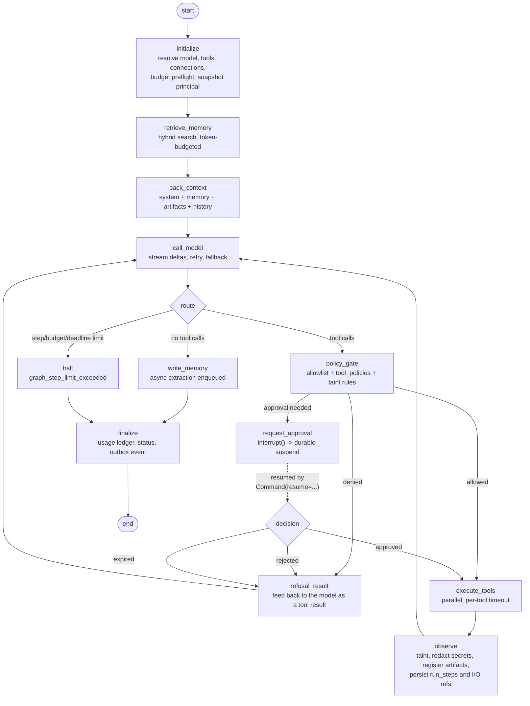
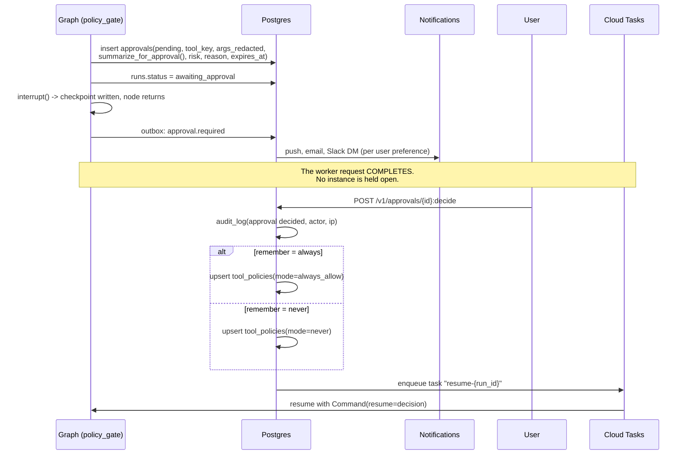
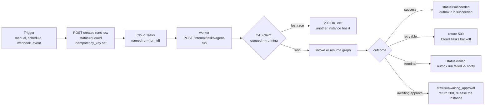

# Agent Runtime (LangGraph)

One runtime executes chat turns, background agents, and pipelines. The only differences are
where it runs (`api` for foreground, `worker` for background), which graph is compiled, and how
output is delivered.

## 1. State schema

```python
class AgentState(TypedDict):
    # Conversation
    messages: Annotated[list[AnyMessage], add_messages]

    # Identity and tenancy — immutable for the life of the run
    run_id: UUID
    workspace_id: UUID
    actor_user_id: UUID
    principal_snapshot: dict          # roles and grants AT RUN START

    # Configuration, resolved once at start
    model_config: ModelConfig        # model_ref, provider impl, reasoning level, fallbacks
    tool_allowlist: frozenset[str]
    connection_bindings: dict[str, UUID]   # connector_key -> connection_id
    memory_set_ids: list[UUID]
    memory_write_mode: Literal["off", "append", "overwrite"]

    # Safety — the taint ratchet
    trust_level: Literal["trusted", "untrusted"]
    taint_sources: list[TaintSource]

    # Control
    step_count: int
    tool_call_count: int
    pending_approval_id: UUID | None
    cancel_requested: bool

    # Accounting
    budget: Budget                   # limit, spent, tool call cap, wall clock deadline

    # Working set
    artifacts: list[ArtifactRef]
    scratch: dict                    # node-local, never sent to the model
    errors: list[RunError]
```

Four deliberate choices:

**`principal_snapshot` is captured at run start.** A scheduled agent runs at 9am on Monday; its
owner may have lost a workspace role at 8am. Re-resolving permissions per step would make a
long run's behaviour depend on when each step happened to execute, which is both
non-reproducible and a security ambiguity. We snapshot, and we **re-validate against live
state at every tool call** — the snapshot is the ceiling, live state can only narrow it. A
revoked connection or a removed role stops the run; a newly *granted* permission does not
silently widen a run in flight.

**`trust_level` is a ratchet.** It only ever goes `trusted → untrusted`. Nothing in the graph
can clear it, because there is no reliable way to "sanitize" text back into instructions we
trust. This is the mechanism that makes prompt-injection containment structural rather than
heuristic ([safety doc](safety-and-prompt-injection.md)).

**`budget` lives in state, not in a side table read per step.** It is checkpointed with
everything else, so a resumed run cannot forget what it already spent — the obvious bug where
a retried run restarts its budget from zero.

**`scratch` is never serialized into a message.** Node-local working data (a parsed dataframe
handle, a pagination cursor) stays out of the model's context, which keeps token costs from
silently growing with pipeline complexity.

## 2. Graph topology



Properties worth calling out:

- **The cycle is `call_model → gate → execute → observe → call_model`.** Bounded by
  `step_count` (default 25), `tool_call_count` (default 50), remaining budget, and a wall-clock
  deadline. Whichever binds first halts the run with a specific error rather than letting it
  spin.
- **A denied tool is reported to the model as a tool result**, not as a crash. The model then
  explains to the user what it could not do and why, which is a far better experience than an
  error page, and it lets the model choose a permitted alternative.
- **`observe` is the single place tool output enters the conversation.** Tainting, secret
  redaction, artifact registration, and step persistence all happen there. One node means one
  place to audit.

### Sub-agents

A sub-agent is a compiled subgraph invoked from a node, with:

- A **narrowed** tool allowlist — intersection with the parent's, never a union.
- A **slice** of the parent's budget, deducted from it rather than added alongside.
- The parent's `trust_level` **inherited**, and any taint the sub-agent acquires propagates
  back up. Delegation is not a laundering mechanism.
- Its own `run_steps` rows with `kind = 'subagent'` and a `parent_run_step_id`, so the UI can
  render the call tree.
- A depth limit of 3, because deeper delegation is almost always a loop in disguise.

## 3. Checkpointing

`AsyncPostgresSaver` from `langgraph-checkpoint-postgres`, against the `langgraph` schema, with
`thread_id = str(run_id)`.

```python
checkpointer = AsyncPostgresSaver(pool)
await checkpointer.setup()       # idempotent, on worker boot, NOT via Alembic
graph = builder.compile(checkpointer=checkpointer, interrupt_before=[])
```

Checkpoints are written after every node, which is what makes four separate features work with
no additional machinery:

| Feature | Mechanism |
| --- | --- |
| Approval suspend and resume | `interrupt()` persists state; the Cloud Run request finishes; resume happens hours later in a different instance |
| Instance death mid-run | Cloud Tasks retries; the run resumes from the last checkpoint rather than restarting |
| Pause and resume | A status change; the next resume reads the checkpoint |
| Time-travel debugging | Checkpoint history is queryable, so "what did the state look like at step 7" is answerable in support |

Two operational rules, both in the backend rules file because both are easy to get wrong:

1. **Alembic must never touch the `langgraph` schema.** CI asserts this. An autogenerated
   migration against those tables will corrupt live suspended runs.
2. **Upgrading `langgraph-checkpoint-postgres` is a schema change.** It needs a release note and
   a pre-deploy check for suspended runs, because a pending approval created under the old
   format must still resume under the new one. The deploy checklist queries
   `runs WHERE status = 'awaiting_approval'` and the upgrade is blocked if any exist and the
   library's checkpoint version changed.

Checkpoint retention: completed runs' checkpoints are deleted after 7 days by the nightly
retention job. They are debugging aids, not records — the records are `run_steps` and
`run_events`.

## 4. Approvals



| Design point | Choice and reason |
| --- | --- |
| Expiry | 24 h default, configurable per workspace. On expiry the run fails with `approval_expired` rather than hanging forever — a run in limbo holds a Cloud Tasks retry slot and confuses users. |
| Arguments shown | `summarize_for_approval()` output, human-readable, with the full arguments available behind a disclosure. Raw JSON alone trains people to click through. |
| Arguments stored | Redacted through the secret patterns before persisting, because approval records are long-lived and widely readable within a workspace. |
| Mutability | The user **cannot edit** the arguments in the approval dialog in MVP. Approve-with-edits means the model's reasoning no longer matches what executed. v1 adds "reject with feedback", which sends the user's note back as the tool result so the model can retry properly. |
| Who may approve | Only a principal with `approval.decide` on the run's resource. Never a share-link principal, never the agent itself, never a PAT. |
| Batching | Multiple tool calls in one model turn produce one approval per call, presented as a grouped card with "approve all" — but each decision is recorded individually for audit. |
| `remember` | Writes `tool_policies`, scoped to the agent if the run has one, otherwise workspace-wide. Setting `always_allow` requires step-up re-auth, because it is a durable privilege grant. |

## 5. Background execution



The critical correctness details:

**Compare-and-swap claim.** Cloud Tasks delivers at least once. The handler's first action is
`UPDATE runs SET status='running', attempt=attempt+1 WHERE id=$1 AND status IN ('queued','awaiting_approval')`
and it exits with `200` if zero rows were affected. Without this, a duplicate delivery runs the
agent twice and sends two emails.

**Returning `200` on a terminal failure.** A business failure (the model refused, the connector
is revoked) must not be retried by Cloud Tasks — it will fail identically. Only infrastructure
failures return `5xx`. Getting this backwards produces the classic "the same broken job retried
100 times" incident.

**Approval suspension returns `200` and releases the instance.** A run waiting a day for a
human must not hold a Cloud Run container or a Cloud Tasks attempt. This is the single biggest
practical payoff of durable checkpointing.

**Cancellation** sets `cancel_requested`, which the graph checks between nodes and which
propagates a cancel to the in-flight provider request through the httpx cancel scope. Tools
already in flight are allowed to finish — killing a tool mid-write is worse than letting it
complete, since many are not idempotent.

**Queue configuration** per queue: `max_concurrent_dispatches` caps total parallelism,
`max_dispatches_per_second` smooths bursts, `max_attempts = 5` with
`min_backoff = 10s / max_backoff = 10m`. Exhausted tasks land in a dead-letter topic with a
documented redrive runbook. A **per-workspace concurrency cap** is enforced in the handler
(count running runs for the workspace; if over, re-enqueue with delay) because Cloud Tasks
queues are global and one noisy tenant must not starve the rest.

## 6. Limits per agent

| Limit | Default | Enforced |
| --- | --- | --- |
| Steps per run | 25 | `step_count` in state, checked in `route` |
| Tool calls per run | 50 | `tool_call_count` |
| Wall clock per run | 30 min foreground, 60 min background | Deadline in `budget`, checked per node; Cloud Run's hard ceiling is 60 min |
| Spend per run | Workspace default, agent override | Preflight at start, checked before every model call |
| Spend per day per agent | Optional | `budgets` scoped to the agent |
| Concurrent runs per agent | 3 | Claim-time check |
| Concurrent runs per workspace | 10 (plan-dependent) | Claim-time check |
| Sub-agent depth | 3 | `initialize` |
| Output size per tool | 256 KB inline, larger spills to an artifact | `observe` |

A run that hits a limit **fails with a specific error and a remediation**, never a generic
timeout. "This agent reached its 25-step limit — raise it in settings or simplify the task" is
actionable; "run failed" is not.

## 7. Testing

The whole point of this section is that agent tests must be deterministic, fast, and run on
every PR. No real model calls.

**`FakeChatModel`** is the primary tool: constructed with a scripted list of responses
(text, tool calls, errors) and asserting on the exact requests it received. It lets us test
graph logic exhaustively without nondeterminism.

| Test | What it proves |
| --- | --- |
| Happy path with one tool | The full cycle runs, `run_steps` and `usage_events` are written, the final message is correct |
| `ask_each_time` policy | The run suspends, an `approvals` row exists, no provider call for the tool occurred, and resume executes it |
| `never` policy | The tool is refused *before* execution, the refusal is fed back to the model, and no HTTP call is made (strict mock) |
| Taint gating | A run that ingests untrusted content cannot call a high-risk tool even with `always_allow`, unless `allow_when_tainted` is set |
| Step limit | A model that loops forever halts at 25 with `graph_step_limit_exceeded` |
| Budget exhaustion | A run stops mid-way with `budget_exceeded` and partial results are persisted |
| Checkpoint resume | Kill after step 3, resume, and assert steps 1-3 did not re-execute |
| Duplicate task delivery | Two concurrent handler invocations for one run produce exactly one execution |
| Cancellation | `:cancel` stops at the next node boundary and preserves partial output |
| Revoked connection mid-run | A tool call after the connection is revoked fails with `connection_revoked`, not a 401 from the provider |
| Sub-agent narrowing | A sub-agent cannot call a tool outside the parent's allowlist; acquired taint propagates up |
| Tool result orphaning | A history trim never leaves a `tool_result` without its `tool_call` |

**Not tested:** model output quality, prompt wording, whether the agent "chooses well". Those
belong in the nightly eval harness (v2) with a small golden set, tracking tool-selection
accuracy and refusal behaviour over time. Putting them in CI would make the suite slow,
expensive, and flaky, and contributors would start ignoring red builds — which costs more than
the tests are worth.
