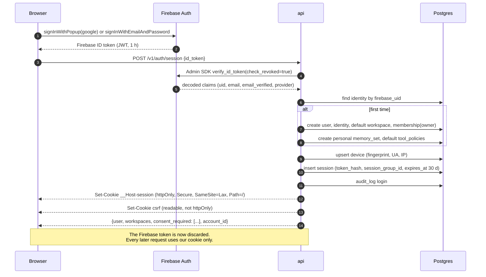
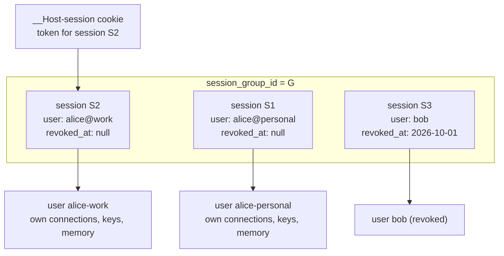

# Auth, Sessions, and Multi-Account

## 1. The problem with using Firebase Auth directly

Firebase Authentication is an excellent identity provider and a poor session manager. Four
specific limitations drive this design:

| Limitation | Consequence if we rely on Firebase alone |
| --- | --- |
| One active user per `Auth` instance, persisted under a single storage key | "Multiple accounts per device" is unimplementable without instantiating several named Firebase apps, each with its own token lifecycle in `localStorage` |
| ID tokens are valid for one hour, and revocation is not reflected until refresh | A fired employee, a stolen laptop, or a leaked token stays valid for up to an hour unless every request pays for a `checkRevoked` round trip to Firebase |
| No server-side session registry | No device list, no "sign out everywhere", no last-seen IP, no per-session audit trail |
| No concept of organizations (Identity Platform "tenants" isolate whole user pools, which is the wrong shape) | Workspace membership has to live in our database regardless, so Firebase's model buys us nothing here |

**Decision: Firebase is the identity provider only.** It proves "this human controls this Google
account / GitHub account / email". Everything after that proof is ours.

## 2. Session architecture



After this exchange the Firebase ID token is **never used again**. We do not refresh it, store
it, or send it anywhere. This is the key simplification: one Firebase verification at login
instead of one per request, and total control over session lifetime afterwards.

### Cookie design

| Cookie | Properties | Contents |
| --- | --- | --- |
| `__Host-session` | `httpOnly`, `Secure`, `SameSite=Lax`, `Path=/`, 30 days rolling | A 256-bit opaque random token. Only its SHA-256 is stored in `sessions.token_hash`. |
| `csrf` | `Secure`, `SameSite=Lax`, **not** `httpOnly` | A 128-bit random value the client echoes in `X-CSRF-Token` on unsafe methods. |

The `__Host-` prefix is not decoration: it makes the browser refuse the cookie unless it is
`Secure`, has `Path=/`, and has **no `Domain` attribute**, which means a compromised subdomain
cannot set or overwrite our session cookie. `SameSite=Lax` rather than `Strict` because OAuth
connector callbacks are top-level cross-site GET redirects back into the app, and `Strict`
would drop the session on exactly that navigation.

No JWTs for our own sessions. An opaque token means revocation is a single `UPDATE`, effective
on the very next request. A self-contained JWT would reintroduce the Firebase problem we are
solving.

## 3. Multi-account on one device

Schema delta to [04](../04-database-schema.md): `app.sessions` gains
`session_group_id uuid NOT NULL`.

All sessions created in the same browser share one `session_group_id`. The cookie carries the
token of the **most recently activated** session. A request selects a different signed-in
identity with `X-Account-Id: {user_id}`.



Resolution algorithm, implemented once in `get_principal()`:

1. Read `__Host-session`; hash it; load the session. Reject if missing, expired, or revoked.
2. Read `X-Account-Id`. If absent, the cookie's own session is active.
3. If present, load the session for that user **within the same `session_group_id`**, requiring
   `revoked_at IS NULL` and `expires_at > now()`. If no such session exists, return `401
   session_expired` with `account_id` echoed, so the UI can prompt re-login for that one account
   without signing the others out.
4. Resolve the active workspace from `X-Workspace-Id`, falling back to
   `sessions.active_workspace_id`, then `users.default_workspace_id`. Verify membership.
5. Open the database transaction and `SET LOCAL app.workspace_id` / `app.user_id`.

The critical property: **`X-Account-Id` is not a trust boundary bypass.** The server only
accepts an account whose session already exists, unrevoked, in the same group. An attacker who
guesses another user's ID gets a `401`, not their data. This is asserted by a test.

### Identity linking versus account switching

Two different features that users confuse, so the UI must not.

**Identity linking** — "I signed up with Google, now I want to also sign in with GitHub, same
account." Implemented with Firebase `linkWithPopup`, producing a second row in
`app.identities` against the same `user_id`. Same connections, same keys, same memory.

**Account switching** — "I have a work account and a personal account." Two `users` rows, two
Firebase identities, two session rows in one group. Separate everything.

**Workspace switching** — "Same me, different context." One user, one session, different
`active_workspace_id`. Separate connections, keys, memory, and artifacts, because those are all
`workspace_id`-scoped.

Most users who think they want multiple accounts actually want workspace switching, and it is
strictly better: one login, one bill, shared chat history where they want it. The switcher UI
presents workspaces as the primary list and identities as a secondary "Add another account"
affordance, which steers people to the better model without preventing the other.

### Email collision at signup

The genuinely hard edge case. If `alice@example.com` signs up with Google and later signs in
with GitHub using the same verified email, Firebase's default
`one account per email address` setting returns an `auth/account-exists-with-different-credential`
error. We handle it explicitly rather than letting it surface raw: the frontend catches it,
prompts "This email already has an account — sign in with Google to link GitHub", and after
Google login calls `linkWithCredential`. The dangerous alternative is Firebase's
`multiple accounts per email address` setting, which allows **account takeover via an
unverified email** at a provider that does not verify. That setting stays off, and a comment in
the Terraform explains why so nobody flips it.

## 4. Session lifecycle

| Event | Behaviour |
| --- | --- |
| Idle timeout | 30 days rolling. `expires_at` is extended on use, at most once per hour to avoid a write per request. |
| Absolute timeout | 90 days. Re-authentication with Firebase required regardless of activity. |
| Revocation | `UPDATE sessions SET revoked_at = now(), revoked_reason = ...`. Effective on the next request, with no cache to invalidate. |
| Password or email change | Revoke every session for that user except the current one. |
| Provider unlink | Revoke sessions created through the unlinked provider. |
| Suspicious login (new country, new device) | Allow, but write an audit event and send a notification. We do not block, because false positives on a solo developer travelling are worse than the marginal risk at this scale. |
| Step-up re-auth | Required for: viewing or rotating a provider key, revoking a connection, changing tool policy to `always_allow`, creating an MCP token, deleting an account. Implemented as "Firebase re-authentication within the last 5 minutes", recorded as `sessions.reauthed_at`. |

Step-up re-auth is what stops the most plausible real attack: XSS or a borrowed laptop turning
into exfiltrated API keys. The session cookie alone is not sufficient for any
secret-touching operation.

### Device and session list

`GET /v1/me/sessions` returns every session in the user's groups across all devices, with
`device.user_agent` parsed to a friendly label, `last_ip` coarsened to city granularity,
`last_seen_at`, `created_at`, and a `is_current` flag. `POST /v1/me/sessions/{id}:revoke`
kills one; `DELETE /v1/auth/sessions` kills the whole group on this device. Device fingerprints
are a SHA-256 of a coarse, non-invasive signal set (user agent plus accepted languages plus
platform) used only for grouping and display, never for authentication — fingerprint-based auth
is both spoofable and a privacy problem.

## 5. Consent gating

Terms, privacy policy, and AI data-use consent are versioned rows in `consent_documents` with a
`content_sha256`, so what the user agreed to is provable years later.

A FastAPI dependency ordered immediately after authentication checks for any
`is_required = true` document whose `effective_at <= now()` and which the user has not accepted
at that version. If any exist it short-circuits with:

```json
{
  "status": 409,
  "code": "consent_required",
  "detail": "Updated terms require your acceptance.",
  "required": [
    { "kind": "terms", "version": 3, "url": "/legal/terms/v3", "summary_of_changes": "..." }
  ]
}
```

The frontend renders a blocking modal. Exempt routes: `GET /v1/me`, `GET /v1/me/consents`,
`POST /v1/me/consents`, `DELETE /v1/auth/session*`, and the health endpoints — a user must
always be able to read the terms, accept them, or leave.

Acceptance records `accepted_at`, `ip`, `user_agent`, and the document's content hash. Changing
a published document's text is forbidden; a change means a new version row, which triggers
re-acceptance. A test asserts that `consent_documents` rows are immutable after
`effective_at` passes.

## 6. Machine access

Two non-browser paths, both deliberately distinct from sessions:

- **Personal access tokens** for scripts and CI: `yq_pat_` prefix, 256-bit, stored hashed, with
  explicit scopes, an expiry, and an optional workspace restriction. Shown once at creation.
  The prefix exists so GitHub secret scanning can detect a leaked token and so we can write our
  own leak detector.
- **MCP tokens**: OAuth 2.1, covered in [mcp-server.md](mcp-server.md).

Neither can perform a step-up-re-auth-gated operation. A PAT can never read a provider key or
create another token, which contains the blast radius of a leaked token to "can do work" rather
than "can take over the account".

## 7. Local development and self-host

`docker compose` runs the **Firebase Auth emulator**. The backend's token verifier switches on
`FIREBASE_AUTH_EMULATOR_HOST`, in which case it validates the emulator's unsigned tokens
instead of fetching Google's signing keys. Seed users are created by `make seed`, so a
contributor never needs a Firebase project to work on anything other than auth itself.

Self-hosters who do not want Firebase at all get an `AUTH_PROVIDER=oidc` mode in v2, which
accepts any OIDC provider (Authentik, Keycloak, Dex) at the same `identities` boundary. This is
cheap *because* Firebase is confined to one verification function — the whole rest of the system
only knows about `sessions` and `users`. That containment is the main architectural payoff of
this design.

## 8. Security properties and their tests

| Property | Enforced by | Test |
| --- | --- | --- |
| A session token is never readable by JavaScript | `httpOnly` cookie | E2E asserts `document.cookie` has no session value |
| A compromised subdomain cannot set a session | `__Host-` prefix | Unit test on cookie attributes |
| Revocation is immediate | Opaque token, DB lookup per request | E2E: revoke from device list, next request is 401 |
| `X-Account-Id` cannot reach another user's data | Same-`session_group_id` requirement | Authorization test asserting 401 |
| CSRF | Double-submit plus `SameSite=Lax` | Test: unsafe method without the header is 403 |
| Secrets need fresh authentication | `reauthed_at` within 5 minutes | Test: key read with a stale session is 403 `reauth_required` |
| Consent cannot be bypassed | Dependency ordering, explicit exempt list | Test: every non-exempt route returns 409 for a non-consenting user |
| No account takeover by unverified email | Firebase single-account-per-email, explicit link flow | Documented in Terraform; manual verification in the release checklist |
