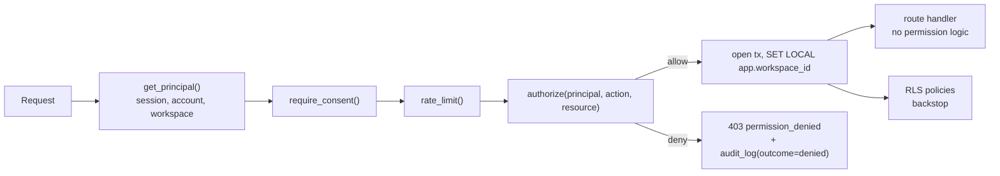

# Authorization and Sharing

## 1. The one rule

> Every authorization decision in the system is made by one function,
> `authorize(principal, action, resource)`, invoked as a FastAPI dependency before the route
> handler runs. Route handlers contain **zero** permission logic.

The reason is empirical: authorization bugs in applications like this one are almost never
"the policy was wrong". They are "there were eleven places that checked and the twelfth
forgot". One chokepoint turns a correctness problem into a coverage problem, and coverage is
testable.



## 2. Principal model

```python
@dataclass(frozen=True)
class Principal:
    kind: Literal["user", "share_link", "mcp_client", "pat", "system", "agent"]
    user_id: UUID | None
    workspace_id: UUID | None
    workspace_role: Literal["owner", "admin", "member", "guest"] | None
    session_id: UUID | None
    reauthed_at: datetime | None
    scopes: frozenset[str]          # PAT and MCP tokens only
    share_link_id: UUID | None      # anonymous link visitors
    acting_for_run_id: UUID | None  # agent acting on a user's behalf
    trust_level: Literal["trusted", "untrusted"]  # see safety doc
```

Modelling anonymous share-link visitors and agents as *principals* rather than as special
cases is what keeps the chokepoint honest. An agent calling a tool goes through the same
`authorize()` as a browser request, which is how "an agent cannot do something its owner
cannot do" becomes structurally true instead of aspirational.

## 3. Workspace roles (RBAC layer)

| Capability | owner | admin | member | guest |
| --- | --- | --- | --- | --- |
| Read resources granted to them | yes | yes | yes | yes |
| Create chats, run agents and pipelines | yes | yes | yes | no |
| Create and edit agents and pipelines | yes | yes | yes | no |
| Create connections (own) | yes | yes | yes | no |
| Read other members' connections | no | no | no | no |
| Manage provider keys | yes | yes | own only | no |
| Set tool policy to `always_allow` | yes | yes | own agents | no |
| Invite and remove members | yes | yes | no | no |
| Read audit log | yes | yes | no | no |
| Manage budgets | yes | yes | no | no |
| Transfer or delete the workspace | yes | no | no | no |

Note the row that is "no" for everyone including `owner`: **nobody reads another member's
connection tokens or provider keys.** A workspace owner can see *that* a connection exists,
revoke it, and see what it was used for in the audit log, but cannot borrow it. This is the
right default — a shared workspace is not consent to send email as a colleague — and it is
enforced by `connections.owner_user_id`, not by UI omission.

## 4. Resource ACL layer

`app.resource_grants` is the resource-level layer. Roles follow the Google Docs model because
users already understand it.

| Role | chat | agent | pipeline | memory_set | artifact |
| --- | --- | --- | --- | --- | --- |
| `viewer` | read messages and artifacts | read definition and runs | read definition and runs | read memories | read and download |
| `commenter` | viewer plus add comments | — | — | — | — |
| `editor` | viewer plus send messages, rename, re-share at or below own role | viewer plus edit and run | viewer plus edit, run, pause | viewer plus add and edit | viewer plus new version |
| `owner` | everything plus delete and transfer | everything | everything | everything | everything |

Resolution order in `authorize()`, highest wins:

1. `system` principal (internal jobs) — allowed, audited.
2. Resource `created_by == principal.user_id` and same workspace → `owner`.
3. Workspace `owner` or `admin` → `editor` on workspace-owned resources (not on another
   member's private memory sets or connections).
4. Direct grant in `resource_grants` for `subject_user_id`, unrevoked and unexpired.
5. Grant to a workspace the principal is a member of (`subject_type = 'workspace'`).
6. Share-link grant, if the principal arrived via a valid link.
7. Otherwise deny.

Declined by design: role **inheritance through a hierarchy** (folders, projects as permission
containers). It is the feature that makes authorization systems impossible to reason about,
and "share the chat" plus "share the workspace" covers the real use cases. Projects exist as a
memory scope and an organizing label, not as a permission boundary.

## 5. Derived access: what sharing a chat actually shares

The requirement is "sharing a chat grants access to the artifacts used in that chat". The
tempting implementation — copy an artifact grant for each referenced artifact at share time —
is wrong, because an artifact generated *after* the share would be missed, and revoking the
chat share would leave orphaned artifact grants behind. Both are silent, both are bad.

**Implementation: derive, don't copy.**

```python
def can_read_artifact(p: Principal, artifact_id: UUID) -> bool:
    if direct_grant_allows(p, "artifact", artifact_id, "viewer"):
        return True
    # Derived: readable if the principal can read ANY chat that references it
    return exists(
        select(ChatArtifact)
        .join(Chat, Chat.id == ChatArtifact.chat_id)
        .where(ChatArtifact.artifact_id == artifact_id)
        .where(chat_readable_predicate(p))        # same predicate authorize() uses
    )
```

Revoking the chat share instantly removes artifact access, and a newly generated artifact is
covered the moment it is linked. The cost is one extra join, served by
`ix_chat_artifacts_artifact`.

### The inclusion model, stated for users

This table appears verbatim in the share dialog, because the single most damaging thing a
sharing feature can do is surprise someone.

| Shared with a chat | Not shared, ever |
| --- | --- |
| All messages, including tool calls and results | Your connector tokens and OAuth grants |
| Reasoning traces, if the owner enables "include reasoning" on the link | Your LLM provider API keys |
| Artifacts uploaded or generated in that chat | Your personal or workspace memories |
| Which model was used, and the run's cost if the owner enables it | Your other chats, agents, or pipelines |
| Agent and tool names that were invoked | The ability to invoke any tool or connector |
| Memories that were *retrieved into* the conversation (they are already in the transcript) | Your memory sets themselves, or the ability to write memories |

Two consequences that need enforcing in code, not just documenting:

**A share-link principal can never execute a tool.** `authorize()` denies every
`action.startswith("tool.")` for `kind == "share_link"` unconditionally, before any grant
lookup. An `editor` link on a chat permits sending messages, which means running the model —
so link-based editors are capped at `commenter` in MVP and `editor` links require a
*registered* user grant in v1. A public URL that can spend the owner's API credits is a
denial-of-wallet vulnerability, so the capability is gated on an identified human.

**Retrieved memories are already disclosed.** If a memory was pulled into the context of a
shared conversation, its content is in the transcript. We surface this honestly in the share
dialog ("3 memories were used in this chat and will be visible") with a per-message redaction
option, rather than pretending transcript content can be clawed back.

## 6. Share links

```python
token = secrets.token_urlsafe(32)            # 256 bits, shown once
row.token_hash = sha256(token)               # only the hash is stored
```

| Control | Behaviour |
| --- | --- |
| Expiry | Optional `expires_at`; default suggestion 30 days, with "no expiry" requiring an explicit click |
| Revoke | `revoked_at` set; effective immediately, no cache |
| Password | Optional, Argon2id-hashed; `GET /v1/public/{token}` returns `403 password_required` first |
| Rate limit | 60 resolutions per minute per token, and per IP, at the edge — a public URL is an unauthenticated endpoint and must be treated as one |
| Visibility | `view_count` and `last_viewed_at` shown to the owner |
| Indexing | `X-Robots-Tag: noindex, nofollow` and a `robots.txt` deny on `/share/*` |
| Reasoning | Off by default on links. Reasoning traces routinely contain more candid intermediate content than the final answer. |

Link resolution never creates a session. The principal is `kind="share_link"` for that request
only, carrying no workspace role, which means every "is this user a member" branch naturally
fails closed.

### Email-targeted grants to people without accounts

`resource_grants` allows `subject_type = 'email'` with `subject_user_id IS NULL`. At signup,
and at every login, a job claims pending grants matching the user's **verified** email and
populates `subject_user_id`. Matching on an unverified email would be an account-takeover
primitive, so verification is required and the matching is case-folded via
`ix_grants_pending_email` on `lower(subject_email)`.

## 7. RLS as the backstop

Application-layer `authorize()` is the primary control. Postgres RLS
([04 §1](../04-database-schema.md)) is the second. They protect against different failures:

| Failure | Caught by |
| --- | --- |
| A new endpoint forgets its `authorize()` dependency | RLS — it returns zero rows for other tenants |
| A hand-written query omits `WHERE workspace_id = ...` | RLS |
| A background job runs without tenant context | RLS — sees nothing, fails loudly rather than leaking |
| The policy itself is wrong (a `viewer` can edit) | Only tests. RLS cannot express role semantics. |
| Cross-user access *within* a workspace (reading a colleague's connection) | Only `authorize()`. RLS is tenant-scoped, not user-scoped. |

So RLS does not make `authorize()` optional, and `authorize()` does not make RLS optional.
A CI check asserts that every route in the OpenAPI spec has either an `authorize()` dependency
or an explicit `@public` marker, which is what converts "we should remember" into "the build
fails".

## 8. Performance

Authorization runs on essentially every request, so it cannot be slow.

- **One query per request.** `get_principal()` loads session, user, membership, and role in a
  single joined query, cached on `request.state`.
- **Grant lookups are indexed and narrow.** `ix_grants_subject` covers the common path. For a
  list endpoint we never check N resources individually: the predicate
  (`chat_readable_predicate`) is composed into the list query itself as a `WHERE`, so
  pagination counts are correct and there is no N+1.
- **No permission cache with a TTL.** A revoked share that keeps working for 60 seconds is a
  real incident, and the queries are cheap enough that caching buys microseconds at the cost of
  a correctness hazard. If this ever becomes a measured bottleneck, the fix is a
  request-scoped memo plus an explicit invalidation event, not a TTL.

## 9. Test matrix

This is the one area where exhaustive testing is justified, because the cost of a gap is a
data breach. A parametrized test generates the full cross-product:

```
principals  = {owner, admin, member, guest, non_member, share_link_viewer,
               share_link_commenter, anonymous, pat_limited_scope, mcp_token,
               agent_acting_for_member, archived_member, revoked_session}
resources   = {own_chat, other_member_chat, other_workspace_chat, shared_chat,
               archived_chat, artifact_clean, artifact_infected, agent, pipeline,
               personal_memory_set, workspace_memory_set, connection, provider_key,
               audit_log, budget, mcp_token}
actions     = {read, list, create, update, delete, share, run, execute_tool,
               read_secret, rotate_secret, decide_approval}
```

The expectation table is **data, in a YAML fixture**, reviewed as a document. A PR that changes
a permission must change the fixture, which makes every authorization change visible in review
rather than buried in a policy function diff. Specific must-pass assertions:

1. Cross-workspace access returns `404 not_found`, never `403` — a `403` confirms the resource
   exists, which is an information leak on enumerable IDs.
2. A share-link principal gets `403` on every `tool.*` and `*_secret` action.
3. A `guest` cannot start a run, so cannot spend the workspace's credits.
4. An agent principal's effective permissions are the **intersection** of its owner's
   permissions and its configured tool allowlist — never a union, and never an escalation.
5. Direct SQL as the `younique_app` role without tenant context returns zero rows from every
   tenant-scoped table.
6. An archived resource returns `410 archived` to those who could read it, and `404` to those
   who could not. Archival is not a permission change.
