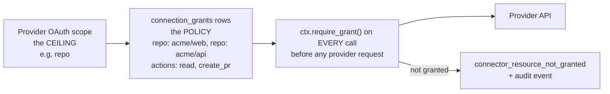

# Connector Framework

## 1. The design goal

Adding a connector must be a **self-contained contribution**: one directory, one manifest,
tools, tests, docs. No edits to the agent runtime, the API layer, or the frontend. If adding
Notion requires touching `agents/runtime/`, the framework has failed. Everything below is in
service of that one property, because community-contributed connectors are how the "any other
platform" requirement actually gets met.

## 2. Anatomy of a connector

```
connectors/
├── _sdk/                          # Apache-2.0, published as younique-connector-sdk
│   ├── manifest.py                # Pydantic models for the manifest
│   ├── tool.py                    # @tool decorator, ToolContext, ToolResult
│   ├── oauth.py                   # OAuth2AuthorizationCode, PKCE, refresh helpers
│   ├── http.py                    # SSRF-safe client, retry, rate-limit handling
│   ├── errors.py                  # ConnectorError hierarchy -> API error codes
│   └── testing.py                 # record/replay harness, fake ToolContext
├── gmail/
│   ├── manifest.py                # the single source of truth for this connector
│   ├── auth.py                    # provider-specific OAuth quirks
│   ├── client.py                  # thin API wrapper
│   ├── tools/
│   │   ├── send_email.py
│   │   ├── list_messages.py
│   │   └── get_message.py
│   ├── resources.py               # lists grantable resources (mailboxes, labels)
│   ├── health.py                  # the cheapest authenticated probe
│   ├── cassettes/                 # recorded HTTP for contract tests
│   ├── tests/
│   └── README.md                  # scopes, approval status, limitations, setup
├── github/
├── slack/
├── http/                          # generic, user-supplied auth
├── webhook/                       # inbound trigger source
└── mcp/                           # consume an external MCP server (v2)
```

Discovery is by directory scan at startup: each package exports `MANIFEST`, which is
registered into an in-process `ConnectorRegistry` and synced to a `connectors` catalogue table
for the API to serve. A connector with an invalid manifest fails startup loudly rather than
being skipped — a silently absent connector is much harder to diagnose.

## 3. The manifest

```python
MANIFEST = ConnectorManifest(
    key="gmail",
    display_name="Gmail",
    category="email",
    icon="gmail.svg",
    description="Send and read email through your Gmail account.",

    auth=OAuth2AuthorizationCode(
        authorize_url="https://accounts.google.com/o/oauth2/v2/auth",
        token_url="https://oauth2.googleapis.com/token",
        revoke_url="https://oauth2.googleapis.com/revoke",
        pkce=True,
        extra_authorize_params={"access_type": "offline", "prompt": "consent"},
        supports_byo_client=True,          # self-host escape hatch
    ),

    # Scopes are declared per permission bundle, never as one blob.
    permission_bundles=[
        PermissionBundle(
            key="send",
            display_name="Send email",
            description="Send email as you. Cannot read your mailbox.",
            scopes=["https://www.googleapis.com/auth/gmail.send"],
            tools=["gmail.send_email"],
            risk="high",
        ),
        PermissionBundle(
            key="read",
            display_name="Read email",
            description="Read your messages and attachments.",
            scopes=["https://www.googleapis.com/auth/gmail.readonly"],
            tools=["gmail.list_messages", "gmail.get_message"],
            risk="medium",
            produces_untrusted_content=True,       # critical: see safety doc
        ),
    ],

    grantable_resources=[
        GrantableResource(kind="mailbox", lister="resources:list_mailboxes", required=False),
    ],

    platform_status=PlatformStatus(
        approval_required=True,
        approval_kind="google_oauth_verification + CASA Tier 2 (annual)",
        approval_state="in_progress",
        limitations=[
            "All Gmail scopes are Google-restricted; a published app needs annual CASA.",
            "Unverified apps are capped at 100 test users.",
            "Attachments over 25 MB require the resumable upload endpoint.",
        ],
        byo_client_recommended=True,
    ),

    rate_limits=RateLimits(
        provider_quota="250 quota units/user/second",
        our_limit_per_minute=60,
        backoff="exponential_jitter",
    ),
    health_check="health:probe",
    docs_url="https://docs.younique.dev/connectors/gmail",
)
```

Three fields deserve emphasis.

**`permission_bundles`** are how "send-only versus read" becomes a real product feature rather
than a scope string buried in code. The connect flow shows bundles as checkboxes with
plain-language descriptions and a risk badge, requests only the selected bundles' scopes, and
the tools a connection exposes are the union of its granted bundles' tools. A user who picks
only `send` has a connection that is *incapable* of reading their mail — the tool does not
exist on it, so there is nothing to misconfigure.

**`produces_untrusted_content`** marks bundles whose tools return attacker-influenceable text.
Anyone can email you. The agent runtime reads this flag to taint a run, which gates high-risk
capabilities ([safety doc](safety-and-prompt-injection.md)). Getting this flag wrong is the
most consequential mistake a connector author can make, so a checklist item in the PR template
asks about it explicitly and a test asserts that every read-shaped tool's bundle sets it.

**`platform_status`** surfaces approval reality in the UI before a user invests effort. The
Instagram connector will say, in the connect dialog, that personal accounts cannot be used —
rather than letting someone connect and discover it when the first tool call fails.

## 4. Tool definition

```python
@tool(
    key="gmail.send_email",
    display_name="Send email",
    risk="high",                        # drives the default approval policy
    requires_bundle="send",
    idempotent=False,
    default_policy="ask_each_time",
    cost_hint="free",
)
class SendEmail(Tool):
    class Input(BaseModel):
        to: list[EmailStr] = Field(max_length=25)
        subject: str = Field(max_length=500)
        body_markdown: str = Field(max_length=100_000)
        cc: list[EmailStr] = Field(default_factory=list, max_length=25)
        attachment_artifact_ids: list[UUID] = Field(default_factory=list, max_length=10)
        reply_to_message_id: str | None = None

    class Output(BaseModel):
        provider_message_id: str
        thread_id: str

    def summarize_for_approval(self, inp: Input) -> ApprovalSummary:
        return ApprovalSummary(
            headline=f"Send email to {', '.join(inp.to)}",
            details=[("Subject", inp.subject), ("Attachments", str(len(inp.attachment_artifact_ids)))],
            body_preview=inp.body_markdown[:500],
            irreversible=True,
        )

    async def execute(self, ctx: ToolContext, inp: Input) -> Output:
        for aid in inp.attachment_artifact_ids:
            await ctx.require_artifact_clean(aid)       # raises if not scanned clean
        token = await ctx.access_token()                # handles refresh + locking
        ...
```

`Input` being a Pydantic model means the JSON Schema handed to the LLM is generated, validated
on the way in, and documented in the UI — one definition, four uses. The `max_length` bounds
are not decoration: they are the first line of defence against a prompt-injected agent emailing
a thousand recipients.

`summarize_for_approval` is mandatory for `risk="high"` tools and enforced by a test. An
approval dialog showing raw JSON is an approval dialog users click through without reading,
which defeats the entire mechanism. The human-readable summary is the product.

`ToolContext` is the only way a tool reaches the outside world, and it is what makes the
security properties enforceable in one place:

| `ctx` method | Guarantee |
| --- | --- |
| `ctx.access_token()` | Decrypt, refresh under an advisory lock, never expose the refresh token |
| `ctx.http` | SSRF-safe client: resolved-IP checks, no redirects to private ranges, timeouts, per-connector rate limiting |
| `ctx.require_grant(kind, ref, action)` | Raises `connector_resource_not_granted` unless `connection_grants` allows it |
| `ctx.require_artifact_clean(id)` | Raises unless the artifact scanned clean and the principal can read it |
| `ctx.emit_artifact(...)` | Register generated output as a versioned artifact |
| `ctx.mark_untrusted(text)` | Wrap returned content with provenance so the runtime taints the run |
| `ctx.budget` | Remaining spend and tool-call allowance for the run |
| `ctx.logger` | Pre-redacted structured logger bound to the run and step |

A tool that reaches for `httpx` directly instead of `ctx.http` bypasses SSRF protection and
rate limiting. A lint rule (`ruff` custom check plus a CI grep) forbids direct `httpx`,
`requests`, `socket`, and `subprocess` imports inside `connectors/*/`.

## 5. Granular permissions: scope is the ceiling, grants are the policy

OAuth scopes are coarse. GitHub's classic OAuth `repo` scope grants access to **every** repo
the user can reach; there is no "only these two" scope. The user requirement is explicitly
"specific repos only", so we enforce it ourselves.



Post-OAuth, the connect flow has a **resource selection step**: `GET /v1/connections/{id}/resources`
lists what the token can reach, and the user picks. Rules:

- The default is **nothing selected**. A user must affirmatively choose repos. Defaulting to
  "all" would make the feature theatre.
- Every tool calls `ctx.require_grant()` *before* the provider request, so an injected agent
  asking for `evil/exfil` is refused by us, not by GitHub.
- A denied grant check is a **security audit event**, not just an error, because in practice it
  means either a confused model or an injection attempt.
- Where a provider offers a genuinely narrower credential we prefer it: GitHub **App
  installation tokens** are repo-scoped by the platform, so the GitHub connector uses a GitHub
  App rather than an OAuth app, and `connection_grants` becomes defence in depth rather than
  the only control. This is worth the extra implementation cost for the highest-risk connector.

## 6. Platform approval reality

This is the section that governs the roadmap, and the numbers are not negotiable by effort.

| Platform | What is required | Elapsed time | Recurring | Plan |
| --- | --- | --- | --- | --- |
| **Google** (Gmail, Drive, Calendar) | OAuth app verification; **all Gmail and most Drive scopes are "restricted"**, requiring a CASA Tier 2/3 assessment by a Google-authorized assessor | 6-12 weeks, mostly waiting | **Annually** | Submit in Phase 0. Until cleared: hosted app in testing mode (≤100 users) plus BYO OAuth client for self-host. `drive.file` (non-restricted, per-file access) is used where possible to avoid the restricted tier entirely. |
| **Google Maps** | API key with billing; no app review | Days | No | MVP-eligible. Server-side key, usage-capped, referrer-restricted. |
| **Meta / Instagram** | Business verification plus App Review per permission; Business or Creator accounts only; **Basic Display API deprecated Dec 2024, so personal accounts have no API** | 4-10 weeks, with rejections common | On permission changes | v2. Scope to publish, comments, mentions, insights. State the personal-account limitation in the UI. |
| **LinkedIn** | `w_member_social` via the self-serve "Share on LinkedIn" product is available. **Feed reading and messaging have no API.** Marketing Developer Platform is partner-gated. | Days for self-serve; months and uncertain for partner | No | v2, publish-only. Do not promise reading. |
| **Slack** | App Directory review only for public distribution; private install needs none | 2-4 weeks for the directory | No | v1. Ship as a private/manual install first, which needs zero review. |
| **GitHub** | None. A GitHub App is self-serve. | Hours | No | v1, and the easiest high-value connector. Use a GitHub App for native repo scoping. |
| **Generic HTTP / webhook / MCP** | None | — | No | MVP. These are the "any other platform" answer. |

Three strategic consequences:

1. **The BYO OAuth client mode is not a nice-to-have; it is the product's unblock.** Every
   OAuth connector supports it (`supports_byo_client`). A self-hoster creates their own app in
   the provider's console, stays within that provider's "own use" allowance, and needs no
   review from anybody. The connect dialog offers "use Younique's app" or "use my own app",
   and for Google it explains why the second option exists.
2. **Prefer non-restricted scopes even when they are less convenient.** `drive.file` instead
   of `drive.readonly` means the agent only sees files the user explicitly picked — which is
   both a lower approval tier *and* genuinely better privacy. This trade is worth making
   almost every time.
3. **Approval state is data in the manifest**, so the UI, the docs site, and the connector
   catalogue all tell the same truth without anyone remembering to update three places.

## 7. Health and status

`connections.health` is populated by the connector's `health_check` probe — the cheapest
authenticated call that proves the token works (`GET /user` for GitHub, `auth.test` for Slack,
a profile fetch for Gmail).

| Trigger | Action |
| --- | --- |
| Daily `connector-sync` task | Probe every active connection; update `health` and `last_checked_at` |
| Token expiring within an hour | Proactive refresh |
| Refresh failure | `status = needs_reauth`, pause dependent schedules, notify with a one-click reconnect |
| Three consecutive probe failures | `health = failing`, notify |
| Provider returns 403 on a previously working scope | `needs_reauth` — the user revoked a scope provider-side |
| User revokes in our UI | Call the provider's `revoke_url`, zero the ciphertext, archive the connection |

Pausing dependent schedules on failure is the part that matters to the retail persona. A dead
connection should surface as a notification and a paused pipeline, not as fourteen consecutive
failed runs and a Monday morning with no report.

## 8. Testing a connector

Three tiers, and no more:

**Contract tests (required).** Recorded HTTP cassettes replayed with `respx`. Assert request
shape (URL, method, headers minus auth, body), response parsing, error mapping, and pagination.
Cassettes are recorded once against the real API by the author with
`YOUNIQUE_RECORD=1`, and a scrubber strips tokens, cookies, and emails before commit. CI fails
if a cassette contains anything matching the secret patterns.

**Error-path tests (required).** One case per error the provider actually returns: 401, 403,
429 with and without `Retry-After`, 404, 5xx, and a malformed body. Each must map to the
correct `ConnectorError` subclass. This tier catches more real bugs than the happy path does,
because the happy path is what the author already ran by hand.

**Grant-enforcement tests (required).** A tool called with a resource *not* in
`connection_grants` must raise `connector_resource_not_granted` **before** any HTTP request is
made. Asserted by a strict `respx` mock that fails the test on any unexpected call.

**Not tested:** live provider calls in CI, OAuth redirect flows end to end (one Playwright test
covers the generic flow once, against a mock provider — it is framework behaviour, not
per-connector behaviour), and exhaustive field-mapping of every response attribute.

## 9. The generic connectors

These three carry the "any other platform" requirement, and they are MVP because they are the
difference between a six-integration product and an open-ended one.

**`http`** — a user-configured HTTP tool. Base URL, auth (bearer, basic, header, query, or
OAuth2 client credentials), and a list of declared operations with JSON Schema parameters.
Locked down hard: an **explicit host allowlist per connection**, DNS resolution checked against
private and link-local ranges before connecting *and* after redirects (DNS rebinding), no
redirects to a different host by default, a 30 s timeout, a 10 MB response cap, and all
responses marked untrusted. Without the resolved-IP check this connector is an SSRF hole
pointed at the GCP metadata service, so that check is in `_sdk/http.py` and cannot be opted out
of.

**`webhook`** — an inbound trigger. We mint a URL with a high-entropy path plus an HMAC secret;
payloads are verified, replay-rejected on a timestamp window, size-capped, and delivered to a
trigger as untrusted content.

**`mcp`** (v2) — connect any external MCP server. Tools are discovered at connect time and
cached with their schemas. Every result is untrusted, every tool defaults to
`ask_each_time`, and the server's declared tool list is re-verified on each session because a
malicious MCP server changing a tool's description between sessions is a documented attack
("rug pull"). A tool-definition change requires re-approval by the user.
