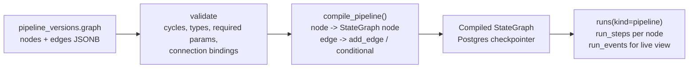

# Pipeline Engine

## 1. There is no pipeline engine

Pipelines **compile to LangGraph graphs**. This is the single most leveraged decision in the
plan, so it is worth being explicit about what it buys.

A pipeline needs: retries, cancellation, pause and resume, per-step input/output capture, cost
accounting, approval gates on destination steps, checkpointing so a two-hour run survives an
instance restart, and a run history UI. The agent runtime
([agent-runtime.md](agent-runtime.md)) already has every one of those. A separate pipeline
executor would mean two implementations of each, two sets of bugs, two cost-attribution paths
that disagree, and two run-history screens.

So `pipeline_versions.graph` (JSONB) is a declarative DAG, and a compiler turns it into a
`StateGraph` at run time. Pipeline runs are `runs` rows with `kind = 'pipeline'`, and node
executions are `run_steps` rows with `node_name` set. The run-detail UI is the same component.



## 2. Graph document

```json
{
  "schema_version": 1,
  "nodes": [
    {
      "id": "n1",
      "type": "source.gsheet",
      "label": "Supplier feed",
      "params": { "connection_id": "...", "spreadsheet_id": "...", "range": "Feed!A:Z",
                  "has_header": true },
      "position": { "x": 80, "y": 120 }
    },
    {
      "id": "n2",
      "type": "transform.clean",
      "label": "Clean",
      "params": { "trim": true, "drop_empty_rows": true,
                  "coerce": { "price": "decimal", "qty": "integer" },
                  "dedupe_on": ["sku"], "on_error": "quarantine_row" }
    },
    {
      "id": "n3",
      "type": "transform.diff",
      "label": "Compare to last week",
      "params": { "key": ["sku"], "compare": ["price", "qty"],
                  "baseline": { "kind": "previous_run_output", "node_id": "n2", "offset": 1 } }
    },
    {
      "id": "n4",
      "type": "ai.summarize",
      "label": "Explain discrepancies",
      "params": { "model_id": "...", "instructions": "...", "max_input_rows": 500,
                  "input_trust": "untrusted" }
    },
    {
      "id": "n5",
      "type": "dest.email",
      "label": "Email me",
      "params": { "connection_id": "...", "to": ["ops@acme.com"],
                  "subject": "Supplier discrepancies {{ run.date }}",
                  "attach_as": "xlsx" },
      "approval": "inherit"
    }
  ],
  "edges": [
    { "from": "n1", "to": "n2" },
    { "from": "n2", "to": "n3" },
    { "from": "n3", "to": "n4" },
    { "from": "n4", "to": "n5",
      "condition": { "kind": "expr", "expr": "n3.output.changed_count > 0" } }
  ]
}
```

That document is the retail persona's entire requirement — "clean this, compare it with last
week, and send me the discrepancies every Monday at 9am" — expressed declaratively, with the
`croniter` schedule attached as a trigger.

Note the conditional edge: if nothing changed, no email is sent. "Do not email me when there
is nothing to say" is the difference between a tool someone keeps and one they mute.

## 3. Node registry

Nodes are code, registered like connector tools, with a Pydantic params model that generates
both validation and the editor's form:

```python
@node(
    type="transform.diff",
    category="transform",
    label="Compare datasets",
    inputs={"current": DataFrameRef, "baseline": DataFrameRef | None},
    outputs={"added": DataFrameRef, "removed": DataFrameRef,
             "changed": DataFrameRef, "changed_count": int},
    idempotent=True,
)
class DiffNode(PipelineNode):
    class Params(BaseModel):
        key: list[str] = Field(min_length=1)
        compare: list[str] = Field(default_factory=list)
        baseline: BaselineSpec
        tolerance: dict[str, Decimal] = Field(default_factory=dict)

    async def run(self, ctx: NodeContext, inp: Inputs, p: Params) -> Outputs: ...
```

`GET /v1/node-types` serves the registry with each node's JSON Schema. **The visual editor
renders entirely from that response**, so adding a node type makes it appear in the palette
with a working parameter form and no frontend change. That is the property that makes "add a
pipeline node" a self-contained contribution.

### Node catalogue

| Category | Types | Phase |
| --- | --- | --- |
| Source | `source.csv_upload`, `source.gsheet`, `source.http`, `source.email_attachment`, `source.artifact`, `source.webhook_payload`, `source.sql` (read-only, user-supplied DSN), `source.previous_run` | v1 |
| Transform | `transform.clean`, `transform.filter`, `transform.map_columns`, `transform.join`, `transform.aggregate`, `transform.diff`, `transform.sort`, `transform.validate` (JSON Schema or column rules), `transform.pivot` | v1 |
| AI | `ai.summarize`, `ai.classify`, `ai.extract` (schema-constrained), `ai.generate`, `ai.agent` (invokes a full agent as a step) | v1 |
| Destination | `dest.email`, `dest.slack`, `dest.gsheet`, `dest.webhook`, `dest.artifact`, `dest.social_post` | v1 / v2 |
| Control | `control.branch`, `control.foreach` (bounded fan-out), `control.approval` (explicit human gate), `control.delay`, `control.error_handler` | v1 |

Deliberately absent: `transform.python` and `transform.javascript`. Arbitrary code execution
waits for the v2 sandbox ([00 §3.5](../00-assumptions-and-decisions.md)). The declarative
transform set covers the overwhelming majority of data-cleaning work, and `ai.extract` with a
schema covers much of the rest.

## 4. Data passing

Pipeline data is frequently too large for graph state. Everything passes **by reference**:

```python
DataFrameRef = (
    InlineRows(rows: list[dict], row_count: int)        # ≤ 500 rows and ≤ 256 KB
  | ArtifactRef(artifact_version_id: UUID)              # Parquet in GCS
)
```

`NodeContext.read_frame(ref)` and `ctx.write_frame(df)` are the only accessors. `write_frame`
decides inline versus spill based on size, so a node author never thinks about it. Spilled
frames are Parquet — columnar, compressed, typed, and readable directly by pandas and DuckDB,
which matters because the UI's step inspector reads a slice of the Parquet rather than
materializing the whole thing.

`run_steps.input_ref` / `output_ref` hold these references, which is exactly the "view per-step
input/output" requirement: the inspector resolves the ref, shows the first 100 rows plus the
schema and row count, and offers a download.

Intermediate artifacts are marked `origin = 'generated'`, `internal = true`, so they are
available for inspection and for `source.previous_run` baselines but do not clutter the
Artifacts page. Retention is 30 days, except the most recent successful output per node, which
is kept indefinitely so a week-over-week baseline never silently vanishes.

## 5. Validation before save

`POST /v1/pipelines/{id}/versions/{v}:validate` must pass before publish. Catching these at
edit time rather than at 9am on Monday is most of the perceived quality of a pipeline product.

| Check | Error |
| --- | --- |
| Cycle detection | `pipeline_cycle` with the offending node path |
| Disconnected node | `pipeline_node_unreachable` |
| No destination | `pipeline_no_destination` (warning, not an error — a pipeline may just write an artifact) |
| Type mismatch across an edge | `pipeline_type_mismatch` with both sides named |
| Missing required param | `pipeline_param_missing` |
| Connection not bound, revoked, or `needs_reauth` | `pipeline_connection_invalid` |
| Referenced resource not in `connection_grants` | `connector_resource_not_granted` |
| Model retired | `provider_model_deprecated` with the replacement offered |
| `foreach` without a bound | `pipeline_unbounded_fanout` |
| Estimated cost per run above the budget | `budget_exceeded` (warning with the estimate shown) |

The editor shows these inline on the offending node, and publish is blocked on errors.

## 6. Scheduling

One Cloud Scheduler job per minute drives everything
([02 §5.2](../02-system-architecture.md)). The correctness work is in the dispatcher.

```python
now = utcnow()
due = await db.execute(
    select(Schedule)
    .where(Schedule.state == "active", Schedule.next_fire_at <= now)
    .order_by(Schedule.next_fire_at)
    .with_for_update(skip_locked=True)
    .limit(500)
)
for s in due:
    fire_at = s.next_fire_at
    # Idempotency key makes a duplicated tick harmless
    run = await create_run(trigger=s.trigger, idempotency_key=f"sched:{s.id}:{fire_at.isoformat()}")
    await tasks.create(queue="pipeline-runs", name=f"run-{run.id}", payload={"run_id": run.id})
    s.last_fire_at = fire_at
    s.next_fire_at = next_fire(s.cron, s.timezone, after=fire_at)
```

| Concern | Handling |
| --- | --- |
| Concurrent ticks from multiple `api` instances | `FOR UPDATE SKIP LOCKED` plus a unique `idempotency_key` on `runs` plus a named Cloud Task — three independent barriers, because a duplicate email to the operator persona is a trust-destroying bug |
| Timezones and DST | `croniter` with `zoneinfo`. "9am Monday" in `Europe/London` is 09:00 local across the BST transition, not a fixed UTC offset. |
| DST spring-forward gap | A 02:30 daily schedule on the day 02:30 does not exist fires at 03:00 (the next valid instant). Documented, and shown by `GET /v1/schedules/{id}/next-fires`. |
| DST fall-back duplicate | A 01:30 schedule on the day 01:30 happens twice fires **once**, on the first occurrence, enforced by the `idempotency_key` containing the UTC instant. |
| Missed fires (outage, long pause) | `catchup_policy` per schedule: `skip` (default — fire once for now, log the skipped count), `run_once`, or `run_all` (capped at 10). Default `skip`, because catching up 200 missed runs is almost never what the user wants and can be expensive. |
| A run still going when the next fires | `overlap_policy`: `skip` (default), `queue` (max 1 deep), or `allow` |
| Clock skew | `next_fire_at` is computed from the previous **scheduled** time, never from "now", so drift cannot accumulate |
| Paused schedule | `state = 'paused'`; excluded by the partial index, so no cost on the hot query. On resume, `next_fire_at` is recomputed forward from now. |

`GET /v1/schedules/{id}/next-fires?count=5` renders the next five fires in the user's local
timezone in the editor. It exists purely to build confidence that the cron means what the user
thinks — the cheapest possible fix for the most common scheduling complaint.

## 7. Visual editor and run monitoring

React Flow (xyflow). Two views over the same graph document.

**Edit mode.** Palette from `GET /v1/node-types`, drag to canvas, click a node for a form
generated from its JSON Schema, edges drawn between typed ports with incompatible connections
refused at drag time. Autosave to a draft version; publish creates an immutable
`pipeline_versions` row. A running pipeline always executes a **published** version, so editing
never mutates something mid-flight.

**Run mode.** The same layout, with each node coloured by `run_steps.status` and animated
edges showing data flow. Updated over the run's SSE stream, so it is live rather than polled.
Clicking a node opens the step inspector: parameters as executed, input preview, output
preview, duration, cost, logs, and the error with its remediation if it failed. A failed node
offers "retry from here", which creates a new run seeded with the prior run's upstream outputs
— the feature that turns debugging a pipeline from minutes into seconds.

Accessibility: a node graph is not keyboard-navigable by default, so the editor ships with a
**list view** that presents the same DAG as a nested, fully keyboard-operable outline with the
same editing capabilities. This is not a degraded fallback; some users prefer it, and it is the
only honest way to meet the accessibility requirement for this screen.

## 8. Archive, not delete

`DELETE /v1/pipelines/{id}` sets `archived_at`. The pipeline disappears from the user's list,
its schedules are paused, its run history is retained, and `POST :restore` brings it back. Same
for agents, chats, memories, memory sets, artifacts, and connections — with one exception:
**revoking a connection also calls the provider's revoke endpoint and zeroes the stored
ciphertext**, because retaining a live credential that the user asked to remove would be
indefensible. The connection row survives for audit and attribution; the token does not.

Hard deletion happens only through the GDPR erasure job, documented in
[08-security-and-privacy.md](../08-security-and-privacy.md).

## 9. Testing

| Test | Proves |
| --- | --- |
| Compile a representative DAG | Nodes and edges map to the expected `StateGraph` topology |
| Validation table | Each row in §5 produces its specific error |
| `transform.diff` correctness | Added, removed, and changed rows against fixture CSVs, including tolerance and mixed types |
| Inline-to-spill threshold | A frame just over the limit spills to Parquet; round-trips identically |
| Conditional edge | The email node is skipped when `changed_count == 0` |
| DST matrix | Spring-forward gap, fall-back duplicate, and a normal week across three timezones |
| Dispatcher idempotency | Two concurrent ticks for the same due schedule create exactly one run |
| Resume mid-pipeline | Kill after node 3; resume re-executes only nodes 4+ |
| Published-version immutability | Editing while a run is in flight does not change that run's behaviour |

**Not tested:** the React Flow canvas interaction itself (library behaviour), every node type's
full parameter matrix (one happy path plus one error path per node), and visual regression on
the graph rendering.
