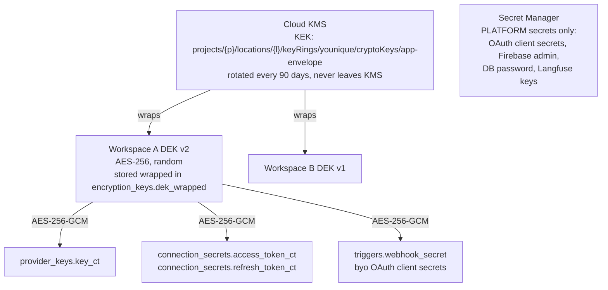
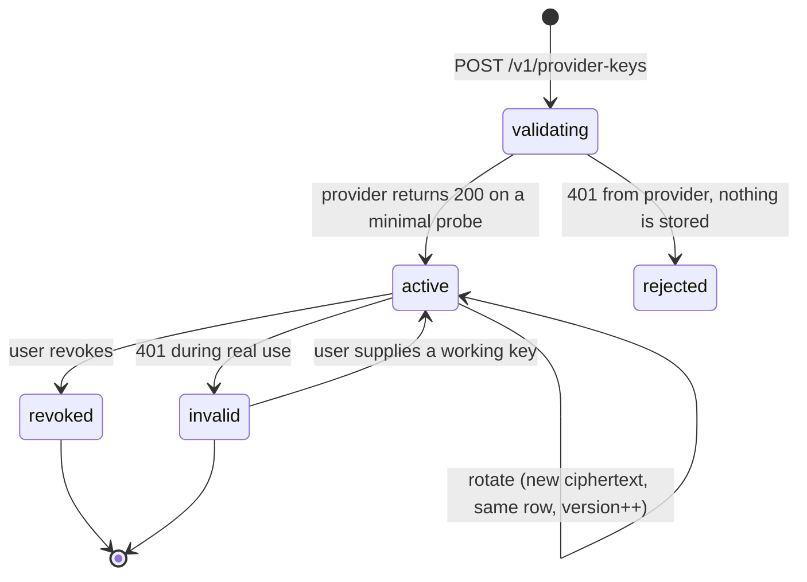

# Secrets, BYOK, and Connector Tokens

Two kinds of user secret flow through this system: **LLM provider API keys** the user brings,
and **OAuth tokens** for connected services. Both are credentials to someone else's account,
both are the highest-value target in the database, and both get the same treatment.

## 1. Key hierarchy



Three levels, each with a distinct job:

- **KEK in Cloud KMS.** Never exported. A database dump is worthless without a live IAM
  identity that can call `kms.cryptoKeyVersions.useToDecrypt`.
- **Per-workspace DEK.** A random 256-bit key, wrapped by the KEK, stored in Postgres. Per
  workspace rather than global so a single-tenant key compromise is bounded, and so GDPR
  erasure of a workspace can be implemented as **crypto-shredding**: destroy the DEK and every
  ciphertext for that tenant is permanently unrecoverable, including in backups we cannot
  selectively edit.
- **Ciphertext in Postgres.** The secret itself.

### Why not one Secret Manager secret per user key

This is the obvious design and it is wrong at this scale.

| Concern | Secret Manager per user key | Envelope in Postgres |
| --- | --- | --- |
| Cost | Billed per secret version per month plus per access. Tens of thousands of user keys plus hourly OAuth refresh rotations becomes a real line item. | Storage is rows; KMS is billed per `unwrap`, which we cache per request. |
| Quotas | Per-project secret count and API rate limits become a scaling ceiling we do not control. | Postgres rows. |
| Transactionality | "Create connection and store token" spans two systems, so a failure leaves an orphan on one side. | One transaction. |
| GDPR erasure | Secret Manager's soft-delete and version retention fight "delete it now, verifiably". | Crypto-shredding is instant and provable. |
| Backup consistency | Two systems with independent backup timelines. | One `pg_dump`, one PITR window. |

Secret Manager keeps the job it is good at: a small, static set of **platform** secrets,
mounted at Cloud Run boot, versioned, and IAM-controlled.

## 2. Encryption details

AES-256-GCM via `cryptography.hazmat`, with a 96-bit random nonce per encryption.

```python
AAD = b"|".join([
    b"younique:v1",
    str(workspace_id).encode(),
    secret_kind.encode(),        # "provider_key" | "oauth_access" | "oauth_refresh" | ...
    str(row_id).encode(),
    str(key_version).encode(),
])
ciphertext = AESGCM(dek).encrypt(nonce, plaintext, AAD)
stored = b"\x01" + nonce + ciphertext   # version byte || nonce || ct+tag
```

The **additional authenticated data** is the part that matters and the part most
implementations omit. Without it, an attacker with `UPDATE` on the table (a SQL injection, a
compromised read-write credential, a bad migration) can copy another workspace's ciphertext
into their own row and the application will happily decrypt it and use it. With AAD bound to
`workspace_id` and `row_id`, that ciphertext fails authentication and the decrypt raises. This
converts a tampering attack into a loud error.

The leading version byte means the format can evolve — a future move to XChaCha20-Poly1305 or
a different AAD scheme is a branch on byte zero, not a flag day.

### Operational caching

Unwrapping the DEK on every request would add a KMS round trip to the hot path. The DEK is
cached **in process memory only**, keyed by `(workspace_id, key_version)`, for 5 minutes, with
a hard cap on entries. Never written to disk, never to a shared cache, and cleared on SIGTERM.
A Cloud Run instance's memory is the trust boundary we already accept for plaintext secrets
during use.

## 3. Provider key lifecycle (BYOK)



**Validate before storing.** On save we make the cheapest possible authenticated call
(`GET /v1/models` for OpenAI, a 1-token `messages` call for Anthropic) and refuse to persist a
key that does not work. A key that silently fails at 3am inside a scheduled pipeline is a much
worse experience than a form error.

**Reads never return material.** `GET /v1/provider-keys` returns
`{id, provider, label, last4, status, created_at, last_validated_at, last_used_at}`. There is
no endpoint that returns a key, for anyone, including the owner and including a workspace
admin. If you lose it, you rotate it. A "reveal key" feature is the single most common way
these systems leak, usually through a screenshot or a browser extension, and the benefit is
nil because the user already has the key in the provider's console.

**`last4` only, never `first4`.** Provider key prefixes (`sk-ant-api03-`, `sk-proj-`) are
structural and give an attacker a head start on a brute force or a guess at which provider
account it belongs to. The last four characters are enough for a human to disambiguate two keys.

**Rotation** writes new ciphertext to the same row with `version + 1`, so every reference
(`usage_events.provider_key_id`) stays intact and usage history survives. **Revocation** is a
status change plus a zeroing of `key_ct`; the row persists so historical usage attribution
does not develop holes.

**Step-up re-auth** ([auth doc §4](auth-and-multi-account.md)) is required for save, rotate,
and revoke. A stolen session cookie should not be sufficient to swap in an attacker's key and
bill the user, or to exfiltrate by rotating.

### Marking a key invalid

When a provider returns `401`, the run fails with `provider_invalid_key`, the key is marked
`invalid`, every scheduled agent and pipeline depending on it is **paused** rather than left to
fail repeatedly, and the user is notified. Repeated authentication failures against a provider
look like credential stuffing from the provider's side and can get the user's account flagged,
so failing fast and stopping is the correct behaviour, not retrying.

## 4. Connector token lifecycle

OAuth tokens have a problem provider keys do not: they expire, and refreshing them is a
distributed-systems race.

### The refresh race

Five concurrent pipeline steps using the same Gmail connection all see an expired access token
and all call the token endpoint. Google — and most providers — invalidate the old refresh token
on use (refresh token rotation), so four of those five calls fail and, worse, can invalidate the
refresh token the winner just obtained. The connection dies and the user has to re-authorize,
which from their side looks like the product is broken.

**Solution: a database advisory lock, scoped to the connection.**

```python
async def get_access_token(conn_id: UUID) -> str:
    sec = await load(conn_id)
    if sec.access_expires_at > now() + timedelta(seconds=120):
        return decrypt(sec.access_token_ct)

    # Serialize refresh across every instance and every request
    async with pg_advisory_xact_lock(hash_connection(conn_id)):
        sec = await load(conn_id)                  # re-read inside the lock
        if sec.access_expires_at > now() + timedelta(seconds=120):
            return decrypt(sec.access_token_ct)    # someone else refreshed
        new = await provider.refresh(decrypt(sec.refresh_token_ct))
        await store(conn_id, new)                  # rotated refresh token too
        return new.access_token
```

`pg_advisory_xact_lock` releases automatically on transaction end, including on a crash, which
a Redis lock with a TTL does not guarantee as cleanly. The 120-second skew buffer prevents a
token that is valid *now* from expiring mid-request.

Refresh failure moves the connection to `needs_reauth`, pauses dependent schedules, and
notifies the user with a one-click reconnect — never a silent retry loop.

### Proactive refresh

A `connector-sync` task refreshes tokens expiring within the hour and runs a lightweight
health probe per connection daily, populating `connections.health`. The point is that a user
discovers a dead connection on the Connections page, not at 9am on Monday when the discrepancy
report does not arrive.

## 5. Redaction

Encryption at rest is the easy half. Secrets leak through logs, traces, error messages, and
prompts far more often than through the database.

Four enforced layers:

**1. Logging.** A `structlog` processor runs on every event, not as a convention at call sites:

```python
SENSITIVE_KEYS = {"authorization", "api_key", "access_token", "refresh_token",
                  "client_secret", "password", "token", "secret", "cookie",
                  "key_ct", "dek_wrapped", "id_token", "private_key"}
SECRET_PATTERNS = [
    r"sk-ant-api\d{2}-[\w-]{20,}", r"sk-proj-[\w-]{20,}", r"sk-[A-Za-z0-9]{32,}",
    r"gh[pousr]_[A-Za-z0-9]{36,}", r"xox[baprs]-[A-Za-z0-9-]{10,}",
    r"ya29\.[\w.-]+", r"AIza[\w-]{35}", r"yq_pat_[A-Za-z0-9]{32,}",
    r"eyJ[A-Za-z0-9_-]{10,}\.[A-Za-z0-9_-]{10,}\.[A-Za-z0-9_-]{10,}",  # JWT
]
```

Key-name matching is case-insensitive and recursive through nested dicts and lists. Pattern
matching is the backstop for a secret that arrives inside a free-text field — a user pasting a
key into the chat, which happens constantly. Redacted values become
`"[redacted:api_key]"`, preserving the shape for debugging.

**2. Traces.** An OTel `SpanProcessor` applies the same redaction to attributes and events.
Prompt and completion content is **not recorded by default**; a workspace can opt into content
capture for debugging, and even then the secret patterns still apply. Details in
[09-observability.md](../09-observability.md).

**3. Errors.** Provider SDK exceptions frequently echo the request, including the
`Authorization` header. Every outbound call is wrapped by a normalizer that constructs our own
typed error from status code plus a known-safe subset of the body. The raw exception string
never reaches a log, a trace, an API response, or a user.

**4. Prompts.** Secrets must never enter an LLM context — the provider logs it, and the model
may repeat it. Tool results are scanned with the same patterns before being added to the
message history, and a match is replaced and flagged as a security audit event, because a
connector returning something key-shaped is worth investigating.

A unit test feeds a known-secret corpus through all four paths and asserts zero leakage.

## 6. Self-host without Cloud KMS

Self-hosters should not need a GCP account. `CRYPTO_BACKEND` selects the KEK provider:

| Backend | KEK source | Suitable for |
| --- | --- | --- |
| `gcp_kms` | Cloud KMS | Hosted and production self-host on GCP |
| `env` | A 32-byte base64 key in `YOUNIQUE_MASTER_KEY` | Local development, single-node self-host |
| `file` | A key file with 0400 permissions, path from env | Docker and bare-metal self-host |
| `vault` (v2) | HashiCorp Vault transit engine | Enterprise self-host |

The interface is three methods (`wrap`, `unwrap`, `key_id`), so the DEK, AAD, and ciphertext
format are identical across backends and a workspace can be migrated between them by
re-wrapping DEKs — no ciphertext rewrite needed. The `env` backend logs a loud startup warning
if `ENVIRONMENT=production`, and refuses to start if the key is the documented example value.

## 7. Threats and mitigations

| Threat | Mitigation | Residual risk |
| --- | --- | --- |
| Database dump stolen (backup leak, replica exposure, SQL injection `SELECT`) | Ciphertext only; KEK in KMS requires live IAM | None meaningful |
| SQL injection with write access swaps ciphertext between rows | AAD bound to `workspace_id` and `row_id` | Decrypt fails loudly |
| Compromised Cloud Run instance | Plaintext is in memory during use; least-privilege service account; KMS audit logs every unwrap with a caller identity | Accepted — a compromised runtime can always read what it processes. Detection via anomalous unwrap volume. |
| Stolen session cookie | Step-up re-auth required for all secret operations; keys are never readable even then | Attacker can *use* the key via chat but cannot exfiltrate it |
| XSS | Keys are never sent to the frontend; `httpOnly` cookie; strict CSP | Attacker can act as the user in-session, not steal credentials |
| Malicious or compromised dependency exfiltrates secrets | Lockfiles with hash pinning, Dependabot, `pip-audit` and `npm audit` in CI, no network egress from `worker` except an allowlist | The highest residual risk in the system. v1 adds egress allowlisting via VPC Service Controls. |
| Insider or maintainer access to production | No human has `kms.decrypt` in prod; break-glass access requires a second approver and writes an alert | Audited, not prevented |
| Secret leaks into logs or traces | Four-layer redaction plus a leakage test | A novel key format not in the pattern list — mitigated by the key-name layer catching it structurally |
| GDPR "delete my data" must cover backups | Crypto-shredding: destroy the workspace DEK | Metadata rows remain until the retention window expires; documented in the privacy policy |
