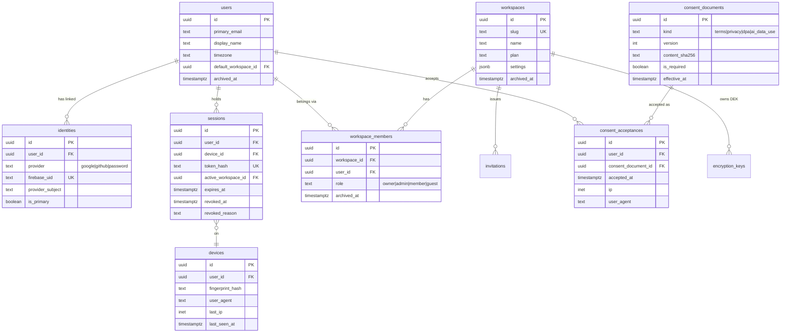
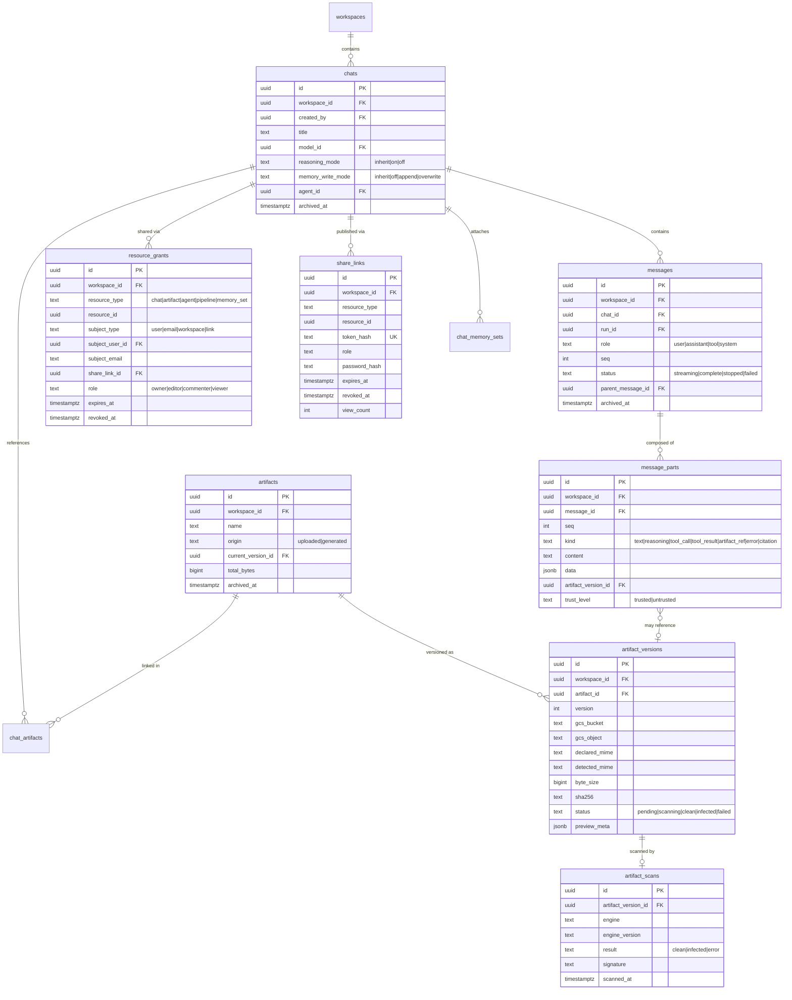
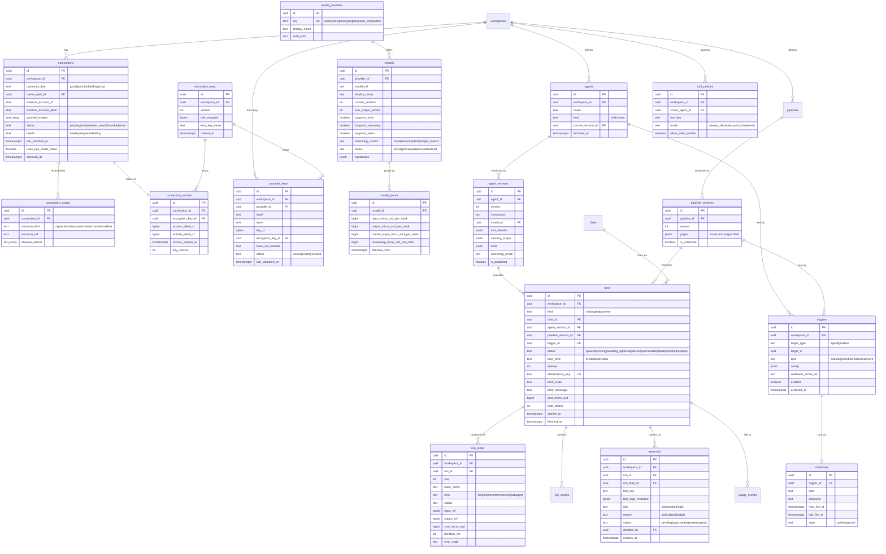
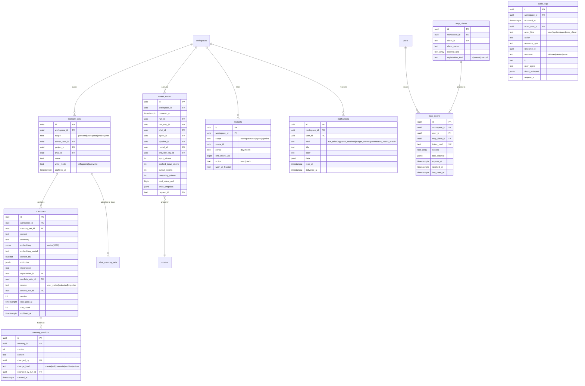

# 04 — Database Schema

Postgres 16 on Cloud SQL. One database, four schemas:

| Schema | Owner | Migrated by |
| --- | --- | --- |
| `app` | Us. All business tables. | Alembic |
| `langgraph` | `langgraph-checkpoint-postgres`. Checkpoints, writes, blobs. | **The library's own `setup()`**, never Alembic |
| `audit` | Append-only security log, partitioned. Separate schema so we can grant it `INSERT`-only. | Alembic |
| `analytics` | Materialized rollups. Droppable and rebuildable. | Alembic |

Keeping LangGraph's tables in their own schema is not cosmetic. The library evolves its
checkpoint format independently, and if Alembic ever autogenerates against them we will
produce a migration that corrupts live agent state. The backend rules file states this as a
hard rule, and CI asserts that no Alembic migration references the `langgraph` schema.

## 1. Conventions

These apply to every table unless explicitly noted.

| Convention | Rule | Why |
| --- | --- | --- |
| Primary key | `id uuid PRIMARY KEY` holding a **UUIDv7**, generated in Python via `uuid6.uuid7()` | Time-ordered, so B-tree inserts stay at the right edge of the index instead of scattering like UUIDv4. Not generated in-database because Cloud SQL's extension allowlist does not include `pg_uuidv7`. |
| Tenancy | `workspace_id uuid NOT NULL REFERENCES app.workspaces(id)` on every tenant-scoped table | One column, one RLS policy shape, one index prefix. Denormalized onto child tables (e.g. `message_parts`) deliberately so RLS never needs a join. |
| Audit columns | `created_at timestamptz NOT NULL DEFAULT now()`, `updated_at timestamptz NOT NULL DEFAULT now()`, `created_by uuid`, `updated_by uuid` | `updated_at` maintained by a single shared trigger, not by the ORM, so raw SQL fixes cannot skip it. |
| Soft delete | `archived_at timestamptz`, `archived_by uuid`. Never `is_deleted boolean`. | A timestamp answers "when" and "whether" in one column, and partial indexes `WHERE archived_at IS NULL` keep hot queries on the live subset. |
| Enumerations | `text` with a `CHECK (col IN (...))` constraint, not native `CREATE TYPE` enums | Native enums cannot drop a value and `ALTER TYPE ... ADD VALUE` has transaction restrictions that complicate zero-downtime migration. A `CHECK` is a one-line change. |
| Money | `cost_micro_usd bigint` — millionths of a USD | Never floats for money. LLM costs genuinely need six decimal places (a cached-input token can be $0.00000030). |
| Timestamps | Always `timestamptz`, always stored UTC. User timezones live in `users.timezone` and `schedules.timezone`. | The retail persona's "Monday 9am" is a presentation and scheduling concern, not a storage concern. |
| JSONB | Used for *genuinely open* shapes: connector-specific config, node parameters, provider raw responses, trigger definitions. Anything we filter, sort, join, or constrain on is a real column. | JSONB cannot be foreign-keyed or cheaply constrained, and `->>` predicates mislead the planner. The test: "will we ever need an index or FK on this?" If maybe, make it a column. |
| Naming | `snake_case`, plural tables, singular columns, `fk_`/`ix_`/`uq_`/`ck_` prefixes on constraints | Alembic autogenerate produces readable diffs when names are deterministic. |
| Deletes | `ON DELETE RESTRICT` by default; `CASCADE` only for owned child rows that are meaningless alone (`message_parts`, `artifact_versions`, `run_steps`) | An accidental cascade across tenancy boundaries is unrecoverable. |

### Row-Level Security

RLS is the backstop for the `authorize()` chokepoint, not a replacement for it.

```sql
-- Applied to every tenant-scoped table
ALTER TABLE app.chats ENABLE ROW LEVEL SECURITY;
ALTER TABLE app.chats FORCE ROW LEVEL SECURITY;

CREATE POLICY tenant_isolation ON app.chats
  USING (workspace_id = current_setting('app.workspace_id', true)::uuid)
  WITH CHECK (workspace_id = current_setting('app.workspace_id', true)::uuid);
```

The application connects as `younique_app`, a role that is **not** the table owner and does
**not** have `BYPASSRLS`. Every request's database session opens a transaction and issues:

```sql
SET LOCAL app.workspace_id = $1;
SET LOCAL app.user_id = $2;
```

`SET LOCAL` (not `SET`) is essential: it is scoped to the transaction and reset on commit or
rollback, which makes it safe with a connection pool. A plain `SET` would leak one tenant's
context onto the next request that borrows the connection — the single most dangerous bug this
schema can have. The SQLAlchemy session dependency owns this, no caller sets it manually, and
a test asserts that a session opened without a workspace context sees zero rows.

Three deliberate exceptions, each with its own narrow policy: `app.users` and `app.identities`
(cross-workspace by nature, policed by `app.user_id`), `audit.*` (insert-only for the app
role, readable only by an admin role), and `app.models` / `app.model_prices` (global registry,
readable by all, writable only by the admin role).

## 2. ER diagrams

Split by domain, because a single diagram of ~50 tables is unreadable.

### 2.1 Identity, tenancy, and consent



### 2.2 Chat, artifacts, and access control



### 2.3 Connectors, secrets, models, agents, pipelines, and runs



### 2.4 Memory, usage, audit, and operations



## 3. Design decisions worth defending

### 3.1 `message_parts` as rows, not a JSONB blob on `messages`

An assistant turn is a heterogeneous, ordered sequence: reasoning, text, a tool call, a tool
result, a citation, more text. Storing that as `messages.content jsonb` is tempting and wrong
for four reasons.

1. **Reasoning traces must be independently hideable and independently deletable.** A
   workspace that disables reasoning display, or a retention policy that drops reasoning after
   30 days, is a `DELETE WHERE kind = 'reasoning'` — not a rewrite of every message row.
2. **Streaming resume needs per-part sequence numbers.** We append parts as they arrive, so a
   reconnect replays from a known `(message_id, seq)`.
3. **Trust level is per-part.** A tool result from an email body is untrusted; the user's own
   text is trusted. Taint tracking needs a column, and a column inside JSONB cannot be indexed
   usefully or constrained.
4. **Artifact references need a real foreign key.** `artifact_version_id` as an FK means a
   referenced artifact cannot vanish; as a JSONB field it means silent dangling pointers.

The cost is one extra join on chat load, which is fully served by
`ix_message_parts_message_seq`.

### 3.2 One `runs` table for chat turns, agent runs, and pipeline runs

Retries, cancellation, cost accounting, approvals, step history, trust level, and budget
enforcement are identical across all three. Three parallel tables would mean three
implementations of each and inevitably three different bugs. A discriminator column plus three
nullable FKs (`chat_id`, `agent_version_id`, `pipeline_version_id`) with a `CHECK` enforcing
exactly one is the cheaper shape:

```sql
CONSTRAINT ck_runs_kind_target CHECK (
  (kind = 'chat'     AND chat_id IS NOT NULL AND agent_version_id IS NULL AND pipeline_version_id IS NULL)
  OR (kind = 'agent'    AND agent_version_id IS NOT NULL AND pipeline_version_id IS NULL)
  OR (kind = 'pipeline' AND pipeline_version_id IS NOT NULL AND agent_version_id IS NULL)
)
```

Pipeline node executions are `run_steps` rows with `node_name` set. The "per-step input/output"
requirement is satisfied by the same table that serves agent step history and the same UI
component.

### 3.3 `input_ref` / `output_ref` as JSONB pointers, not inline payloads

A pipeline step can pass a 40 MB dataframe. Storing step I/O inline would bloat the hot table
and blow up `pg_dump`. So `run_steps.input_ref` holds either a small inline value
(`{"inline": {...}}`, capped at 8 KB) or a pointer (`{"artifact_version_id": "..."}` or
`{"gcs_object": "..."}`). The UI's step inspector resolves pointers lazily. One helper
(`materialize_ref`) is the only code that knows the difference.

### 3.4 Partitioning: three tables yes, `messages` no

Declarative `RANGE` partitioning by month, with a monthly job that pre-creates the next two
partitions and detaches partitions past retention:

| Table | Partition | Retention | Why |
| --- | --- | --- | --- |
| `app.usage_events` | monthly on `occurred_at` | 25 months hot, then export to GCS Parquet | Append-only, always queried by time range, highest row count in the system. Dropping an old partition is instant; `DELETE` of 200M rows is not. |
| `audit.audit_logs` | monthly on `occurred_at` | 13 months (24 if SOC 2 is pursued) | Same access pattern, plus a legal retention boundary that maps exactly to partition detach. |
| `app.run_events` | monthly on `created_at` | 30 days | The SSE replay buffer. High write volume, short life, read only during an active run or a recent replay. |

**`messages` is deliberately not partitioned.** Its dominant query is "load this chat,
ordered", which is scoped by `chat_id`, not by time. `RANGE` partitioning on `created_at`
would make every chat load touch every partition a long-running chat spans. `HASH` on
`chat_id` would help that one query and hurt every cross-chat listing while adding permanent
operational weight. The trigger to revisit is **100 million rows or a p95 chat-load above
200 ms**, whichever comes first; at that point `HASH(chat_id)` with 32 partitions is the move.
Same reasoning for `run_steps`, with a trigger of 50 million rows.

### 3.5 Vector storage

`memories.embedding vector(1536)` with an HNSW index:

```sql
CREATE INDEX ix_memories_embedding_hnsw
  ON app.memories USING hnsw (embedding vector_cosine_ops)
  WITH (m = 16, ef_construction = 64)
  WHERE archived_at IS NULL;
```

HNSW over IVFFlat because IVFFlat needs representative data at build time and degrades as the
corpus grows, while memory corpora grow continuously from empty. The partial predicate keeps
archived memories out of the index entirely, which is both faster and a correctness guarantee
that archived memories cannot be retrieved.

`pgvector` cannot have a variable-dimension column, which is the real constraint behind
[assumption A9](00-assumptions-and-decisions.md). `embedding_model` is recorded per row so a
future model change is a mechanical backfill: add `embedding_v2`, dual-write, backfill, swap
the index, drop the old column. The alternative — one table per embedding model — adds a
union to every retrieval query to solve a problem we will face at most once a year.

Hybrid retrieval needs lexical search too, so `content_fts tsvector` is a stored generated
column with a GIN index. Keeping it generated means it can never drift from `content`:

```sql
content_fts tsvector GENERATED ALWAYS AS (to_tsvector('english', content)) STORED
```

### 3.6 Price snapshotting in `usage_events`

`cost_micro_usd` is computed **at write time** from the `model_prices` row effective at
`occurred_at`, and the full price row is copied into `price_snapshot jsonb`. Historical cost is
therefore immutable and auditable even after a provider changes pricing or we fix a pricing
error. Recomputing cost from current prices — the obvious shortcut — silently rewrites
financial history and makes last month's invoice irreproducible.

`request_id` is `UNIQUE` and carries the provider's request identifier (or a synthesized one).
That is how a Cloud Tasks retry of a step whose LLM call already succeeded cannot double-bill:
the insert conflicts and is skipped.

### 3.7 Secrets as `bytea` in Postgres, not Secret Manager rows

`provider_keys.key_ct` and `connection_secrets.*_ct` hold AES-256-GCM ciphertext. The data key
is a per-workspace DEK in `encryption_keys.dek_wrapped`, itself wrapped by a per-environment
Cloud KMS KEK. Additional authenticated data is bound to
`workspace_id || row_id || key_version`, so a ciphertext copied from one row to another fails
to decrypt — this defeats the "swap another tenant's token into my row" attack that encryption
alone does not stop. Full treatment in
[03-designs/secrets-and-byok.md](03-designs/secrets-and-byok.md); the rejected alternative is
argued in [02 §6](02-system-architecture.md).

### 3.8 The models registry is data, not code

"Users can use new models as they release, without a redeploy" means the registry must be
rows. `app.models` and `app.model_prices` are seeded from
`packages/model-registry/models.yaml` by an idempotent migration-time upsert, and are editable
by an admin at runtime. A workspace can also register a private model (an OpenAI-compatible
endpoint, a local Ollama) with `workspace_id` set — hence `models.workspace_id` is nullable,
`NULL` meaning global.

### 3.9 `idempotency_keys` and `outbox`

Two small tables that prevent two whole classes of bug.

```sql
CREATE TABLE app.idempotency_keys (
  id                uuid PRIMARY KEY,
  workspace_id      uuid NOT NULL,
  user_id           uuid NOT NULL,
  key               text NOT NULL,
  endpoint          text NOT NULL,
  request_sha256    text NOT NULL,
  response_status   int,
  response_body     jsonb,
  state             text NOT NULL CHECK (state IN ('in_flight','completed')),
  created_at        timestamptz NOT NULL DEFAULT now(),
  expires_at        timestamptz NOT NULL,
  CONSTRAINT uq_idem UNIQUE (workspace_id, user_id, endpoint, key)
);

CREATE TABLE app.outbox (
  id             uuid PRIMARY KEY,
  workspace_id   uuid,
  topic          text NOT NULL,
  payload        jsonb NOT NULL,
  created_at     timestamptz NOT NULL DEFAULT now(),
  published_at   timestamptz,
  attempts       int NOT NULL DEFAULT 0,
  last_error     text
);
CREATE INDEX ix_outbox_unpublished ON app.outbox (created_at) WHERE published_at IS NULL;
```

Replaying a request with the same key and the same body returns the stored response; with a
*different* body it returns `409 idempotency_key_reuse`, which catches a client bug rather than
silently doing the wrong thing. The outbox exists because "insert a row and publish to Pub/Sub"
is not atomic — without it, a rollback after a successful publish emits an event for work that
never happened, and the retail persona gets an email about a comparison that did not run.

## 4. Index plan

Only the indexes that serve a known query. Every one of these maps to a specific screen or job.

```sql
-- Chat load: the single hottest query in the product
CREATE INDEX ix_messages_chat_seq        ON app.messages (chat_id, seq)
  WHERE archived_at IS NULL;
CREATE INDEX ix_message_parts_message_seq ON app.message_parts (message_id, seq);

-- Chat list sidebar
CREATE INDEX ix_chats_ws_updated         ON app.chats (workspace_id, updated_at DESC)
  WHERE archived_at IS NULL;

-- Artifacts page: filter by type, date, direction; search by name
CREATE INDEX ix_artifacts_ws_created     ON app.artifacts (workspace_id, created_at DESC)
  WHERE archived_at IS NULL;
CREATE INDEX ix_artifact_versions_artifact ON app.artifact_versions (artifact_id, version DESC);
CREATE INDEX ix_artifacts_name_trgm      ON app.artifacts USING gin (name gin_trgm_ops);

-- Scheduler tick: must stay sub-millisecond, it runs every 60 s
CREATE INDEX ix_schedules_due            ON app.schedules (next_fire_at)
  WHERE state = 'active';

-- Run lists and the dispatcher's claim query
CREATE INDEX ix_runs_ws_created          ON app.runs (workspace_id, created_at DESC);
CREATE INDEX ix_runs_status_queued       ON app.runs (created_at) WHERE status = 'queued';
CREATE INDEX ix_run_steps_run_seq        ON app.run_steps (run_id, seq);
CREATE UNIQUE INDEX uq_runs_idempotency  ON app.runs (idempotency_key)
  WHERE idempotency_key IS NOT NULL;

-- Approval inbox
CREATE INDEX ix_approvals_pending        ON app.approvals (workspace_id, created_at DESC)
  WHERE status = 'pending';

-- Authorization: resolved on essentially every request
CREATE INDEX ix_grants_subject           ON app.resource_grants (subject_user_id, resource_type, resource_id)
  WHERE revoked_at IS NULL;
CREATE INDEX ix_grants_resource          ON app.resource_grants (resource_type, resource_id)
  WHERE revoked_at IS NULL;
CREATE INDEX ix_grants_pending_email     ON app.resource_grants (lower(subject_email))
  WHERE subject_user_id IS NULL AND revoked_at IS NULL;
CREATE UNIQUE INDEX uq_member_ws_user    ON app.workspace_members (workspace_id, user_id)
  WHERE archived_at IS NULL;

-- Session validation: every single request
CREATE UNIQUE INDEX uq_sessions_token    ON app.sessions (token_hash);
CREATE INDEX ix_sessions_user_active     ON app.sessions (user_id)
  WHERE revoked_at IS NULL;

-- Usage dashboards (per partition)
CREATE INDEX ix_usage_ws_time            ON app.usage_events (workspace_id, occurred_at DESC);
CREATE INDEX ix_usage_run                ON app.usage_events (run_id);
CREATE UNIQUE INDEX uq_usage_request     ON app.usage_events (request_id);

-- Memory retrieval: vector + lexical + scope
CREATE INDEX ix_memories_set             ON app.memories (memory_set_id)
  WHERE archived_at IS NULL;
CREATE INDEX ix_memories_fts             ON app.memories USING gin (content_fts);
-- plus ix_memories_embedding_hnsw above

-- Audit search (per partition)
CREATE INDEX ix_audit_ws_time            ON audit.audit_logs (workspace_id, occurred_at DESC);
CREATE INDEX ix_audit_actor              ON audit.audit_logs (actor_user_id, occurred_at DESC);
```

Deliberately absent: indexes on every FK. Postgres does not require them, and a write-heavy
table with eleven unused indexes is slower at the thing it does most. Indexes get added from
`pg_stat_statements` evidence, and a PR adding one must say which query it serves.

## 5. Migration strategy

**Tool:** Alembic, one head, linear history. Branching migration graphs in a project with
concurrent contributors produce merge conflicts nobody can resolve safely. CI fails on
multiple heads.

**Expand-and-contract, always.** Because production rollback is a Cloud Run traffic shift to
the previous revision (seconds), the previous image must keep working against the new schema.
A column rename is therefore three releases:

1. Add the new nullable column; application dual-writes, reads old.
2. Backfill in batches; switch reads to new.
3. Drop the old column — in a *later* release, after the previous revision is no longer a
   rollback target.

**Rules enforced in CI** (`scripts/check_migration.py`):

- No `DROP COLUMN`, `DROP TABLE`, or type narrowing in the same migration as code that needs it.
- `CREATE INDEX` must be `CONCURRENTLY`, and that migration must be in its own file with
  `transactional_ddl = False` (Postgres refuses `CONCURRENTLY` inside a transaction).
- A new `NOT NULL` column must have a `DEFAULT` or be added nullable-then-backfilled. Postgres
  11+ makes a constant default cheap, but a volatile default still rewrites the table.
- No migration may reference the `langgraph` schema.
- Backfills touching more than 10,000 rows must be a batched data-migration script under
  `backend/migrations/data/`, not inline DDL, so they can be paused and resumed.
- `ALTER TABLE ... ADD CONSTRAINT` must use `NOT VALID` followed by a separate `VALIDATE
  CONSTRAINT`, so the write lock is brief.

**Lock discipline.** Every migration runs with `SET lock_timeout = '3s'` and
`SET statement_timeout = '30s'`. A migration that cannot get its lock fails fast and is retried
rather than queueing behind a long read and stalling every write in the database — the single
most common cause of self-inflicted outages in Postgres deployments.

**Testing.** Migrations run against a `testcontainers` Postgres seeded with a representative
fixture, in CI, on every PR that touches `backend/migrations/`. The test asserts
`upgrade head` succeeds, `downgrade -1` succeeds, and that Alembic autogenerate against the
resulting schema produces an **empty** diff — which catches the common bug of a hand-edited
migration drifting from the ORM models.

**LangGraph tables** are created by `AsyncPostgresSaver.setup()` on worker boot, idempotently,
and their version is pinned in `pyproject.toml`. Upgrading `langgraph-checkpoint-postgres` is
treated as a schema change with its own release note, because an in-flight suspended run
(a pending approval) must survive it.
