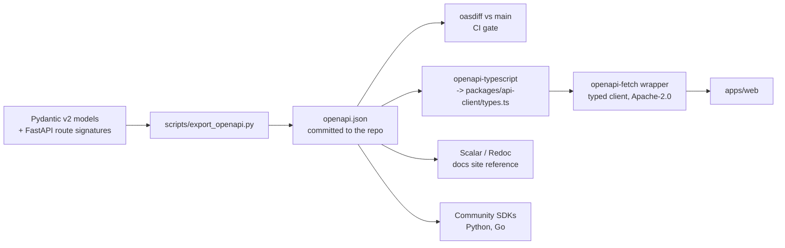

# 05 — API Design

## 1. Conventions

| Topic | Decision |
| --- | --- |
| Base path | `https://api.younique.dev/v1`. Self-host: `/{origin}/api/v1`. |
| Style | Resource-oriented REST. Verbs only as sub-resource actions on an explicit `:action` path segment (`POST /v1/runs/{id}:cancel`), never as a `?action=` query parameter. |
| Media type | `application/json` for requests and responses; `text/event-stream` for streams; `application/problem+json` for errors. |
| Casing | `snake_case` in JSON. The backend is Python and the generated TypeScript client is typed, so there is no ergonomic cost, and it removes a whole class of serializer bug. |
| IDs | UUIDv7 strings. Opaque to clients. Never sequential integers in URLs. |
| Timestamps | RFC 3339 UTC with `Z`, e.g. `2026-10-06T11:52:00Z`. |
| Auth | `__Host-session` httpOnly cookie plus `X-Account-Id: {user_id}` to select the active identity, plus `X-Workspace-Id: {workspace_id}`. Machine clients use `Authorization: Bearer {pat}`. |
| CSRF | Double-submit: `X-CSRF-Token` header must equal the `csrf` cookie on every unsafe method. Rejected before any handler runs. |
| Pagination | Cursor only. `?limit=50&cursor=...` returns `{ "data": [...], "next_cursor": "..." }`. The cursor is base64 of `(sort_key, id)`. **No offset pagination anywhere** — it is incorrect under concurrent writes and it degrades linearly. |
| Filtering | Explicit named parameters per endpoint (`?status=failed&agent_id=...`), never a generic query DSL. A DSL on top of RLS is an authorization bypass waiting to happen. |
| Sorting | `?sort=-created_at`. Only fields with a supporting index are accepted; anything else is `422`. |
| Sparse fields | `?expand=artifacts,model` for a small, fixed, documented set of expansions. No GraphQL-style arbitrary selection. |
| Idempotency | `Idempotency-Key` header required on every `POST` that creates a resource or triggers work; optional elsewhere. Backed by `app.idempotency_keys`. |
| Rate limits | Per user, per workspace, and per IP, returned as `RateLimit-Limit`, `RateLimit-Remaining`, `RateLimit-Reset` (RFC 9331 draft naming) plus `Retry-After` on `429`. Cloud Armor handles volumetric abuse at the edge; the app enforces semantic limits (runs per minute, tool calls per run). |
| Request IDs | Every response carries `X-Request-Id`. It appears in the error body, in Cloud Logging, and as the OTel trace ID, so a user can paste it into a bug report and we can find the trace. |
| Partial responses | Any field the caller is not authorized to see is **omitted**, never nulled. A `null` leaks existence. |
| Payload limits | 1 MB JSON bodies. Anything larger is an artifact upload. |

### Why `snake_case` and not `camelCase`

The TypeScript client is generated from OpenAPI, so developers never hand-write either form.
Choosing the server's native casing eliminates a translation layer that, in every codebase
I have seen do it, eventually produces one endpoint where a nested object was missed.

## 2. Error format

RFC 9457 Problem Details, extended with three fields we actually need: a stable machine
`code`, a `retryable` hint, and the `request_id`.

```json
{
  "type": "https://younique.dev/errors/provider_rate_limited",
  "title": "The model provider rate-limited this request",
  "status": 429,
  "detail": "Anthropic returned 429 for claude-sonnet-4-5. Your key's rate limit was exceeded.",
  "code": "provider_rate_limited",
  "retryable": true,
  "retry_after_ms": 4200,
  "request_id": "01932f1e-7c4a-7b3d-9f21-8a0c5d6e7f80",
  "resource": { "type": "run", "id": "0193..." },
  "errors": [
    { "field": "model_id", "code": "invalid", "detail": "Model is deprecated." }
  ],
  "remediation": {
    "message": "Retry in a few seconds, or switch to a fallback model.",
    "action": "switch_model",
    "href": "/settings/models"
  }
}
```

`remediation` is the field that makes the difference between a usable product and a frustrating
one. Every error the user can resolve carries a machine-readable action the frontend renders as
a button. Errors they cannot resolve carry a `request_id` and nothing that implies they should
try harder.

### Error code taxonomy

`code` is the contract. The HTTP status is advisory; clients branch on `code`.

| Category | Codes | Status | Retryable |
| --- | --- | --- | --- |
| Auth | `unauthenticated`, `session_expired`, `session_revoked`, `csrf_failed` | 401 | no |
| Consent | `consent_required` (body lists the required document versions) | 409 | no |
| Authorization | `permission_denied`, `workspace_mismatch`, `share_link_expired`, `share_link_revoked`, `password_required` | 403 | no |
| Not found | `not_found`, `archived` | 404, 410 | no |
| Validation | `validation_failed`, `unsupported_media_type`, `payload_too_large`, `unsupported_sort`, `invalid_cursor` | 422, 415, 413 | no |
| Conflict | `conflict`, `version_conflict`, `idempotency_key_reuse`, `idempotency_in_flight` | 409 | no / yes for in-flight |
| Rate limit | `rate_limited`, `concurrency_limit_reached` | 429 | yes |
| Budget | `budget_exceeded`, `quota_exceeded` | 402 | no |
| Provider | `provider_rate_limited`, `provider_timeout`, `provider_unavailable`, `provider_invalid_key`, `provider_insufficient_quota`, `provider_content_filtered`, `provider_context_length_exceeded`, `provider_model_deprecated`, `provider_stream_interrupted` | 429, 504, 502, 400 | varies, stated per code |
| Connector | `connection_needs_reauth`, `connection_revoked`, `connector_permission_denied`, `connector_resource_not_granted`, `connector_rate_limited`, `connector_unavailable` | 409, 403, 429, 502 | varies |
| Approval | `approval_required`, `approval_expired`, `approval_rejected`, `tool_blocked_by_policy`, `tool_blocked_by_taint` | 409, 403 | no |
| Artifact | `artifact_not_clean`, `artifact_scan_failed`, `unsupported_file_type`, `file_too_large` | 409, 415, 413 | no |
| Run | `run_not_resumable`, `run_cancelled`, `run_timeout`, `graph_step_limit_exceeded` | 409, 504 | no |
| Internal | `internal_error`, `dependency_unavailable`, `database_unavailable` | 500, 503 | yes |

`provider_*` and `connector_*` are the two families that matter most in practice, because they
are the errors users will actually hit. Each one has a defined UI treatment specified in
[06-frontend-architecture.md](06-frontend-architecture.md) — a toast, an inline retry, a
reconnect prompt, or a model-switch offer. There is no generic "something went wrong" path.

### Provider error handling policy

| Condition | Automatic behaviour |
| --- | --- |
| `429` with `Retry-After` | Honour the header, up to 3 attempts, full jitter |
| `429` without a header | Exponential backoff from 1 s, 3 attempts, full jitter |
| `5xx` / timeout | 2 retries, then try the chat's configured fallback model, then fail |
| Invalid key | No retry. Mark `provider_keys.status = 'invalid'`, notify the user, stop using it |
| Content filtered | No retry. Surface the provider's reason verbatim; never silently retry with a modified prompt |
| Context length exceeded | One retry after trimming the memory block and oldest turns to fit; if still too large, fail with a clear message and an offer to switch to a larger-context model |
| Model deprecated/retired | No retry. Mark the registry row, notify affected workspaces, offer the registry's `replacement_model_id` |
| Stream interrupted mid-token | Persist the partial assistant message with `status = 'stopped'` and `error_code = 'provider_stream_interrupted'`. **Never discard partial output** — the user may want what arrived, and we have already paid for it |

Retries are bounded by the run's remaining budget, so a provider having a bad day cannot
multiply a user's spend.

## 3. Streaming: SSE, not WebSocket

**Decision: Server-Sent Events over HTTP POST.** See [ADR-0003](adr/).

Chat streaming is unidirectional: tokens flow down, and the only upward signals (stop,
approve) are ordinary idempotent HTTP calls on their own endpoints. A WebSocket would buy
bidirectionality we do not need, in exchange for a stateful connection that complicates the
load balancer, breaks scale-to-zero accounting on Cloud Run, requires our own heartbeat and
reconnect-and-resume protocol, and makes authorization a per-message concern instead of a
per-request one.

One wrinkle: the browser `EventSource` API cannot set request headers or use `POST`. We
therefore stream over `fetch()` with a `ReadableStream` body reader and parse SSE frames
client-side (roughly 40 lines, in `packages/ui/lib/sse.ts`). This keeps cookie and CSRF
handling identical to every other request.

### Resumability

Every event is persisted to `app.run_events` with a monotonic `seq` before it is flushed to
the wire. If the connection drops — a tab sleeping, a mobile network, or an approval
suspending the run — the client reconnects to:

```
GET /v1/runs/{run_id}/events?last_event_id={seq}
```

and receives every missed event followed by the live tail. This is what makes "close the tab,
approve from your phone, come back and see the completed answer" work, and it is why run
events are a table rather than an in-memory channel. `run_events` is partitioned monthly with
a 30-day retention since it is a replay buffer, not a record.

Live tailing of a **background** run (executing in `worker`, streamed from `api`) uses Postgres
`LISTEN/NOTIFY`: the worker notifies on channel `run_{run_id}` after each event insert, and one
shared listener connection per `api` instance fans out in-process to connected clients. This
avoids both polling and a Redis dependency at MVP. If instance count or run concurrency makes
the shared listener a bottleneck, Memorystore Redis pub/sub is the drop-in replacement, and the
interface is already abstracted behind `RunEventBus`.

### Event types

```
event: run.started            data: {"run_id","chat_id","model":{...},"reasoning":true}
event: message.created        data: {"message_id","role":"assistant","seq"}
event: part.created           data: {"part_id","kind":"reasoning|text|tool_call","seq"}
event: part.delta             data: {"part_id","text":"..."}
event: part.completed         data: {"part_id","token_count"}
event: tool.started           data: {"run_step_id","tool_key","args_redacted"}
event: tool.completed         data: {"run_step_id","status","output_ref","duration_ms"}
event: approval.required      data: {"approval_id","tool_key","args_redacted","risk","reason","expires_at"}
event: artifact.created       data: {"artifact_id","version","name","detected_mime","status"}
event: memory.written         data: {"memory_id","memory_set_id","change_kind"}
event: usage                  data: {"input_tokens","output_tokens","reasoning_tokens","cost_micro_usd"}
event: run.completed          data: {"run_id","status","cost_micro_usd","total_tokens","duration_ms"}
event: error                  data: {<RFC 9457 problem object>}
event: ping                   data: {}
```

Each frame carries `id: {seq}`. A `ping` every 15 seconds keeps intermediaries from idling the
connection out — relevant because the load balancer's default stream idle timeout will kill a
quiet connection, and a reasoning model can think for a long time before emitting anything.

**Stop** is `POST /v1/runs/{id}:cancel`, which sets a cancellation flag the graph checks between
nodes and which cancels the in-flight provider request. Partial output is preserved with
`status = 'stopped'`. **Regenerate** is `POST /v1/chats/{id}/messages:regenerate` with the
target `message_id`; it archives the assistant message and starts a new run from the same
parent, so the prior answer stays in history rather than being destroyed.

## 4. Resource list

Phase column: M = MVP, 1 = v1, 2 = v2.

### Identity, sessions, and workspaces

| Method and path | Purpose | Phase |
| --- | --- | --- |
| `POST /v1/auth/session` | Exchange a Firebase ID token for a session cookie; adds to the session set | M |
| `DELETE /v1/auth/session` | Sign out the active account only | M |
| `DELETE /v1/auth/sessions` | Sign out every account on this device | M |
| `GET /v1/auth/accounts` | List signed-in identities for the account switcher | M |
| `POST /v1/auth/accounts:switch` | Set the active identity | M |
| `GET /v1/me` | Current user, memberships, consent status, feature flags | M |
| `PATCH /v1/me` | Display name, timezone, global preferences (default model, reasoning default, memory write mode) | M |
| `GET /v1/me/sessions` | Device and session list with IP, user agent, last seen | M |
| `POST /v1/me/sessions/{id}:revoke` | Revoke one session; effective on the next request | M |
| `GET /v1/me/consents` | Required documents and acceptance state | M |
| `POST /v1/me/consents` | Accept a document version; records IP and user agent | M |
| `POST /v1/me:export` | Start a GDPR data export; returns a job | 1 |
| `POST /v1/me:delete` | Start account erasure with a 30-day grace period | 1 |
| `GET/POST /v1/workspaces`, `GET/PATCH /v1/workspaces/{id}` | Workspace CRUD; `DELETE` archives | M |
| `GET/POST/DELETE /v1/workspaces/{id}/members` | Membership and role management | 1 |
| `GET/POST /v1/workspaces/{id}/invitations`, `POST .../{inv}:accept` | Email invitations | 1 |

### Chats and messages

| Method and path | Purpose | Phase |
| --- | --- | --- |
| `GET /v1/chats` | List; filters `?agent_id`, `?shared=true`, `?archived=true`, `?q=` | M |
| `POST /v1/chats` | Create; optional `model_id`, `agent_id`, `memory_set_ids` | M |
| `GET /v1/chats/{id}` | Chat with settings and attached memory sets | M |
| `PATCH /v1/chats/{id}` | Title, model, `reasoning_mode`, `memory_write_mode` | M |
| `DELETE /v1/chats/{id}` | **Archive** (soft). Returns `204`. | M |
| `POST /v1/chats/{id}:restore` | Un-archive | M |
| `GET /v1/chats/{id}/messages` | Paginated, with parts; `?include_reasoning=false` to omit traces | M |
| `POST /v1/chats/{id}/messages` | Send a message. `Accept: text/event-stream` streams; `application/json` returns a `run_id` to poll or tail | M |
| `POST /v1/chats/{id}/messages:regenerate` | Regenerate from a target message | M |
| `GET /v1/chats/{id}/artifacts` | The per-chat file and artifact panel | M |
| `PUT /v1/chats/{id}/memory-sets` | Attach or detach memory sets | 1 |
| `GET /v1/chats/{id}/usage` | Token and cost totals for this chat | M |

### Runs, approvals, and tool policy

| Method and path | Purpose | Phase |
| --- | --- | --- |
| `GET /v1/runs` | Unified run list; `?kind`, `?status`, `?agent_id`, `?pipeline_id`, `?since` | M |
| `GET /v1/runs/{id}` | Run detail with cost, trust level, and error | M |
| `GET /v1/runs/{id}/steps` | Per-step status, timing, cost, and I/O refs | M |
| `GET /v1/runs/{id}/steps/{sid}/input` / `/output` | Resolve a step I/O pointer (inline or signed URL) | 1 |
| `GET /v1/runs/{id}/events` | SSE tail or replay from `?last_event_id=` | M |
| `POST /v1/runs/{id}:cancel` / `:retry` / `:pause` / `:resume` | Lifecycle actions | M / 1 |
| `GET /v1/approvals` | Approval inbox; `?status=pending` | M |
| `POST /v1/approvals/{id}:decide` | `{decision: approve|reject, note?, remember?: "always"|"never"}` | M |
| `GET/PUT /v1/tool-policies` | Per-tool `always_allow` / `ask_each_time` / `never`, optionally scoped to an agent | M |

### Models and keys

| Method and path | Purpose | Phase |
| --- | --- | --- |
| `GET /v1/models` | Registry; `?supports_tools`, `?supports_reasoning`, `?available=true` (only models the workspace has a valid key for) | M |
| `GET /v1/providers` | Providers and whether a key is configured | M |
| `GET /v1/provider-keys` | Masked list: label, `last4`, status, `last_validated_at`. **Never returns key material.** | M |
| `POST /v1/provider-keys` | Save a key; validates against the provider before persisting | M |
| `POST /v1/provider-keys/{id}:rotate` / `:revoke` / `:validate` | Key lifecycle | M |
| `POST /v1/models` | Register a workspace-private OpenAI-compatible model | M |

### Connections

| Method and path | Purpose | Phase |
| --- | --- | --- |
| `GET /v1/connectors` | Catalogue with manifests, required scopes, and **documented platform limitations** | M |
| `GET /v1/connections` | User's connections with health and status | M |
| `POST /v1/connections` | Begin OAuth; returns `authorize_url` | M |
| `GET /v1/connections/callback` | OAuth redirect target; validates state and PKCE | M |
| `GET/PUT /v1/connections/{id}/grants` | The enforced resource allowlist (repos, mailboxes, channels, spreadsheets) | M |
| `POST /v1/connections/{id}:test` / `:reauth` / `:revoke` | Health check and lifecycle | M |
| `GET /v1/connections/{id}/resources` | List grantable resources from the provider (e.g. the user's repos) | M |
| `PUT /v1/workspaces/{id}/oauth-clients/{connector}` | BYO OAuth client ID and secret, for self-host and unverified-app use | M |
| `POST /v1/webhooks/{connector}/{connection_id}` | Inbound provider webhooks; HMAC-verified, replay-rejected | 1 |

### Artifacts

| Method and path | Purpose | Phase |
| --- | --- | --- |
| `GET /v1/artifacts` | The Artifacts page; `?chat_id`, `?origin=uploaded\|generated`, `?mime_group=`, `?from`, `?to`, `?q=`, `?status=` | M |
| `POST /v1/artifacts` | Reserve an artifact and get a signed resumable upload URL | M |
| `POST /v1/artifacts/{id}/versions` | New version of an existing artifact | M |
| `GET /v1/artifacts/{id}` | Metadata and version history | M |
| `GET /v1/artifacts/{id}/download` | `302` to a 5-minute signed URL; `409 artifact_not_clean` unless scanned clean | M |
| `GET /v1/artifacts/{id}/preview` | Rendered preview payload (CSV rows, JSON tree, thumbnail URL, PDF page count) | M |
| `DELETE /v1/artifacts/{id}` | Archive | M |

### Agents, pipelines, triggers, and schedules

| Method and path | Purpose | Phase |
| --- | --- | --- |
| `GET/POST /v1/agents`, `GET/PATCH/DELETE /v1/agents/{id}` | Agent CRUD; `DELETE` archives | 1 |
| `GET/POST /v1/agents/{id}/versions`, `POST .../{v}:publish` | Versioning | 1 |
| `POST /v1/agents/{id}:run` | Manual trigger; returns a run | 1 |
| `GET/POST /v1/pipelines`, `GET/PATCH/DELETE /v1/pipelines/{id}` | Pipeline CRUD | 1 |
| `GET/POST /v1/pipelines/{id}/versions`, `POST .../{v}:publish` | Versioning | 1 |
| `POST /v1/pipelines/{id}/versions/{v}:validate` | DAG validation: cycles, type compatibility, missing connections | 1 |
| `POST /v1/pipelines/{id}:run` | Manual trigger with optional input bindings | 1 |
| `GET /v1/node-types` | Node registry with JSON Schema for each node's parameters — this is what the visual editor renders from | 1 |
| `GET/POST/PATCH/DELETE /v1/triggers` | Manual, schedule, webhook, and event triggers | 1 |
| `POST /v1/schedules/{id}:pause` / `:resume` | Schedule control | 1 |
| `GET /v1/schedules/{id}/next-fires?count=5` | Preview upcoming fires in the user's timezone — a DST-correctness confidence builder | 1 |

### Memory

| Method and path | Purpose | Phase |
| --- | --- | --- |
| `GET/POST /v1/memory-sets`, `GET/PATCH/DELETE /v1/memory-sets/{id}` | Sets by scope | 1 |
| `GET /v1/memories` | `?memory_set_id`, `?q=` (hybrid search), `?source`, `?since` | 1 |
| `POST /v1/memories` | Manual write | 1 |
| `PATCH /v1/memories/{id}` | Edit; creates a `memory_versions` row | 1 |
| `GET /v1/memories/{id}/versions`, `POST .../versions/{v}:restore` | Audit and revert | 1 |
| `DELETE /v1/memories/{id}` | Archive | 1 |
| `POST /v1/memory-sets/{id}:export` | JSON or Markdown export | 1 |
| `POST /v1/memories:preview-retrieval` | Debug endpoint: what *would* be retrieved for this query, with scores and the token budget breakdown | 1 |

### Sharing

| Method and path | Purpose | Phase |
| --- | --- | --- |
| `GET /v1/{resource_type}/{id}/shares` | Grants on a resource | M |
| `POST /v1/{resource_type}/{id}/shares` | Grant to a user or an email with a role | 1 |
| `DELETE /v1/shares/{id}` | Revoke | 1 |
| `POST /v1/{resource_type}/{id}/share-links` | Create a public link with a role, expiry, and optional password | M |
| `POST /v1/share-links/{id}:revoke` | Revoke | M |
| `GET /v1/public/{token}` | Resolve a share link without a session; returns the resource plus what the link does and does not include | M |

### Usage, notifications, and audit

| Method and path | Purpose | Phase |
| --- | --- | --- |
| `GET /v1/usage` | Aggregated; `?group_by=day\|model\|agent\|pipeline\|chat\|user`, `?from`, `?to` | M |
| `GET /v1/usage/events` | Raw ledger, paginated, for reconciliation | M |
| `GET/POST/PATCH/DELETE /v1/budgets` | Budgets with `warn` or `block` | 1 |
| `GET /v1/notifications`, `POST /v1/notifications/{id}:read` | In-app notifications | 1 |
| `GET /v1/audit-logs` | Security events; admin role only; `?action`, `?actor_user_id`, `?from`, `?to` | 1 |

### MCP

| Method and path | Purpose | Phase |
| --- | --- | --- |
| `GET /.well-known/oauth-protected-resource` | RFC 9728 resource metadata | 1 |
| `GET /.well-known/oauth-authorization-server` | RFC 8414 server metadata | 1 |
| `POST /mcp/register` | RFC 7591 dynamic client registration | 1 |
| `GET /mcp/authorize`, `POST /mcp/token` | OAuth 2.1 with mandatory PKCE | 1 |
| `POST /mcp` | MCP Streamable HTTP endpoint | 1 |
| `GET/POST/DELETE /v1/mcp-tokens` | User-visible token management with scopes and revocation | 1 |
| `GET/POST /v1/mcp-servers` | Register an **external** MCP server as a connector | 2 |

### Internal (not exposed through the load balancer)

| Method and path | Caller |
| --- | --- |
| `POST /internal/scheduler/tick` | Cloud Scheduler, every minute |
| `POST /internal/scheduler/nightly-rollup` | Cloud Scheduler |
| `POST /internal/scheduler/nightly-retention` | Cloud Scheduler: partition maintenance, GDPR erasure, expiries |
| `POST /internal/tasks/{agent-run,pipeline-run,memory-extract,connector-sync,outbox-drain}` | Cloud Tasks |
| `POST /internal/events/{gcs-upload,domain}` | Pub/Sub push |
| `GET /healthz`, `GET /readyz` | Cloud Run and uptime checks |

## 5. Versioning and deprecation

Major version in the path (`/v1`). Within a major version, **only additive changes**: new
endpoints, new optional request fields, new response fields, new enum values in fields
documented as open. Clients must tolerate unknown fields, and the generated TypeScript client
does.

Breaking changes get `/v2` mounted alongside `/v1`. The old version then gets a minimum
**six months** of support with:

- `Deprecation: true` and `Sunset: <RFC 1123 date>` response headers (RFC 8594).
- `Link: <...>; rel="successor-version"`.
- A `deprecation_warnings` array in responses for the specific fields affected.
- Metrics per deprecated endpoint per workspace, so we know who still calls it and can contact
  them rather than guessing.

## 6. OpenAPI and client generation



Rules that make this work rather than rot:

1. **`openapi.json` is committed.** CI regenerates it and fails if the committed file differs.
   Reviewers see the API contract change in the diff, which is the single highest-leverage
   review artifact in the repo.
2. **`oasdiff` gates breaking changes.** A PR introducing a breaking change to `/v1` fails CI
   unless it carries the `api-breaking-change` label and an ADR.
3. **Every endpoint supplies `operation_id`, `summary`, `description`, `tags`, and at least one
   example response.** A lint script fails the build on a missing one, because an undocumented
   endpoint becomes a permanently undocumented endpoint.
4. **Error responses are declared.** Every route lists the `code` values it can return, via a
   shared `responses={...}` helper, so the generated client can exhaustively type error
   handling.
5. **The generated client is Apache-2.0** ([00 §2](00-assumptions-and-decisions.md)) so nobody
   has to AGPL their own application to call the API.
6. **A contract test asserts every documented error code is reachable**, which catches codes
   that were renamed in handlers but not in the docs.

SSE endpoints are documented in OpenAPI as `text/event-stream` with the event schemas defined
as named components, plus a hand-written narrative section in the docs site, since OpenAPI
cannot fully express an event stream. The event payload schemas are generated from the same
Pydantic models the server emits, so the client gets typed SSE events too.
