# 07 — Repo Structure, Contributor Workflow, and CI/CD

## 1. Monorepo, and why

**Decision: a single repository.**

| Argument | Detail |
| --- | --- |
| The contracts are tight | `openapi.json` is generated from FastAPI and consumed by the TypeScript client. In separate repos, every API change becomes a two-PR dance with a version-bump in between, and the two drift in the gap. |
| Changes are cross-cutting by nature | "Add the Slack connector" touches `connectors/slack/`, a migration, the connector catalogue endpoint, and an icon in the frontend. One atomic PR with one review and one revert. |
| One CI configuration, path-filtered | A connector PR runs connector tests only. Path filtering gives the isolation people want from multi-repo without the coordination cost. |
| Contributor onboarding | One clone, one `make dev`, one `AGENTS.md`. For an OSS project, the number of repos a newcomer must understand is a direct drag on contribution rate. |
| Honest cost | The repo gets large, `git log` is noisy, and CI needs real path discipline or everything runs on everything. Both are tooling problems with known solutions; repo drift is not. |

Rejected: separate `web` / `api` / `connectors` repos (coordination tax on nearly every change);
git submodules (universally disliked and a recurring source of broken clones).

## 2. Directory tree

```
younique/
├── AGENTS.md                      # ROOT rules file — read this first
├── CLAUDE.md                      # symlink -> AGENTS.md
├── README.md  ARCHITECTURE.md  CONTRIBUTING.md  SECURITY.md
├── CODE_OF_CONDUCT.md  SUPPORT.md  CHANGELOG.md  LICENSE  LICENSE-APACHE
├── Makefile                       # the only entrypoint a contributor needs
├── docker-compose.yml             # full local stack, emulators included
├── openapi.json                   # GENERATED, committed, CI-verified
│
├── apps/
│   └── web/                       # Next.js App Router. NO business logic.
│       ├── AGENTS.md
│       ├── app/                   # routes only; thin, delegate to features/
│       │   ├── (marketing)/       # public landing, legal pages
│       │   ├── (auth)/            # login, signup, consent
│       │   ├── (app)/             # authenticated shell
│       │   │   ├── chat/[id]/  artifacts/  connections/  agents/[id]/
│       │   │   ├── pipelines/[id]/  memory/  usage/  settings/  approvals/
│       │   ├── share/[token]/     # public share view, no session
│       │   └── api/               # ONLY: auth cookie exchange, OTel proxy
│       ├── features/              # vertical slices: chat/, artifacts/, pipelines/...
│       ├── components/ui/         # shadcn primitives, no feature imports
│       ├── lib/                   # api client wiring, sse.ts, formatters
│       └── e2e/                   # Playwright
│
├── backend/
│   ├── AGENTS.md
│   ├── pyproject.toml             # uv; single package, two entrypoints
│   ├── src/younique/
│   │   ├── main_api.py            # ASGI app for the `api` service
│   │   ├── main_worker.py         # ASGI app for the `worker` service
│   │   ├── main_mcp.py            # ASGI app for the `mcp` service
│   │   ├── core/                  # config, logging, otel, errors, db session, deps
│   │   ├── authz/                 # authorize(), policy, principal — THE chokepoint
│   │   ├── models/                # SQLAlchemy ORM
│   │   ├── schemas/               # Pydantic request/response
│   │   ├── api/v1/                # routers, one module per resource
│   │   ├── services/              # business logic; routers stay thin
│   │   ├── crypto/                # envelope encryption, KEK backends
│   │   ├── llm/                   # LLMProvider, LiteLLM + native impls, registry
│   │   ├── agents/                # AGENTS.md — LangGraph runtime
│   │   │   ├── state.py  graph.py  nodes/  tools/  budget.py  taint.py
│   │   ├── pipelines/             # node registry, compiler, scheduler
│   │   ├── memory/                # extraction, retrieval, conflict resolution
│   │   ├── artifacts/             # upload, detect, scan, preview
│   │   ├── usage/                 # ledger, pricing, budgets, rollups
│   │   ├── mcp/                   # FastMCP server + OAuth 2.1
│   │   ├── tasks/                 # Cloud Tasks handlers
│   │   └── events/                # outbox, Pub/Sub handlers
│   ├── migrations/                # Alembic; data/ for batched backfills
│   └── tests/                     # unit/ integration/ authz/ agents/
│
├── connectors/                    # AGENTS.md — self-contained per connector
│   ├── _sdk/                      # Apache-2.0, published separately
│   ├── gmail/ smtp/ google_drive/ google_sheets/ google_calendar/ google_maps/
│   ├── github/ slack/ linkedin/ instagram/
│   └── http/ webhook/ mcp/
│
├── packages/                      # shared, independently licensed
│   ├── api-client/                # Apache-2.0, generated from openapi.json
│   ├── ui/                        # shared React primitives
│   ├── model-registry/            # models.yaml — ADD NEW MODELS HERE
│   └── tsconfig/  eslint-config/
│
├── infra/                         # AGENTS.md
│   ├── terraform/
│   │   ├── modules/               # cloud_run_service, cloud_sql, gcs_bucket, ...
│   │   └── envs/{dev,staging,prod,shared}/   # per-env DIRS, not workspaces
│   └── docker/                    # Dockerfile per service
│
├── docs/                          # this planning set + the docs site source
│   ├── adr/                       # one file per decision, immutable
│   └── site/                      # Mintlify/Docusaurus source
│
├── scripts/                       # export_openapi, check_migration, seed, scrub_cassettes
└── .github/
    ├── workflows/                 # path-filtered pipelines
    ├── ISSUE_TEMPLATE/  PULL_REQUEST_TEMPLATE.md
    └── CODEOWNERS
```

## 3. "Where do I put X?"

This table goes in `CONTRIBUTING.md` and in the root `AGENTS.md`. It is the most-read thing in
the repo after the README.

| I want to... | Put it in | Also touch |
| --- | --- | --- |
| Add a new integration (Notion, Jira, Stripe) | `connectors/{key}/` | Nothing else. That is the point. |
| Add a tool to an existing connector | `connectors/{key}/tools/{tool}.py` | Register in that connector's `MANIFEST` |
| Add a newly released model | `packages/model-registry/models.yaml` | Nothing — one YAML entry |
| Add a model **provider** (new API shape) | `backend/src/younique/llm/providers/` | `model_providers` seed row |
| Add a pipeline node type | `backend/src/younique/pipelines/nodes/` | Nothing in the frontend — the editor renders from JSON Schema |
| Add an API endpoint | `backend/src/younique/api/v1/{resource}.py` | `authorize()` dependency; regenerate `openapi.json` |
| Add business logic | `backend/src/younique/services/` | Never in a router |
| Change the LangGraph graph | `backend/src/younique/agents/graph.py` or `nodes/` | A deterministic test with `FakeChatModel` |
| Change a permission rule | `backend/src/younique/authz/policy.py` | The YAML expectation fixture in `tests/authz/` |
| Add a DB table or column | `backend/src/younique/models/` then `alembic revision --autogenerate` | Review the generated SQL by hand, always |
| Add a UI screen | `apps/web/app/(app)/{route}/` plus `features/{feature}/` | Nothing in `components/ui/` unless it is a generic primitive |
| Add a shared React primitive | `packages/ui/` or `apps/web/components/ui/` | It must not import from `features/` |
| Change GCP infrastructure | `infra/terraform/modules/` then each `envs/*/` | An ADR if it is a new service |
| Record an architectural decision | `docs/adr/NNNN-title.md` | Link it from the affected design doc |
| Write a security-sensitive change | Anywhere, but tag the PR `security` | `SECURITY.md` if the threat model shifts |

## 4. Standards

### Python

| Tool | Configuration |
| --- | --- |
| `ruff` | Lint and format. Replaces black, isort, flake8, and most plugins. Line length 100. |
| `mypy --strict` | On `src/younique/`. Tests are `--strict` minus `disallow_untyped_decorators`. |
| `pytest` | `-x --ff`, `asyncio_mode=auto`, `testcontainers` for Postgres |
| `uv` | Dependency management. `uv.lock` is committed and CI-verified. |

Conventions that are enforced, not suggested:

- **Async all the way down.** No `requests`, no sync SQLAlchemy, no blocking I/O in a handler.
  A blocking call in an async path stalls the whole event loop, and Cloud Run's concurrency
  makes that an outage rather than a slowdown.
- **No business logic in routers.** A router validates, calls one service function, and
  serializes. A router longer than 25 lines is a review comment.
- **`authorize()` or `@public` on every route.** CI fails on a route with neither.
- **Typed errors only.** Raise `ProblemDetail` subclasses. A bare `HTTPException` fails lint.
- **No `print`.** `structlog` only, so redaction applies.
- **Pydantic for every boundary.** Request bodies, tool inputs, node params, connector
  manifests, settings.
- **`Decimal` or `int` for money.** A `float` in a money path fails a custom lint rule.

### TypeScript

| Tool | Configuration |
| --- | --- |
| `eslint` | `@typescript-eslint` strict, `eslint-plugin-react-hooks`, `jsx-a11y` (errors, not warnings) |
| `prettier` | Formatting; no debate |
| `tsc --noEmit` | `strict: true`, `noUncheckedIndexedAccess: true` |
| `pnpm` | Workspaces plus Turborepo for caching |

- **No `any`.** `unknown` plus narrowing. A justified `any` needs an inline comment and a
  reviewer's agreement.
- **Server Components by default**; `'use client'` only where interactivity requires it.
- **All API calls through `packages/api-client`.** A raw `fetch` to our own API fails lint,
  because it bypasses the generated types and the error handling.
- **Every interactive element is keyboard-operable**, enforced by `jsx-a11y` as an error.

### Commits, branches, releases

- **Conventional Commits**, enforced by `commitlint`. `feat(connectors): add slack`,
  `fix(authz): deny share-link tool execution`. Scopes match top-level directories.
- **DCO**: every commit needs `Signed-off-by`. Enforced by a GitHub Action. No CLA
  ([00 §2](00-assumptions-and-decisions.md)).
- **Branches**: `main` is always deployable. Work on `feat/`, `fix/`, `docs/`, `chore/`.
  Squash merge, so `main` history is one commit per PR.
- **Versioning**: SemVer on the API and the published packages. The application itself is
  continuously deployed and versioned by date plus short SHA.
- **CHANGELOG**: generated by `release-please` from Conventional Commits. Never hand-edited.
- **Releases**: tag `v*` → staging → full E2E → manual approval → prod with gradual traffic.

### Pre-commit

Fast checks only. A pre-commit hook that takes 30 seconds gets bypassed with `--no-verify`,
which is worse than not having it.

```yaml
- ruff (fix) + ruff-format
- prettier + eslint --fix (staged files only)
- detect-secrets         # blocks committed credentials
- commitlint
- check-added-large-files (500 KB)
- forbid direct httpx/requests/socket/subprocess imports in connectors/*/
```

Type checking, tests, and migration checks run in CI, not pre-commit.

## 5. Local development in under 15 minutes

```bash
git clone https://github.com/younique/younique && cd younique
make setup     # installs uv + pnpm deps, copies .env.example, generates a dev master key
make dev       # docker compose up + migrations + seed + web/api/worker in watch mode
```

`docker compose` provides Postgres 16 with `pgvector`, the **Firebase Auth emulator**,
`fake-gcs-server`, a Cloud Tasks emulator shim (a small FastAPI app that immediately POSTs to
the worker), ClamAV, and Langfuse. No GCP account, no Firebase project, no cloud credentials.

`make seed` creates two users, a workspace, a few chats with artifacts, a mock connector
connection, a sample agent, and a sample pipeline — so a contributor sees a populated app
rather than an empty one and can start on their actual task immediately.

The 15-minute target is a **CI job**: a weekly workflow on a clean runner times
`make setup && make dev && curl /healthz` and fails if it exceeds 15 minutes or breaks. Setup
instructions rot silently otherwise, and a broken setup is the single largest cause of lost
contributors.

## 6. CI/CD

### Path filtering

```yaml
# .github/workflows/ci.yml
jobs:
  changes:
    outputs: { web, backend, connectors, agents, infra, docs, migrations }
    steps:
      - uses: dorny/paths-filter@v3
        with:
          filters: |
            web:        ['apps/web/**', 'packages/ui/**', 'packages/api-client/**']
            backend:    ['backend/**', 'openapi.json']
            connectors: ['connectors/**']
            agents:     ['backend/src/younique/agents/**', 'backend/src/younique/pipelines/**']
            infra:      ['infra/**']
            docs:       ['docs/**', '**/*.md']
            migrations: ['backend/migrations/**', 'backend/src/younique/models/**']
```

| Job | Runs when | Duration target |
| --- | --- | --- |
| `lint-commit` + `dco` | always | 20 s |
| `web-lint-types` | `web` | 2 min |
| `web-unit` | `web` | 1 min |
| `backend-lint-types` | `backend` or `connectors` | 2 min |
| `backend-unit` | `backend` | 3 min |
| `backend-authz` | `backend` (always, even for a connector PR) | 2 min |
| `agents-graph-tests` | `agents` or `backend` | 2 min |
| `connector-contract` | `connectors` — **only the changed connectors** | 1 min |
| `migration-check` | `migrations` | 3 min |
| `openapi-drift` + `oasdiff` | `backend` | 1 min |
| `terraform-validate` + `tflint` + `checkov` | `infra` | 2 min |
| `e2e-critical` | `web` or `backend`, and on every `main` push | 8 min |
| `e2e-full` | nightly and on release tags | 25 min |
| `security-scan` (`pip-audit`, `npm audit`, Trivy, CodeQL) | always, plus weekly | 4 min |
| `docs-build` | `docs` | 1 min |

`backend-authz` runs on *every* backend or connector PR regardless of path, because a connector
adding a tool can change the authorization surface. It is cheap and it is the suite whose
failure matters most.

Target: a connector-only PR is green in **under 4 minutes**. If contributors wait 20 minutes for
feedback, they context-switch and the PR goes stale.

### Deployment

```mermaid
flowchart LR
    PR["Pull request"] --> CI["Path-filtered CI"]
    CI --> Prev["Preview env:<br/>Cloud Run revision per PR<br/>+ dedicated DB on the shared preview instance"]
    PR -->|"squash merge"| Main["main"]
    Main --> Dev["auto-deploy -> dev<br/>migrate, smoke test"]
    Main -->|"release-please PR merged"| Tag["tag v*"]
    Tag --> Stg["staging<br/>prod-like, anonymized data<br/>full E2E"]
    Stg -->|"manual approval"| Prod0["prod: deploy --no-traffic"]
    Prod0 --> Smoke["smoke test the tagged revision URL"]
    Smoke --> P10["10% traffic, watch SLOs 10 min"]
    P10 --> P100["100%"]
    P100 --> Done["tag the revision 'stable'"]
    P10 -->|"error budget burn"| RB["rollback: shift traffic<br/>to 'stable' (seconds)"]
```



**Preview environments.** Each PR gets a Cloud Run revision plus its own Postgres *database*
(not instance) on a shared preview Cloud SQL instance, created and dropped by the workflow.
Cloud SQL has no cheap ephemeral-instance model, so per-PR databases on one instance is the
pragmatic equivalent. Previews are destroyed on merge or after 7 days.

**Rollback is a traffic shift**, so it takes seconds and needs no rebuild. The constraint this
imposes is the expand-and-contract migration rule
([04 §5](04-database-schema.md)): the previous revision must keep working against the new
schema, which is why no release ever contains both a destructive migration and the code that
depends on it.

**Authentication to GCP is Workload Identity Federation only.** No service-account JSON keys
exist anywhere, including in GitHub secrets. A leaked key is the most common cloud breach
vector for OSS projects, and WIF eliminates the artifact entirely.

## 7. Documentation set

| File | Contains |
| --- | --- |
| `README.md` | What it is, a screenshot, quickstart, link to docs. Must be comprehensible in 30 seconds. |
| `ARCHITECTURE.md` | A condensed `docs/02` with the container diagram and the service table |
| `CONTRIBUTING.md` | Setup, the "where do I put X?" table, standards, PR expectations, DCO |
| `SECURITY.md` | Responsible disclosure (GitHub private vulnerability reporting plus an email), a 90-day coordinated-disclosure policy, scope, and the honest residual-risk list from the safety doc |
| `CODE_OF_CONDUCT.md` | Contributor Covenant 2.1 |
| `SUPPORT.md` | Where to ask: Discussions for questions, Issues for bugs, Discord for chat |
| `CHANGELOG.md` | Generated |
| `docs/adr/` | ADRs, immutable once accepted, superseded by new ones |

### Issue and PR templates

Issue templates: bug report (with a `request_id` field, which makes a report immediately
actionable), feature request, **new connector request** (asking for API docs, OAuth scopes, and
known approval requirements upfront), and security — the last one redirects to private
reporting rather than accepting a public issue.

The PR template's checklist is short and every item is load-bearing:

```markdown
- [ ] `Signed-off-by` present (DCO)
- [ ] Tests for the behaviour I changed
- [ ] Touched an endpoint? `authorize()` dependency present, `openapi.json` regenerated
- [ ] Touched permissions? `tests/authz/expectations.yaml` updated
- [ ] Added a connector tool? Risk class set, `summarize_for_approval` written if high risk,
      `produces_untrusted_content` set correctly on the bundle
- [ ] Migration? Expand-and-contract, reviewed the generated SQL, `CONCURRENTLY` for indexes
- [ ] No secrets, no `print`, no `float` for money
```

### Docs site

Mintlify, built from `docs/site/`, deployed on merge to `main`. Sections: Getting Started,
Guides per persona, Connectors (generated from manifests, including each one's limitations and
approval status), API Reference (from `openapi.json` via Scalar), Self-Hosting, Architecture,
Contributing.

The connector pages being **generated from the manifests** is what keeps "Instagram does not
support personal accounts" visible in the docs, the UI, and the catalogue API without anyone
remembering to update three places.

## 8. Licensing in practice

| Path | License |
| --- | --- |
| Everything by default | **AGPL-3.0-only** |
| `packages/api-client/`, `packages/sdk/`, `connectors/_sdk/` | **Apache-2.0** (`LICENSE-APACHE` in each) |
| `docs/` | CC-BY-4.0 |

Every source file carries an SPDX header (`# SPDX-License-Identifier: AGPL-3.0-only`), checked
by `reuse lint` in CI. The permissive edges mean nobody has to AGPL their own application to
call the API or publish a connector, which is the difference between an ecosystem and a walled
garden with a copyleft label.
