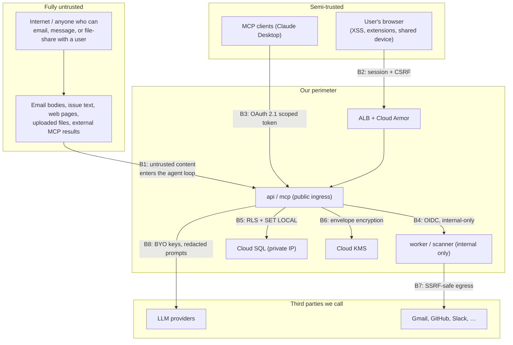
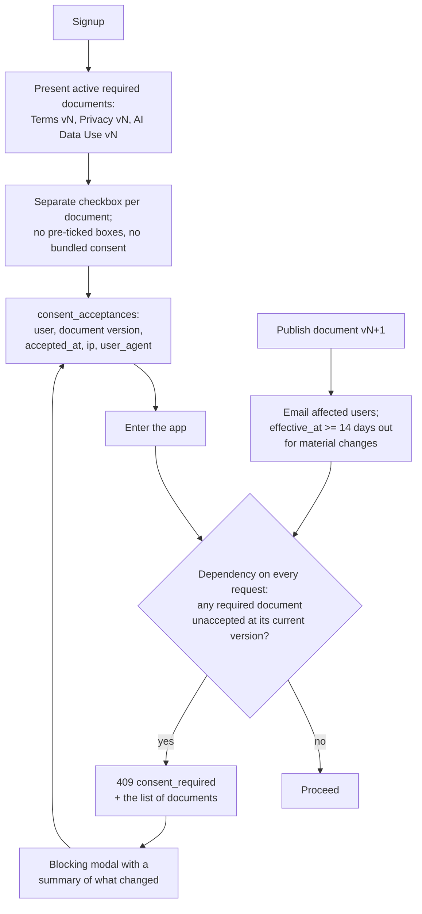

# 08 — Security, Threat Model, Privacy, and Consent

## 1. What we are actually defending

Younique holds, for each user: LLM provider API keys with real billing attached, OAuth tokens
granting access to their email, code, calendar, and files, the contents of everything those
tools read, and a durable memory of facts about them. It then lets a language model act on all
of that.

That makes three assets paramount, in order: **connector tokens and provider keys**, **tenant
isolation**, and **the integrity of the agent's decision loop**. Most of the controls below
exist to protect one of those three.

## 2. Trust boundaries

**B1 is the boundary that makes this product different from an ordinary SaaS app**, and it is
the one with no equivalent in standard web security checklists. Everything in
[safety-and-prompt-injection.md](03-designs/safety-and-prompt-injection.md) exists for it.

## 3. STRIDE threat model

### Spoofing

| Threat | Control | Doc |
| --- | --- | --- |
| Stolen session cookie | `__Host-` prefix, `httpOnly`, `Secure`, `SameSite=Lax`; opaque token with instant server-side revocation; step-up re-auth for all secret operations | [auth §2](03-designs/auth-and-multi-account.md) |
| Forged `X-Account-Id` to reach another user | Only accepts an account with an unrevoked session in the same `session_group_id` | auth §3 |
| Account takeover via unverified email at a second provider | Firebase single-account-per-email; explicit `linkWithCredential` flow. The `multiple accounts per email` setting is **off** and a Terraform comment explains why. | auth §3 |
| Forged internal task call | OIDC token + audience check, **and** `/internal/*` is absent from the ALB URL map | [02 §7](02-system-architecture.md) |
| Forged provider webhook | Per-connector HMAC with a timestamp window; replay rejected | [connector §9](03-designs/connector-framework.md) |
| Confused-deputy with a replayed MCP token | Audience binding per RFC 9728; a token for another resource is rejected | [mcp §1](03-designs/mcp-server.md) |

### Tampering

| Threat | Control |
| --- | --- |
| Ciphertext swapped between rows by an attacker with DB write access | AES-256-GCM **AAD bound to `workspace_id \|\| kind \|\| row_id \|\| key_version`** — the swapped ciphertext fails authentication |
| CSRF | Double-submit `X-CSRF-Token` plus `SameSite=Lax`; rejected before any handler |
| Supply-chain tampering | Lockfiles with hashes, Dependabot, `pip-audit`, `npm audit`, Trivy on images, CodeQL; Binary Authorization in v1 |
| Tool output rewriting the agent's own permissions | No code path exists from tool content to `tool_allowlist`, `tool_policies`, `budget`, or trust level. Verified by reading `observe`, asserted by a test. |
| MCP server changing a tool's description after approval ("rug pull") | Schema hashed at approval; a change disables the tool pending re-approval with a diff |

### Repudiation

Append-only `audit.audit_logs`, monthly-partitioned, 13-month retention, with the app role
granted `INSERT` only. Covered events: logins and failures, session revocation, consent
acceptance, key create/rotate/revoke, connection create/grant-change/revoke, every approval
decision, every share create/revoke, every artifact download, denied grant checks, MCP token
issue and use, and admin actions. Each row carries actor, IP, user agent, outcome, and
`request_id` — so an audit entry joins to a Cloud Trace span.

### Information disclosure

| Threat | Control |
| --- | --- |
| Cross-tenant data access | `authorize()` chokepoint **plus** Postgres RLS with `FORCE ROW LEVEL SECURITY`; the app role has no `BYPASSRLS`. Cross-workspace returns `404`, not `403`, to avoid confirming existence. |
| Secrets in logs, traces, or errors | Four-layer redaction: structlog processor, OTel span processor, provider-error normalization, and tool-output scanning. A leakage test pushes a known-secret corpus through all four. |
| Prompts and completions sent to an observability vendor | Content capture **off by default**; per-workspace opt-in; secret patterns applied regardless |
| Share link over-disclosing | Explicit inclusion table shown in the dialog; derived (not copied) artifact access; reasoning excluded by default; share-link principals denied every `tool.*` and secret action |
| Stored XSS via an artifact (HTML, SVG) | DOMPurify sanitization, `Content-Disposition: attachment`, sandboxed iframe on a **separate origin** with a restrictive CSP |
| Enumerable IDs | UUIDv7 — time-ordered for index locality but not guessable |
| A workspace admin reading a colleague's mailbox | `connections.owner_user_id`; **no role, including `owner`, can read another member's tokens**. A shared workspace is not consent to send email as a colleague. |

### Denial of service

Cloud Armor at the edge for volumetric abuse; app-layer rate limits per user, workspace, and IP;
`max_instances` on every Cloud Run service (a required Terraform argument with no default);
per-queue concurrency caps in Cloud Tasks; per-workspace concurrent-run caps so one tenant
cannot starve others; step, tool-call, wall-clock, and budget limits per run; 100 MB artifact
cap with megapixel and JSON-depth limits against decompression and expansion bombs; and
rate-limited public share-link resolution.

**Denial of wallet** deserves its own line, because it is the version of DoS that applies here.
A public share link that could run the model would let anyone spend the owner's API credits, so
link principals cannot execute tools and link-based `editor` requires an identified user.

### Elevation of privilege

| Threat | Control |
| --- | --- |
| An agent exceeding its owner's permissions | `principal_snapshot` is the ceiling; live re-validation can only narrow. Effective permissions are an **intersection at every layer, never a union** — there is no code path that widens. |
| Sub-agent escalation | Tool allowlist intersected with the parent's; budget is a slice of the parent's; depth capped at 3 |
| An injected agent calling a high-risk tool | Taint ratchet plus capability gating; `always_allow` does not survive tainting |
| SSRF to the GCP metadata endpoint | Resolved-IP checks against RFC 1918, loopback, and link-local (including `169.254.169.254`), **before connect and after every redirect**, in `_sdk/http.py` with no opt-out |
| OAuth scope abuse | Narrowest scopes; `connection_grants` enforced on every call; GitHub uses an App for platform-level repo scoping |
| Arbitrary code execution | **None in MVP.** v2 runs one Cloud Run Job per execution with zero egress, no credentials, and I/O only through pre-signed URLs. |
| PAT or MCP token escalation | Neither can perform a step-up-re-auth-gated operation, read a secret, or mint another token |

## 4. Controls summary

| Domain | Control |
| --- | --- |
| Transit | TLS 1.2+ everywhere, HSTS with preload, managed certificates |
| At rest | Cloud SQL and GCS encryption; CMEK on the artifacts bucket and prod SQL; user secrets envelope-encrypted on top |
| Key management | Per-environment KEK in KMS rotated every 90 days; per-workspace DEKs; `prevent_destroy` on the keyring |
| IAM | One service account per Cloud Run service, least privilege; no `roles/editor`; **no service-account JSON keys anywhere** — WIF only |
| Network | Cloud SQL private IP only; `worker` and `scanner` internal ingress only; egress allowlisting via VPC Service Controls in v1 |
| Input validation | Pydantic at every boundary, with bounds on every list and string. Tool input limits are an anti-exfiltration control. |
| Headers | Strict CSP (no `unsafe-eval`), `X-Content-Type-Options`, `Referrer-Policy: strict-origin-when-cross-origin`, `Permissions-Policy` |
| Files | Magic-byte detection, allowlist of detected types, ClamAV gate that fails closed, quarantine prefix, separate preview origin |
| Dependencies | Hash-pinned lockfiles, Dependabot, `pip-audit`/`npm audit`, Trivy, CodeQL, weekly scheduled scans |
| Secrets in repo | `detect-secrets` pre-commit plus GitHub secret scanning; `yq_pat_` prefix so our own tokens are detectable |
| Disclosure | GitHub private vulnerability reporting plus a security mailbox; 90-day coordinated disclosure; scope and the honest residual-risk list published in `SECURITY.md` |

## 5. Privacy and compliance checklist

| Requirement | Implementation |
| --- | --- |
| **Lawful basis** | Contract for core processing; consent for AI data use and optional telemetry, recorded per version |
| **Data minimization** | Narrowest OAuth scopes; prompt and completion content not stored in traces by default; IP coarsened to city in the device list; no fingerprint-based tracking |
| **Purpose limitation** | **User content is never used to train any model**, ours or a provider's. Stated in the privacy policy and in the consent text, because it is the first question any serious user asks. |
| **Transparency** | A data-flow page listing, per connector, exactly what is read and what is sent where; per-provider sub-processor list |
| **Right of access / portability** | `POST /v1/me:export` produces a complete JSON + file bundle: profile, chats, messages, artifacts, memories with versions, agents, pipelines, run history, usage, audit entries |
| **Right to erasure** | `POST /v1/me:delete` with a 30-day grace period, then the erasure job: hard-delete rows, delete GCS objects, **destroy the workspace DEK (crypto-shredding)** so backup copies are unrecoverable, and retain only a minimal legal-basis record of the deletion itself |
| **Backup erasure** | Crypto-shredding is the answer. PITR windows cannot be selectively edited, so destroying the key is the only provable mechanism — and it is documented in the privacy policy rather than glossed over. |
| **Retention** | Chats and artifacts until deleted; `run_events` 30 days; LangGraph checkpoints 7 days after completion; `usage_events` 25 months then Parquet export; audit logs 13 months; staged uploads 24 hours |
| **Sub-processors** | Google Cloud, Firebase, the LLM providers the *user* chooses (their key, their account, their terms), Langfuse if self-hosted by us. Published and versioned; material changes notified. |
| **International transfers** | Single region at launch (`us-central1`), disclosed. `europe-west1` is a documented v2 deployment target; EU-only residency is a deployment, not a toggle. |
| **Breach notification** | 72-hour process with an owner, a template, and a tested runbook |
| **DPA** | Available as a versioned `consent_documents` row of kind `dpa` for workspace owners |
| **Children** | 16+ in terms; no age verification, stated plainly |
| **Special-category data** | Pattern-matched and dropped from memory extraction unless the user stated it as an explicit preference; logged without content |
| **Automated decision-making** | Agents act on user instruction with approval gates. No profiling, no automated decisions with legal effect. |

Not pursued: SOC 2 certification, HIPAA, PCI. The controls are built to be SOC-2-compatible
(audit log, least privilege, change management, access review) so certification is a process
exercise rather than a rebuild, but we do not claim what we have not audited.

## 6. Terms and consent flow

| Property | Implementation |
| --- | --- |
| Versioned | `consent_documents(kind, version, content_sha256, effective_at, is_required)` |
| Immutable | A published document's text cannot change. A change is a new version. Asserted by a test on rows past `effective_at`. |
| Provable | `content_sha256` means what the user agreed to is verifiable years later, even if the rendered page changes |
| Granular | Terms, Privacy, and AI Data Use are separate acceptances. Optional telemetry is a separate, declinable consent that does not block use. |
| Re-acceptance | Automatic on a version bump; the modal shows a plain-language summary of what changed |
| Auditable | Acceptance is also an `audit_logs` event |
| Exempt routes | `GET /v1/me`, `GET/POST /v1/me/consents`, sign-out, health. A user must always be able to read the terms, accept them, or leave. |
| Withdrawal | Declining new required terms means the account can be exported and deleted but not used — stated clearly, not hidden |

## 7. Security review triggers

A change requires a security review (the `security` PR label plus a maintainer who did not write
it) when it touches: `authz/`, `crypto/`, `api/v1/auth*`, session handling, `_sdk/http.py`, the
taint or gating logic, artifact scanning or serving, share-link resolution, the MCP OAuth
implementation, RLS policies, or IAM in Terraform.

A `security-review` subagent pass is run before each release tag on the diff since the previous
tag. That is cheap and catches the class of mistake where an individually-reasonable change
weakens an invariant established somewhere else.
