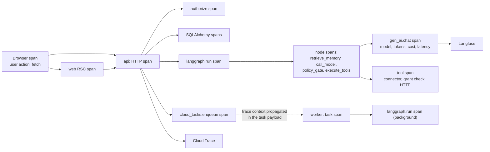

# 09 — Observability

## 1. What we need to be able to answer

Observability design should start from the questions, not the tooling. These are the ones that
will actually be asked, in rough order of frequency:

1. A user pastes a `request_id`. What happened, end to end, including which model and which
   tools ran?
2. Is the product up, and if not, which dependency broke?
3. Why did this agent run fail, and was it our fault, the provider's, or the connector's?
4. Why is this chat slow — our code, the database, or the model?
5. Why did this cost so much?
6. Why did the agent do that? What was in its context?
7. Are scheduled runs firing on time?
8. Is a connector degraded for everyone or just one user?

Each of the sections below exists to answer one or more of these. Anything that answers none of
them is not worth the cardinality.

## 2. Structured logging

`structlog` to stdout as JSON, picked up by Cloud Logging. The redaction processor is a
pipeline stage, not a convention — see [secrets §5](03-designs/secrets-and-byok.md).

Every log line carries: `timestamp`, `severity`, `message`, `request_id`, `trace_id`,
`span_id`, `service`, `revision`, `workspace_id`, `user_id`, plus `run_id`, `run_step_id`,
`chat_id`, `agent_id`, `connector_key`, and `model_ref` where applicable. Bound once per
request or per run, so nothing has to remember to pass them.

| Level | Use |
| --- | --- |
| `debug` | Local only. Never enabled in prod. |
| `info` | State transitions: run started, tool executed, approval decided, connection refreshed |
| `warning` | Recovered problems: a retry succeeded, a fallback model was used, a token was proactively refreshed |
| `error` | A request or run failed in a way we might be responsible for |
| `critical` | Dependency down, DLQ filling, encryption failure |

Two rules: a **provider returning 429 is `warning`, not `error`** — it is expected operational
behaviour and treating it as an error destroys the signal-to-noise ratio of the error rate. And
`trace_id` goes in `logging.googleapis.com/trace` format so Cloud Logging links each line to
its trace automatically; without that, logs and traces are two disconnected tools.

Log exclusion filters drop health checks and static-asset access logs, which are otherwise a
surprisingly large share of the Cloud Logging bill.

## 3. Tracing

OpenTelemetry everywhere, one trace from browser click to provider response.

| Layer | Instrumentation |
| --- | --- |
| Browser | OTel web SDK, exported through `app/api/otel` to avoid CORS. Sampled at 10 %, plus 100 % of sessions with an error. |
| `web` | Auto-instrumented fetch and render spans |
| `api`, `worker`, `mcp` | `opentelemetry-instrumentation-fastapi`, `-sqlalchemy`, `-httpx`, `-asyncpg` |
| LangGraph and LLM calls | OpenLLMetry (Traceloop), using the OTel **GenAI semantic conventions** so attributes are portable |
| Async boundaries | Trace context propagated in the Cloud Tasks payload and the Pub/Sub message attributes |

**Trace-context propagation across Cloud Tasks is the detail that makes this useful.** Without
it, a background run is an orphan trace and question 1 becomes unanswerable for exactly the
runs that matter most.

Sampling: 100 % of errors, 100 % of agent and pipeline runs (they are low-volume and
high-value), 10 % of ordinary API requests, 1 % of health checks. Tail-based sampling via the
OTel collector so the decision is made after an error is known.

### PII-aware redaction

A `SpanProcessor` runs before export:

| Data | Default | Override |
| --- | --- | --- |
| Prompt and completion content | **Not recorded.** Token counts, model, latency, and a content SHA-256 only. | Per-workspace opt-in, for debugging |
| Tool arguments and results | Key names recorded, values redacted | Same opt-in |
| Memory content | Never recorded. IDs and scores only. | No override |
| Secret patterns | Always redacted, in every mode | None |
| Emails and phone numbers | Masked (`a***@example.com`) | Opt-in reveals |
| User and workspace IDs | Always recorded — they are internal identifiers, not PII to us | — |

Content capture off by default is the right trade. The counterargument is that debugging agent
behaviour without seeing the prompt is hard — which is true, and is why the opt-in exists and
why the content SHA-256 is recorded (so "did the prompt change between these two runs" is
answerable without storing it).

## 4. LLM-specific observability

Langfuse, self-hostable and OSS, which matters for an AGPL project — a self-hoster can run the
whole observability stack. Rejected LangSmith: closed, and self-hosters cannot run it.

Per run, Langfuse holds: the model, the resolved parameters, token counts by type, cost, latency
per call, the tool-call tree, retries and fallbacks taken, the final status, and (if the
workspace opted in) prompts and completions.

What this is for, specifically: answering "why did the agent do that". A support request about a
confused agent is nearly impossible to resolve from metrics alone, and Cloud Trace's UI is not
built for reading a conversation.

Self-hosters point `OTEL_EXPORTER_OTLP_ENDPOINT` anywhere — Langfuse, Phoenix, Jaeger, or
nothing. No vendor is required to run the product.

## 5. Metrics

Low-cardinality by design. **Never `user_id` or `workspace_id` as a label** — that is the
classic way to make a metrics bill exceed a compute bill. Per-tenant questions are answered
from Postgres, which is the right tool for high-cardinality aggregation.

| Metric | Type | Labels |
| --- | --- | --- |
| `http_requests_total` | counter | `route`, `method`, `status_class` |
| `http_request_duration_seconds` | histogram | `route`, `method` |
| `chat_first_token_seconds` | histogram | `provider` |
| `llm_calls_total` | counter | `provider`, `model_ref`, `outcome` |
| `llm_call_duration_seconds` | histogram | `provider`, `model_ref` |
| `llm_tokens_total` | counter | `provider`, `model_ref`, `token_kind` |
| `runs_total` | counter | `kind`, `status` |
| `run_duration_seconds` | histogram | `kind` |
| `tool_calls_total` | counter | `connector_key`, `tool_key`, `outcome` |
| `approvals_total` | counter | `decision`, `reason` |
| `queue_depth` / `queue_oldest_task_seconds` | gauge | `queue` |
| `dlq_messages` | gauge | `subscription` |
| `schedule_dispatch_lag_seconds` | histogram | — |
| `connection_health` | gauge | `connector_key`, `health` |
| `db_pool_in_use` / `db_pool_waiting` | gauge | `service` |
| `artifact_scans_total` | counter | `result` |
| `injection_signals_total` | counter | `signal_kind` |

`injection_signals_total` is unusual for a metrics list but it is the leading indicator for an
attack campaign against our users. A spike means someone is probing, and that is worth knowing
before the support tickets arrive.

## 6. SLOs

| SLO | Target (MVP → v1) | Window | Measured from |
| --- | --- | --- | --- |
| API availability | 99.5 % → 99.9 % | 30 days | Non-5xx / total, excluding `4xx` |
| Chat first token | p95 < 2 s | 7 days | `chat_first_token_seconds`, provider time excluded |
| API latency (non-streaming) | p95 < 500 ms | 7 days | `http_request_duration_seconds` |
| Background run start lag | p95 < 30 s | 7 days | `queued_at` → `started_at` |
| Schedule accuracy | p99 < 60 s drift | 30 days | `schedule_dispatch_lag_seconds` |
| Run success rate | > 97 % excluding user cancellations and policy refusals | 7 days | `runs_total` |
| Artifact scan completion | p95 < 30 s | 7 days | Upload finalize → `clean` |
| Data durability | No loss | — | PITR verified by a quarterly restore drill |

Excluding provider time from the first-token SLO is deliberate: we cannot control Anthropic's
latency, and an SLO we cannot act on generates alerts nobody can resolve. Provider latency is
tracked separately as a dependency metric, which is what you actually want when a user complains
about speed.

Error budgets drive **burn-rate alerts** (fast burn: 2 % in 1 h → page; slow burn: 10 % in 6 h →
ticket), not raw threshold alerts. Threshold alerting on a low-traffic service is mostly noise.

## 7. Dashboards

| Dashboard | Panels |
| --- | --- |
| **Golden signals** | Request rate, error rate by class, latency percentiles, saturation (instance count, DB pool, queue depth) |
| **Agent runs** | Runs by status over time, duration distribution by kind, step-count distribution, approval rate and decision mix, limit-hit breakdown, top failure codes |
| **Provider health** | Error rate by provider and model, latency by model, rate-limit incidence, fallback rate, invalid-key count. The first thing to open when "the AI is broken". |
| **Connector health** | Connection count by health, `needs_reauth` count, tool error rate by connector, denied-grant count |
| **Queues** | Depth and oldest-task age per queue, retry rate, **DLQ depth** (any non-zero is actionable) |
| **Cost** | Spend by day and model, token mix, workspaces near budget, platform-paid embedding usage |
| **Database** | Connections in use vs limit, slow queries from `pg_stat_statements`, index hit rate, partition sizes, replication lag |
| **Security** | Failed logins, denied authorizations, injection signals, infected artifacts, SSRF blocks, step-up re-auth failures |

## 8. Alerting

Three tiers, and the discipline is that **tier 1 must be rare or it stops working.**

| Tier | Response | Conditions |
| --- | --- | --- |
| **Page** | Immediate | Availability fast-burn; Cloud SQL unreachable; DLQ above 10; encryption/KMS failure; scheduler tick not firing for 5 min; error rate above 10 % for 5 min |
| **Ticket** | Next business day | Availability slow-burn; latency SLO breach; a connector failing for more than 20 % of its connections; `needs_reauth` spike; artifact scan backlog; partition-creation job failed |
| **Digest** | Daily email | Budget warnings, deprecated-model usage, dependency vulnerabilities, injection-signal summary, flaky-test report |

Every tier-1 alert has a runbook in `docs/runbooks/` with: how to confirm, how to mitigate, how
to resolve, and how to verify. An alert without a runbook gets demoted to tier 2 — being woken
up for something you do not know how to fix is how on-call rotations die.

User-facing failures also notify the **user**, not just us: a failed background run, a
connection needing re-auth, a budget breach, or an approval expiring. Silent failure is the
worst property an automation product can have.

## 9. Frontend observability

- **Web Vitals** (LCP, INP, CLS) reported per route, with Lighthouse CI budgets on PRs.
- **Error tracking** via OTel plus Cloud Error Reporting, with source maps uploaded on deploy
  and the `request_id` attached so a frontend error joins its backend trace.
- **Streaming health**: SSE disconnect rate, reconnect success rate, and resume gap count. A
  non-zero gap count means the resume logic has a bug, and it is the kind of bug users notice
  before monitoring does unless you measure it explicitly.
- **No session replay and no third-party analytics.** Replay tools capture conversation content,
  which contradicts the privacy posture. Product analytics, if added, will be self-hosted and
  consent-gated.

## 10. Cost of observability

Budgeted and reviewed, because observability bills have a habit of overtaking compute bills.

| Control | Effect |
| --- | --- |
| Log exclusions for health checks and static assets | The single largest Cloud Logging saving |
| Tail-based sampling at 10 % baseline | Keeps trace volume proportional to value |
| No high-cardinality metric labels | Prevents time-series explosion |
| 30-day log retention, with security logs exported to GCS Coldline for 13 months | Cheap long-tail retention |
| Content capture off by default | Keeps Langfuse storage small and avoids storing PII |

Target: observability under 10 % of infrastructure spend. Reviewed monthly, reported in the cost
dashboard like any other line item.
