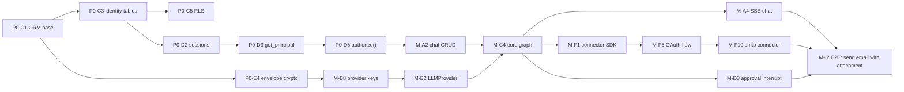

# 12 — Backlog

Epics to stories, in dependency order, each tagged by area and sized. A contributor should be
able to pick any story whose dependencies are done and work without asking questions.

**Sizing:** `XS` under 2 h · `S` half a day · `M` 1-2 days · `L` 3-5 days · `XL` over a week
(decompose before starting).

**Areas:** `BE` backend · `FE` frontend · `AG` agents and pipelines · `CN` connectors ·
`IN` infra · `DX` tooling and CI · `DOC` docs

Acceptance criteria are written as assertions. If you cannot demonstrate each one, the story is
not done.

---

# Phase 0 — Foundations

## Epic P0-A: Repository and tooling

| ID | Story | Area | Size | Depends |
| --- | --- | --- | --- | --- |
| P0-A1 | Monorepo scaffold: `pnpm` workspaces, Turborepo, `uv`, directory tree per [07](07-repo-and-contributor-workflow.md) | DX | M | — |
| P0-A2 | Lint and type config: ruff, mypy strict, eslint, prettier, tsc strict | DX | S | A1 |
| P0-A3 | Pre-commit hooks incl. `detect-secrets`, commitlint, the forbidden-import check | DX | S | A2 |
| P0-A4 | `docker compose`: Postgres+pgvector, Firebase Auth emulator, fake-gcs-server, Cloud Tasks shim, ClamAV, Langfuse | DX | L | A1 |
| P0-A5 | `Makefile`: `setup`, `dev`, `test`, `lint`, `types`, `migrate`, `revision`, `openapi`, `seed` | DX | S | A4 |
| P0-A6 | Path-filtered CI workflows per [07 §6](07-repo-and-contributor-workflow.md) | DX | L | A2 |
| P0-A7 | DCO check, SPDX headers, `reuse lint`, AGPL + Apache-2.0 split | DX | S | A1 |
| P0-A8 | `release-please`, Conventional Commits, CHANGELOG generation | DX | S | A6 |
| P0-A9 | 15-minute-setup timing job on a clean weekly runner | DX | S | A5 |

**A4 acceptance:** `make dev` on a machine with no GCP credentials starts every service;
`/healthz` returns 200; no step requires a cloud account.
**A6 acceptance:** a PR touching only `connectors/gmail/` runs neither frontend nor infra jobs
and completes in under 4 minutes.
**A9 acceptance:** the job fails if clone-to-running exceeds 15 minutes.

## Epic P0-B: Infrastructure

| ID | Story | Area | Size | Depends |
| --- | --- | --- | --- | --- |
| P0-B1 | Terraform module library: `cloud_run_service`, `cloud_sql`, `gcs_bucket`, `task_queue`, `pubsub_topic`, `kms_keyring`, `alb`, `monitoring` | IN | XL → decompose per module | — |
| P0-B2 | `envs/shared`: Artifact Registry, Workload Identity Federation, TF state bucket | IN | M | B1 |
| P0-B3 | `envs/dev` applied end to end | IN | M | B2 |
| P0-B4 | Cloud SQL with private IP, Direct VPC egress, connection-math documented | IN | M | B3 |
| P0-B5 | GCS buckets with lifecycle rules, uniform access, CMEK on artifacts | IN | S | B3 |
| P0-B6 | KMS keyring and KEK with `prevent_destroy` | IN | S | B3 |
| P0-B7 | Cloud Tasks queues and Pub/Sub topics, each with a DLQ | IN | M | B3 |
| P0-B8 | Deploy pipeline: build, push, `--no-traffic`, smoke, gradual traffic, rollback | IN | L | B2, A6 |
| P0-B9 | `envs/staging` and `envs/prod` | IN | M | B8 |
| P0-B10 | Cloud Armor: WAF rules, L7 rate limiting | IN | M | B9 |
| P0-B11 | Per-PR preview environments (Cloud Run revision + per-PR database) | IN | L | B8 |

**B8 acceptance:** a tagged release deploys with no traffic, passes a smoke test at the revision
URL, takes 10 % then 100 %; rollback is a traffic shift completing in under 60 s.
**B1 acceptance:** `max_instances` is a required module argument with no default.

## Epic P0-C: Data layer

| ID | Story | Area | Size | Depends |
| --- | --- | --- | --- | --- |
| P0-C1 | SQLAlchemy base, UUIDv7 PK type, audit-column mixin, soft-delete mixin, `updated_at` trigger | BE | M | A1 |
| P0-C2 | Alembic setup, one-head enforcement, `lock_timeout`, `check_migration.py` | BE | M | C1 |
| P0-C3 | Identity and tenancy tables: `users`, `identities`, `sessions`, `devices`, `workspaces`, `workspace_members`, `invitations` | BE | M | C2 |
| P0-C4 | Consent tables and immutability constraint | BE | S | C3 |
| P0-C5 | **RLS policies on every tenant table** plus the `SET LOCAL` session dependency | BE | L | C3 |
| P0-C6 | `testcontainers` Postgres fixture, transaction-rollback isolation, factories | BE | M | C1 |
| P0-C7 | **RLS isolation test** | BE | S | C5, C6 |
| P0-C8 | `idempotency_keys` and `outbox` tables with the drain task | BE | M | C2 |

**C5 acceptance:** the app role has no `BYPASSRLS`; `FORCE ROW LEVEL SECURITY` on every tenant
table; the session dependency uses `SET LOCAL` (a test asserts context does not survive commit).
**C7 acceptance:** raw SQL as `younique_app` with no tenant context returns zero rows from every
tenant table; with workspace A's context, workspace B's rows are invisible.

## Epic P0-D: Auth and authorization

| ID | Story | Area | Size | Depends |
| --- | --- | --- | --- | --- |
| P0-D1 | Firebase ID token verification with emulator support | BE | M | C3 |
| P0-D2 | Session exchange: `__Host-session` cookie, `session_group_id`, CSRF double-submit | BE | L | D1 |
| P0-D3 | `get_principal()`: cookie, `X-Account-Id` same-group validation, workspace resolution | BE | L | D2 |
| P0-D4 | First-login bootstrap: user, identity, workspace, membership, personal memory set, default tool policies | BE | M | D3 |
| P0-D5 | `authorize(principal, action, resource)` with the role matrix and grant resolution | BE | XL → split by resource type | D3 |
| P0-D6 | CI check: every route has `authorize()` or `@public` | DX | S | D5 |
| P0-D7 | `tests/authz/expectations.yaml` plus the parametrized cross-product test | BE | L | D5 |
| P0-D8 | Session lifecycle: idle and absolute timeout, revocation, device list, step-up re-auth | BE | M | D3 |
| P0-D9 | Consent gating dependency with the exempt-route list | BE | M | C4, D3 |
| P0-D10 | Login, signup, consent modal, account switcher UI | FE | L | D2 |
| P0-D11 | Session and device list UI with revoke | FE | M | D8 |

**D3 acceptance:** `X-Account-Id` for a user without an unrevoked session in the same
`session_group_id` returns `401`, never that user's data.
**D7 acceptance:** every cell of the matrix has an expectation; cross-workspace returns `404`
not `403`; a share-link principal is denied every `tool.*` action.
**D8 acceptance:** revoking from the device list invalidates within one request.

## Epic P0-E: Cross-cutting backend

| ID | Story | Area | Size | Depends |
| --- | --- | --- | --- | --- |
| P0-E1 | Typed error taxonomy, `ProblemDetail`, RFC 9457 handler, `request_id` | BE | M | A1 |
| P0-E2 | `structlog` with the redaction processor; the leakage test | BE | M | E1 |
| P0-E3 | OTel: FastAPI, SQLAlchemy, httpx instrumentation to Cloud Trace | BE | M | E2 |
| P0-E4 | Envelope encryption: KEK backends (`gcp_kms`, `env`, `file`), DEK per workspace, AAD binding | BE | L | C2, B6 |
| P0-E5 | Crypto tests: round-trip, AAD tamper, cross-row swap rejection, rotation | BE | M | E4 |
| P0-E6 | Idempotency middleware | BE | M | C8, E1 |
| P0-E7 | Rate limiting per user, workspace, and IP | BE | M | E1 |
| P0-E8 | OIDC verification for Cloud Tasks, Scheduler, and Pub/Sub callers | BE | S | E1 |
| P0-E9 | `openapi.json` export, drift check, `oasdiff` gate | DX | M | E1, A6 |
| P0-E10 | `packages/api-client` generation (Apache-2.0) | DX | M | E9 |

**E2 acceptance:** a known-secret corpus pushed through logs, traces, error bodies, and prompts
produces zero leaks.
**E5 acceptance:** ciphertext moved between rows fails to decrypt.

## Epic P0-F: Documentation

| ID | Story | Area | Size | Depends |
| --- | --- | --- | --- | --- |
| P0-F1 | `AGENTS.md` and all nested rules files from [07-rules](07-rules/) | DOC | M | — |
| P0-F2 | README, ARCHITECTURE, CONTRIBUTING, SECURITY, CODE_OF_CONDUCT, SUPPORT | DOC | M | — |
| P0-F3 | Issue and PR templates, CODEOWNERS | DOC | S | — |
| P0-F4 | ADRs 0001-0010 for the decisions already made | DOC | M | — |
| P0-F5 | Docs site scaffold with generated API reference | DOC | M | E9 |
| P0-F6 | **Submit Google OAuth verification; begin CASA engagement** | DOC | M | — |

**F6 is the highest-priority non-code story in Phase 0.** Elapsed time is external and cannot be
compressed. Acceptance: a submission with a case number, and a CASA assessor contacted.

---

# MVP

## Epic M-A: Chat

| ID | Story | Area | Size | Depends |
| --- | --- | --- | --- | --- |
| M-A1 | Chat tables: `chats`, `messages`, `message_parts` with partial indexes | BE | M | P0-C |
| M-A2 | Chat CRUD with archive and restore | BE | M | M-A1, P0-D5 |
| M-A3 | `run_events` table, `RunEventBus` with `LISTEN/NOTIFY` fan-out | BE | L | M-A1 |
| M-A4 | SSE endpoint: POST message, stream events, persist each with a `seq` | BE | L | M-A3, M-C4 |
| M-A5 | Resume endpoint `GET /v1/runs/{id}/events?last_event_id=` | BE | M | M-A3 |
| M-A6 | Cancel (`:cancel`) and regenerate (`:regenerate`) | BE | M | M-A4 |
| M-A7 | SSE client parser (`lib/sse.ts`) with reconnect and resume | FE | L | M-A4 |
| M-A8 | Chat UI: message list virtualized, composer, stop, regenerate, rAF-batched deltas | FE | XL → split | M-A7 |
| M-A9 | Code rendering: Shiki, language detection, copy button, worker for large blocks | FE | M | M-A8 |
| M-A10 | Rich rendering: tables, CSV/JSON preview, images, PDF in a sandboxed iframe | FE | L | M-A8, M-E7 |
| M-A11 | Reasoning display: collapsed disclosure, global and per-chat toggle | FE | M | M-A8, M-C5 |
| M-A12 | Per-chat artifact panel | FE | M | M-E7 |
| M-A13 | Error treatment map: every code to its UI shape | FE | M | M-A8, P0-E1 |

**M-A4 acceptance:** first token p95 under 2 s excluding provider time; every event persisted
before flush.
**M-A7 acceptance:** killing the network mid-stream and reconnecting loses zero tokens.
**M-A8 acceptance:** a 500-message chat scrolls at 60 fps; streaming text is in an
`aria-live="polite"` region; the composer is fully keyboard-operable.

## Epic M-B: Models and keys

| ID | Story | Area | Size | Depends |
| --- | --- | --- | --- | --- |
| M-B1 | `model_providers`, `models`, `model_prices` tables and the idempotent YAML seed | BE | M | P0-C2 |
| M-B2 | `LLMProvider` interface and `StreamEvent` union | BE | M | P0-E1 |
| M-B3 | `LiteLLMProvider` | BE | L | M-B2 |
| M-B4 | Native `AnthropicProvider` and `OpenAIProvider` | BE | L | M-B2 |
| M-B5 | Provider error normalization and the retry/backoff/fallback policy | BE | L | M-B2 |
| M-B6 | Reasoning parameter translation across the four dialects | BE | M | M-B2 |
| M-B7 | Token counting and context packing with the no-orphan-tool-result guarantee | BE | L | M-B2 |
| M-B8 | `provider_keys` CRUD: validate-before-store, masked reads, rotate, revoke, step-up re-auth | BE | L | P0-E4, P0-D8 |
| M-B9 | Workspace-private OpenAI-compatible model registration | BE | M | M-B1 |
| M-B10 | Model picker UI with `?available=true` filtering and capability badges | FE | M | M-B1 |
| M-B11 | Key management UI: add, validate, rotate, revoke; never displays material | FE | M | M-B8 |
| M-B12 | Stream normalization fixture tests and the error-mapping table test | BE | M | M-B3, M-B4 |

**M-B8 acceptance:** no endpoint returns key material for any principal; `GET` returns `last4`
only; save with an invalid key returns a form error and stores nothing.
**M-B7 acceptance:** a property test over random histories never exceeds budget and never
orphans a `tool_result`.

## Epic M-C: Agent runtime

| ID | Story | Area | Size | Depends |
| --- | --- | --- | --- | --- |
| M-C1 | `runs` and `run_steps` tables with the kind/target CHECK | BE | M | P0-C2 |
| M-C2 | `AgentState` and `taint.py` | AG | M | M-C1 |
| M-C3 | LangGraph Postgres checkpointer wiring; CI check that Alembic ignores the schema | AG | M | M-C1 |
| M-C4 | Core graph: initialize, pack_context, call_model, route, execute_tools, observe, finalize | AG | XL → one story per node | M-C2, M-B2 |
| M-C5 | Resolution of model, reasoning mode, and tool allowlist | AG | M | M-C4 |
| M-C6 | `policy_gate` with allowlist, `tool_policies`, and taint rules | AG | L | M-C4, M-D2 |
| M-C7 | Limits: steps, tool calls, wall clock, budget; specific errors with remediation | AG | M | M-C4 |
| M-C8 | `FakeChatModel` and the deterministic graph test suite | AG | L | M-C4 |
| M-C9 | **Prompt-injection regression suite** | AG | L | M-C6 |
| M-C10 | Unicode tag-character and bidi stripping | AG | S | M-C2 |

**M-C9 acceptance:** every test in [safety §8](03-designs/safety-and-prompt-injection.md) passes;
the canonical email-injection case produces no unapproved tool call.
**M-C6 acceptance:** `always_allow` plus taint plus `allow_when_tainted=false` on a high-risk
tool requires approval.

## Epic M-D: Approvals and tool policy

| ID | Story | Area | Size | Depends |
| --- | --- | --- | --- | --- |
| M-D1 | `approvals` and `tool_policies` tables | BE | S | P0-C2 |
| M-D2 | Policy resolution: tool default → workspace → agent → taint override | BE | M | M-D1 |
| M-D3 | `interrupt()` suspend, `awaiting_approval` status, instance release | AG | L | M-C4, M-D1 |
| M-D4 | Decide endpoint with `remember`, step-up re-auth for `always_allow`, audit | BE | M | M-D1, P0-D8 |
| M-D5 | Resume via a fresh Cloud Task with `Command(resume=...)` | AG | M | M-D3 |
| M-D6 | Approval expiry job: fail the run with `approval_expired` | BE | S | M-D1 |
| M-D7 | Inline approval card with the human-readable summary and provenance highlighting | FE | L | M-D4 |
| M-D8 | Approvals inbox page | FE | M | M-D4 |
| M-D9 | Tool policy settings UI with risk badges and taint warnings | FE | M | M-D2 |

**M-D3 acceptance:** the worker request completes while a run is suspended; no container is held;
the run resumes correctly in a different instance hours later.
**M-D7 acceptance:** a tool argument copied verbatim from untrusted input is visually flagged.

## Epic M-E: Artifacts

| ID | Story | Area | Size | Depends |
| --- | --- | --- | --- | --- |
| M-E1 | `artifacts`, `artifact_versions`, `artifact_scans`, `chat_artifacts` tables | BE | M | P0-C2 |
| M-E2 | Reservation endpoint and signed resumable upload URL with content-length binding | BE | M | M-E1, P0-B5 |
| M-E3 | GCS → Pub/Sub → worker ingest handler | BE | M | M-E2, P0-B7 |
| M-E4 | Magic-byte detection, extension cross-check, structural validation per type | BE | L | M-E3 |
| M-E5 | `scanner` ClamAV service and the scan state machine | BE/IN | L | M-E3 |
| M-E6 | Promotion to the artifacts bucket; preview and thumbnail generation | BE | M | M-E5 |
| M-E7 | List, metadata, preview, and download endpoints with the `clean` gate | BE | M | M-E6 |
| M-E8 | Versioning and sha256 dedupe | BE | M | M-E1 |
| M-E9 | `ctx.emit_artifact` for generated output | BE | M | M-E6 |
| M-E10 | Upload UI: drag and drop, multi-file, progress, resumable retry | FE | L | M-E2 |
| M-E11 | Artifacts page: grid, table, timeline, full filter and search | FE | XL → split by view | M-E7 |
| M-E12 | Type-aware preview components per MIME group | FE | L | M-E7 |
| M-E13 | Separate preview origin with a strict CSP; SVG sanitization | FE/IN | M | M-E12 |

**M-E5 acceptance:** the EICAR file is quarantined, never downloadable, and surfaces an
`infected` state. Scan timeout fails closed, never open.
**M-E7 acceptance:** download returns `409` for every non-`clean` status; signed URL TTL is 5
minutes.

## Epic M-F: Connectors (MVP set)

| ID | Story | Area | Size | Depends |
| --- | --- | --- | --- | --- |
| M-F1 | Connector SDK: manifest models, `@tool`, `ToolContext`, `ConnectorError` | CN | XL → split | M-C4 |
| M-F2 | SSRF-safe `ctx.http`: resolved-IP checks pre-connect and post-redirect, rate limiting | CN | L | M-F1 |
| M-F3 | Forbidden-import lint rule for `connectors/*/` | DX | S | M-F1 |
| M-F4 | `connections`, `connection_grants`, `connection_secrets`, `oauth_states` tables | BE | M | P0-E4 |
| M-F5 | OAuth flow: authorize, PKCE, single-use state, callback, token storage | BE | L | M-F4 |
| M-F6 | Token refresh with `pg_advisory_xact_lock` | BE | M | M-F5 |
| M-F7 | BYO OAuth client per workspace per connector | BE | M | M-F5 |
| M-F8 | `ctx.require_grant` enforcement and the resource-selection step | BE | M | M-F4 |
| M-F9 | Health probes, daily `connector-sync`, pause-dependents-on-failure | BE | M | M-F6 |
| M-F10 | `smtp` connector (send-only, app passwords) | CN | M | M-F1 |
| M-F11 | `gmail` connector (send + read bundles, BYO client) | CN | L | M-F5 |
| M-F12 | `google-sheets` connector (read/write) | CN | L | M-F5 |
| M-F13 | `google-drive` connector using `drive.file` | CN | M | M-F5 |
| M-F14 | `http` generic connector with a per-connection host allowlist | CN | L | M-F2 |
| M-F15 | `webhook` generic connector with HMAC and replay rejection | CN | M | M-F1 |
| M-F16 | `make new-connector` scaffold and `make validate-connectors` | DX | M | M-F1 |
| M-F17 | Cassette record/replay harness and scrubber with a CI secret check | DX | M | M-F1 |
| M-F18 | Connections UI: catalogue with limitations, connect flow, bundle picker, resource picker, health | FE | XL → split | M-F8 |

**M-F2 acceptance:** `169.254.169.254` and any DNS name resolving to a private range are refused,
before connect and after each redirect.
**M-F8 acceptance:** a tool called with a non-granted resource raises before any HTTP request
(strict mock asserts zero calls) and writes a security audit event.
**M-F11 acceptance:** a `send`-only connection has no read tool available at all.

## Epic M-G: Sharing (MVP subset)

| ID | Story | Area | Size | Depends |
| --- | --- | --- | --- | --- |
| M-G1 | `resource_grants` and `share_links` tables | BE | M | P0-D5 |
| M-G2 | Share-link create, revoke, expiry, optional password | BE | M | M-G1 |
| M-G3 | `GET /v1/public/{token}` resolution with no session created | BE | M | M-G2 |
| M-G4 | Derived artifact access from a readable chat | BE | M | M-G1, M-E7 |
| M-G5 | Share-link principal denied all `tool.*` and secret actions | BE | S | M-G3, P0-D5 |
| M-G6 | Share dialog with the verbatim inclusion/exclusion table | FE | M | M-G2 |
| M-G7 | Public share view, `noindex`, reasoning hidden by default | FE | M | M-G3 |

**M-G5 acceptance:** a share-link principal gets `403` on every `tool.*` and `*_secret` action,
asserted exhaustively.

## Epic M-H: Usage ledger and observability

| ID | Story | Area | Size | Depends |
| --- | --- | --- | --- | --- |
| M-H1 | `usage_events` partitioned table with monthly partition management | BE | M | P0-C2 |
| M-H2 | Cost computation from a price snapshot; idempotent insert on `request_id` | BE | M | M-H1, M-B1 |
| M-H3 | Usage recording on success, partial stream, and failure | BE | M | M-H2, M-C4 |
| M-H4 | `GET /v1/usage` and `/usage/events` | BE | M | M-H1 |
| M-H5 | Per-message and per-run cost display | FE | M | M-H4 |
| M-H6 | `audit_logs` partitioned table plus the audit helper | BE | M | P0-C2 |
| M-H7 | Audit events on login, key change, connection change, share, approval, download | BE | M | M-H6 |
| M-H8 | Langfuse LLM tracing with content capture off by default | BE | M | P0-E3 |
| M-H9 | Uptime checks, error alerting, golden-signals dashboard | IN | M | P0-B9 |
| M-H10 | Frontend OTel through a proxy route | FE | M | P0-E3 |

**M-H2 acceptance:** the cost-arithmetic table passes including cached input and reasoning;
changing a price does not alter a historical event's cost.

## Epic M-I: MVP E2E and launch readiness

| ID | Story | Area | Size | Depends |
| --- | --- | --- | --- | --- |
| M-I1 | E2E: signup, consent, save a key, get a streamed response | FE | M | M-B11, D10 |
| M-I2 | E2E: connect SMTP, send an email with an attachment, approve | FE | L | M-F10, M-D7 |
| M-I3 | E2E: tool policy `never` refuses with no provider call | FE | M | M-D9 |
| M-I4 | E2E: EICAR upload is quarantined | FE | M | M-E5 |
| M-I5 | E2E: share a chat, verify access boundaries | FE | M | M-G7 |
| M-I6 | E2E: account switch isolates connections, keys, and memory | FE | M | D10 |
| M-I7 | Mock LLM and mock provider layer for deterministic E2E | DX | L | M-B2 |
| M-I8 | Launch checklist: SLO dashboard, runbooks, DLQ redrive, backup restore drill | IN/DOC | L | M-H9 |

**M-I8 acceptance:** a restore from PITR into a scratch instance is performed and timed; the DLQ
redrive runbook is executed once against a seeded failure.

---

# v1 (outline — expand when MVP exits)

| Epic | Stories | Area | Size |
| --- | --- | --- | --- |
| V1-A Agents | `agents`/`agent_versions`/`triggers` tables; builder UI; versioning and publish; manual run; run history with step inspector; failure notifications; pause/resume/retry/cancel | BE, FE, AG | XL |
| V1-B Scheduling | `schedules` table; the single Cloud Scheduler tick; dispatcher with `SKIP LOCKED`; croniter+zoneinfo; catchup and overlap policies; `next-fires` preview; the DST test matrix | BE | L |
| V1-C Background execution | Cloud Tasks handlers; CAS claim; per-workspace concurrency cap; DLQ and redrive; 200-on-business-failure discipline | BE, AG | L |
| V1-D Pipelines | Node registry; `GET /v1/node-types`; DAG compiler to LangGraph; validation; data-by-reference with Parquet spill; React Flow editor; live run view; keyboard list view | BE, AG, FE | XL |
| V1-E Memory | `memory_sets`/`memories`/`memory_versions`; async extraction with the untrusted exclusion; conflict resolution; RRF hybrid retrieval; token budgeting; memory manager UI; export; `preview-retrieval` | BE, FE | XL |
| V1-F Connectors | GitHub (as a GitHub App), Slack, Google Calendar, Google Maps, full Gmail | CN | XL |
| V1-G Sharing | Full roles; email-targeted grants with verified-email claiming; comments | BE, FE | L |
| V1-H Usage and budgets | Daily rollups with reconciliation; budgets with three-point enforcement; schedule pause on block; dashboards; pre-publish cost estimate | BE, FE | L |
| V1-I MCP server | OAuth 2.1 with PKCE, dynamic registration, audience binding; FastMCP Streamable HTTP; five-layer scope intersection; approvals over MCP; token management UI | BE, FE | XL |
| V1-J Observability | SLOs with burn-rate alerts; dashboards; PII-aware trace redaction; audit log UI | IN, BE, FE | L |
| V1-K Notifications | `notifications` table; in-app, email, and Slack delivery; preferences | BE, FE | M |
| V1-L Privacy | Data export; GDPR erasure with crypto-shredding; retention jobs | BE | L |

# v2 (outline)

Instagram and LinkedIn connectors (gated on platform approval) · sandboxed code execution
(Cloud Run Job per execution, zero egress) · organizations above workspaces with SSO and SCIM ·
external MCP consumption with rug-pull detection · the nightly eval harness · sub-agent
orchestration in the UI · self-service data export and erasure.

---

## Critical path

The longest dependency chain to a usable MVP. Everything else parallelizes around it.

Three stories gate everything and should be built by the most experienced contributor
available: **P0-D5 `authorize()`**, **P0-E4 envelope crypto**, and **M-C4 the core graph**. Each
is the single chokepoint for an entire category of correctness, and each is expensive to change
later.

**P0-F6 (Google verification) is on no code path but should start on day one**, because its
elapsed time is external and it gates the hosted product's Gmail support.
